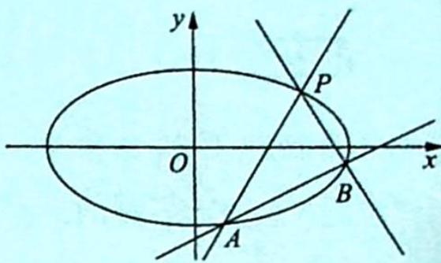

> [!faq]- 《高考数学培优40讲》例题解析
>
> > [!success]- **【答案】** 详见解析
>
> > [!note]- **【分析】**
> > 分析 因为 $AM \perp AN \rightarrow k_{AM} \cdot k_{AN} = -1$ ，所以可以预测直线 MN 会过定点，先用常规套路求出定点，设为 H，由于 A, H 为定点，AH 为定值，而 $\angle ADH = 90^{\circ}$ 。取 AH 的中点 Q，则 $DQ = \frac{1}{2}AH$ 为定值。
>
> > [!note]- **【解析】**
> > 解析 (1) 把点 $A(2,1)$ 代入椭圆方程可得 $\frac{4}{a^2} + \frac{1}{b^2} = 1$ ，离心率 $e = \frac{c}{a} = \frac{\sqrt{2}}{2}$ ，再与 $a^2 = b^2 + c^2$ 联立可解得 $a = \sqrt{6}, b = \sqrt{3}, c = \sqrt{3}$ ，所以椭圆 $C$ 的方程为 $\frac{x^2}{6} + \frac{y^2}{3} = 1$ .
> > (2) 设 $M(x_{1}, y_{1})$ , $N(x_{2}, y_{2})$ ，当 MN 不与 x 轴垂直时，设 $MN: y = kx + m$ ，代入 $\frac{x^{2}}{6} + \frac{y^{2}}{3} = 1$ ，得 $(1 + 2k^{2})x^{2} + 4kmx + 2m^{2} - 6 = 0$ ，所以 $x_{1} + x_{2} = \frac{-4km}{1 + 2k^{2}}$ , $x_{1}x_{2} = \frac{2m^{2} - 6}{1 + 2k^{2}}$ .
> > 由 $AM \perp AN \Rightarrow \overrightarrow{AM} \cdot \overrightarrow{AN} = 0 \Rightarrow (x_1 - 2)(x_2 - 2) + (y_1 - 1)(y_2 - 1) = 0$ ，整理得 $(k^2 + 1)x_1x_2 + (km - k - 2) \cdot (x_1 + x_2) + (m - 1)^2 + 4 = 0$ ，所以 $(k^2 + 1)\frac{2m^2 - 6}{1 + 2k^2} + (km - k - 2)\frac{-4km}{1 + 2k^2} + (m - 1)^2 + 4 = 0.$
> > 整理得 $(2k+m-1)(2k+3m+1)=0$ ，因为直线MN不经过A(2,1)，所以 $2k+m-1\neq0$ ，则 $2k+3m+1=0$ ，直线 $MN:y=k(x-\frac{2}{3})-\frac{1}{3}$ .
> > 因此直线 MN 经过定点 $H\left(\frac{2}{3}, -\frac{1}{3}\right)$ .
> > 当 $MN$ 与 $x$ 轴垂直时容易验证出直线 $MN$ 也经过定点 $H\left(\frac{2}{3}, - \frac{1}{3}\right)$ ，由于 $A(2,1)$ ， $H\left(\frac{2}{3}, - \frac{1}{3}\right)$ 为定点， $AH$ 为定值，而 $\angle ADH = 90^{\circ}$ ，取 $AH$ 的中点 $Q\left(\frac{4}{3}, \frac{1}{3}\right)$ ，则 $DQ = \frac{1}{2} AH = \frac{2\sqrt{2}}{3}$ 为定值.
> > 综上所述, 存在定点 $Q\left(\frac{4}{3}, \frac{1}{3}\right)$ 使得 $|DQ|$ 为定值.
> > <!-- source-part:2 pages:201-327 -->
> > ## 椭圆内接直角三角形的直角顶点在椭圆上(非顶点)时,斜边过定点
> > 椭圆的内接直角三角形, 直角顶点 $P(x_0, y_0)$ 在椭圆上 (不在椭圆顶点上), 则斜边所在的直线过定点 $\left(\frac{a^2 - b^2}{a^2 + b^2} x_0, \frac{b^2 - a^2}{a^2 + b^2} y_0\right)$ .
> > 【证明】如图所示, 设 $A(x_{1}, y_{1})$ , $B(x_{2}, y_{2})$ , 将原坐标系的原点 O 平移至点 P, 则任意一
> > 点的原坐标 $(x,y)$ 与新坐标 $(x',y')$ 的关系为 $\left\{\begin{aligned}x&=x'+x_{0}\\ y&=y'+y_{0}\end{aligned}\right.$ ，故椭圆在新坐标系中的方程为 $\frac{(x'+x_{0})^{2}}{a^{2}}+\frac{(y'+y_{0})^{2}}{b^{2}}=1$ ，即 $\frac{x'^{2}}{a^{2}}+\frac{y'^{2}}{b^{2}}+\frac{2x_{0}}{a^{2}}x'+\frac{2y_{0}}{b^{2}}y'+\frac{x_{0}^{2}}{a^{2}}+\frac{y_{0}^{2}}{b^{2}}=1$ .
> > 
> > 因为点 $P(x_{0}, y_{0})$ 在椭圆 $\frac{x^{2}}{a^{2}} + \frac{y^{2}}{b^{2}} = 1$ 上，所以 $\frac{x_{0}^{2}}{a^{2}} + \frac{y_{0}^{2}}{b^{2}} = 1$ ，则椭圆的方程可化为 $\frac{x^{'2}}{a^{2}} + \frac{y^{'2}}{b^{2}} + \frac{2x_{0}}{a^{2}}x' + \frac{2y_{0}}{b^{2}}y' = 0$ .
> > 设直线 AB 在新坐标系中的方程为 $mx' + ny' = 1$ ，将直线 AB 的方程代入椭圆的方程齐次化得 $\frac{x'^{2}}{a^{2}} + \frac{y'^{2}}{b^{2}} + \left(\frac{2x_{0}}{a^{2}}x' + \frac{2y_{0}}{b^{2}}y'\right)(mx' + ny') = 0$ ，展开得 $\left(\frac{1 + 2y_{0}n}{b^{2}}\right)y'^{2} + \left(\frac{2x_{0}n}{a^{2}} + \frac{2y_{0}m}{b^{2}}\right) \cdot x'y' + \left(\frac{1 + 2x_{0}m}{a^{2}}\right)x'^{2} = 0$ ，左、右两边同时除以 $x'^{2}$ ，得 $\left(\frac{1 + 2y_{0}n}{b^{2}}\right)\left(\frac{y'}{x'}\right)^{2} + \left(\frac{2x_{0}n}{a^{2}} + \frac{2y_{0}m}{b^{2}}\right)\left(\frac{y'}{x'}\right) + \frac{1 + 2x_{0}m}{a^{2}} = 0.$
> > 而上述方程的两根即为直线 $PA, PB$ 的斜率, 所以由根与系数的关系得 $k_{PA} \cdot k_{PB} = \frac{y_1'}{x_1'} \cdot \frac{y_2'}{x_2'} = \frac{b^2(1 + 2x_0m)}{a^2(1 + 2y_0n)}$ .
> > 若 $PA \perp PB$ , 则 $k_{PA} \cdot k_{PB} = \frac{b^2(1 + 2x_0m)}{a^2(1 + 2y_0n)} = -1$ , 即 $-\frac{2b^2x_0}{a^2 + b^2} m - \frac{2a^2y_0}{a^2 + b^2} n = 1$ , 所以直线 $AB$ 在新坐标系中过定点 $\left(-\frac{2b^2x_0}{a^2 + b^2}, -\frac{2a^2y_0}{a^2 + b^2}\right)$ , 则直线 $AB$ 在原坐标系中过定点 $\left(-\frac{2b^2x_0}{a^2 + b^2} + x_0, -\frac{2a^2y_0}{a^2 + b^2} + y_0\right)$ , 即过定点 $\left(\frac{a^2 - b^2}{a^2 + b^2} x_0, \frac{b^2 - a^2}{a^2 + b^2} y_0\right)$ .
