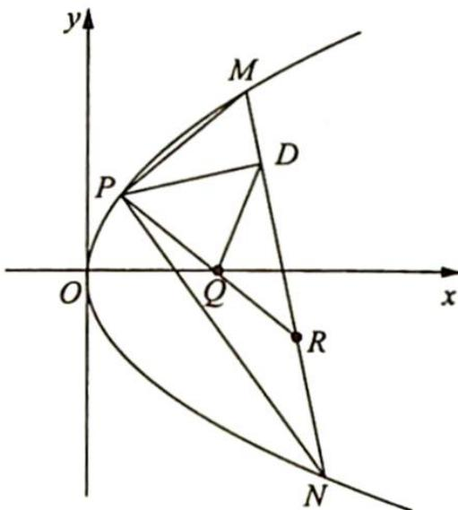
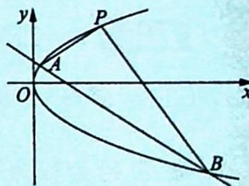

> [!faq]- 《高考数学培优40讲》例题解析
>
> > [!success]- **【答案】** 详见解析
>
> > [!note]- **【分析】**
> > 分析 因为 $PM \perp PN$ ，得 $k_{PM} \cdot k_{PN} = -1$ ，所以预测直线 MN 过定点，先用常规套路，求出定点，设为 R，由于 P, R 为定点， $|PR|$ 为定值，而 $\angle PDR = 90^{\circ}$ 。取 PR 的中点 Q，则 $|DQ| = \frac{1}{2} |PR|$ 为定值。
>
> > [!note]- **【解析】**
> > 解析 ▶ (1)依题意可知 $|PF|=3$ , 得点 $P$ 到准线 $l: x=-\frac{p}{2}$ 的距离为 $2+\frac{p}{2}=3, p=2$ , 所以抛物线 $C$ 的方程为 $y^{2}=4x$ .
> > (2)如图所示,设点 $M,N$ 的坐标分别为 $(x_{1},y_{1}),(x_{2},y_{2})$ , 由 $PM \perp PN$ 得 $\overrightarrow{PM} \cdot \overrightarrow{PN} = 0$ , 又 $\overrightarrow{PM} = (x_{1}-2,y_{1}-2\sqrt{2}), \overrightarrow{PN} = (x_{2}-2,y_{2}-2\sqrt{2})$ , 得 $(x_{1}-2)(x_{2}-2)+(y_{1}-2\sqrt{2})(y_{2}-2\sqrt{2}) = 0$ , 即 $\left(\frac{y_1^2}{4}-2\right)\left(\frac{y_2^2}{4}-2\right) + (y_1 - 2\sqrt{2})(y_2 - 2\sqrt{2}) = 0, \frac{(y_1^2 - 8)(y_2^2 - 8)}{16} + (y_1 - 2\sqrt{2})(y_2 - 2\sqrt{2}) = 0$ , 即 $(y_1 - 2\sqrt{2})(y_2 - 2\sqrt{2}) \cdot [(y_1 + 2\sqrt{2})(y_2 + 2\sqrt{2}) + 16] = 0$ , 则 $(y_1 + 2\sqrt{2})(y_2 + 2\sqrt{2}) + 16 = 0$ , 得 $y_1 y_2 + 2\sqrt{2}(y_1 + y_2) + 24 = 0$ (\*).
> > 
> > 又 $l_{MN}: y - y_{1} = \frac{y_{2} - y_{1}}{\frac{y_{2}^{2}}{4} - \frac{y_{1}^{2}}{4}} \left( x - \frac{y_{1}^{2}}{4} \right)$ ，化简得 $4x - (y_{1} + y_{2})y + y_{1}y_{2} = 0$ ，将 (\*) 式代入上式： $4x - (y_{1} + y_{2})y - 24 - 2\sqrt{2}(y_{1} + y_{2}) = 0$ ，即 $4x - (2\sqrt{2} + y)(y_{1} + y_{2}) = 24$ .
> > 直线 $MN$ 过定点 $(6, -2\sqrt{2})$ ，此点设为 $R$ 。又 $P(2, 2\sqrt{2})$ ，则 $|PR|$ 为定值。
> > 若 $Q$ 为线段 $PR$ 的中点即 $Q(4,0)$ , 则 $|DQ| = \frac{1}{2} |PR| = \frac{1}{2}\sqrt{(6 - 2)^2 + (-2\sqrt{2} - 2\sqrt{2})^2} = 2\sqrt{3}$ 为定值.
> > ## 评注
> > 本题实为定点模型: 点 $P(x_0, y_0)$ 在抛物线 $y^2 = 2px (p > 0)$ 上, 过点 $P$ 作两直线 $l_1, l_2$ 分别交抛物线于 $A, B$ 两点, 若 $PA \perp PB$ , 则直线 $AB$ 过定点 $(x_0 + 2p, -y_0)$ . 只有掌握一些基本的模型、套路、方法, 分析解析几何问题才会信手拈来.
> > ## 双曲线、抛物线内接直角三角形斜边过定点的证明
> > ## 1. 双曲线中的结论
> > 已知双曲线 $C: \frac{x^2}{a^2} - \frac{y^2}{b^2} = 1 (a > 0, b > 0)$ , 若直线 $l: y = kx + m$ 与双曲线 $C$ 相交于 $A, B$ 两点 ( $A, B$ 不是左、右顶点), 则以 $AB$ 为直径的圆过双曲线 $C$ 的右顶点的充要条件是直线 $l$ 过定点 $\left(\frac{a(a^2 + b^2)}{a^2 - b^2}, 0\right)$ .
> > ## 2. 抛物线中的结论
> > 已知抛物线 $C: y^{2} = 2px (p > 0)$ , 若直线 $l: y = kx + m$ 与抛物线 $C$ 相交于 $A, B$ 两点 $(A, B$ 不是原点 $O$ ), 则以 $A, B$ 为直径的圆过抛物线 $C$ 上的一点 $P(x_{0}, y_{0})$ 的充要条件是直线 $l$ 过定点 $(2p + x_{0}, -y_{0})$ , 当点 $P$ 与坐标原点重合时, 定点坐标为 $(2p, 0)$ .
> > 【证明】双曲线的证明类似于椭圆,在此不再赘述.下面证明抛物线中的模型拓展:
> > 如图所示, 设 $A(x_{1}, y_{1}), B(x_{2}, y_{2})$ , 将原坐标系的原点 $O$ 平移至点 $P$ , 则任意一点的
> > 原坐标 $(x,y)$ 与新坐标 $(x',y')$ 的关系为 $\left\{\begin{aligned}x&=x'+x_{0}\\ y&=y'+y_{0}\end{aligned}\right.$ ，所以抛物线在新坐标系中的方程为 $(y'+y_{0})^{2}=2p(x'+x_{0})$ ，即 $y'^{2}+2y_{0}y'-2px'+y_{0}^{2}-2px_{0}=0$ 。
> > 
> > 因为点 $P(x_{0}, y_{0})$ 在抛物线 $y^{2} = 2px$ 上，所以 $y_{0}^{2} = 2px_{0}$ ，则抛物线的方程可化为 $y'^{2} + 2y_{0}y' - 2px' = 0$ .
> > 设直线 AB 在新坐标系中的方程为 $mx' + ny' = 1$ ，将直线 AB 的方程代入抛物线的方程齐次化得 $y'^{2} + (2y_{0}y' - 2px') (mx' + ny') = 0$ ，展开得 $(1 + 2y_{0}n)y'^{2} + (2y_{0}m - 2pn)x'y' - 2pmx'^{2} = 0$ ，左、右两边同时除以 $x'^{2}$ ，得 $(1 + 2y_{0}n)\left(\frac{y'}{x'}\right)^{2} + (2y_{0}m - 2pn)\left(\frac{y'}{x'}\right) - 2pm = 0$ 。
> > 而上述方程的两根即为直线 $PA, PB$ 的斜率, 所以由根与系数的关系得 $k_{PA} \cdot k_{PB} = \frac{y_1'}{x_1'} \cdot \frac{y_2'}{x_2'} = -\frac{2pm}{1 + 2y_0n}$ .
> > 若 $PA \perp PB$ , 则 $k_{PA} \cdot k_{PB} = -\frac{2pm}{1 + 2y_0n} = -1$ , 即 $2pm - 2y_0n = 1$ , 所以直线 $AB$ 在新坐标系中过定点 $(2p, -2y_0)$ , 则直线 $AB$ 在原坐标系中过定点 $(2p + x_0, -2y_0 + y_0)$ , 即过定点 $(2p + x_0, -y_0)$ .
> > 故当点 P 与坐标原点重合时, 定点坐标为 $(2p,0)$ .
> > 2. 斜率之积不为 -1，为定值 $\lambda\left(\lambda\neq\frac{b^{2}}{a^{2}}\right)$
