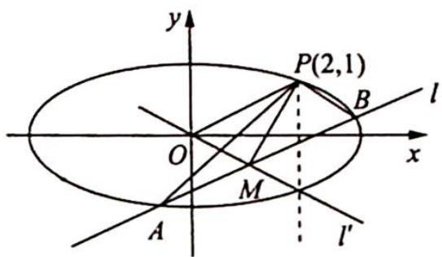

> [!faq]- 《高考数学培优40讲》例题解析
>
> > [!success]- **【答案】** 详见解析
>
> > [!note]- **【分析】**
> > 本题未单列分析。
>
> > [!note]- **【解析】**
> > 解析 (1)由题意可知, $e=\frac{c}{a}=\frac{\sqrt{3}}{2}$ ,得 $\frac{b}{a}=\frac{1}{2},\frac{b^{2}}{a^{2}}=\frac{1}{4}$ ,即 $a^{2}=4b^{2}$ ,所以 $\frac{x^{2}}{4b^{2}}+\frac{y^{2}}{b^{2}}=1$ 过点 $P(2,1)$ ，即 $\frac{4}{4b^{2}}+\frac{1}{b^{2}}=1$ ，得 $\frac{2}{b^{2}}=1,b^{2}=2,a^{2}=8$ ，故椭圆C的方程为 $\frac{x^{2}}{8}+\frac{y^{2}}{2}=1$ .
> > (2)解法一(坐标法:建立目标函数):如图所示,由题意得 $P(2,1)$ , $k_{OP}=k_{AB}=\frac{1}{2}$ , AB:y=$\frac{1}{2} x + m, \left\{ \begin{array}{l} y = \frac{1}{2} x + m \\ x^2 + 4y^2 = 8 \end{array} \right.$ , 消 $y$ 得 $x^2 + 4\left(\frac{1}{4} x^2 + m^2 + mx\right) - 8 = 0$ , 即 $2x^2 + 4mx + 4m^2 - 8 = 0, x^2 + 2mx + 2m^2 - 4 = 0, \Delta = 4m^2 - 4(2m^2 - 4) > 0$ , 亦即 $m^2 - 2m^2 + 4 > 0$ , 所以 $-2 < m < 2$ .
> > 又 $\left\{ \begin{array}{l} x_{1} + x_{2} = -2m \\ x_{1}x_{2} = 2m^{2} - 4 \end{array} \right., M\left(-m, \frac{m}{2}\right), |PM|^{2} = (2 + m)^{2} + \left(1 - \frac{m}{2}\right)^{2} = 4 + m^{2} + 4m + \frac{m^{2}}{4} - m + 1 = \frac{5m^{2}}{4} + 3m + 5.$
> > 对称轴 $m = -\frac{6}{5}, |PM|_{\min}^2 = \frac{5 \times \frac{36}{25}}{4} - \frac{18}{5} + 5 = \frac{9 - 18 + 25}{5} = \frac{16}{5}$ , 所以 $|PM|_{\min} = \frac{4}{\sqrt{5}} = \frac{4\sqrt{5}}{5}$ .
> > 解法二(数形结合:转化为点到直线的距离):同解法一可得 $M\left(-m,\frac{m}{2}\right)$ ,所以 $OM$ 所在的直线方程为 $l':y=-\frac{1}{2}x$ ,即 $x+2y=0$ ,又 $P(2,1)$ , $d(P,l')=\frac{|2+2|}{\sqrt{5}}=\frac{4\sqrt{5}}{5}$ .因此 $|PM|_{\min}=\frac{4}{\sqrt{5}}=\frac{4\sqrt{5}}{5}$ .
> > 
