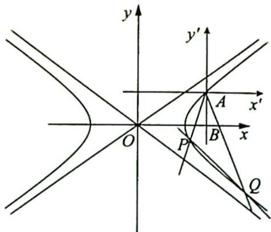
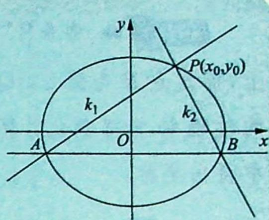

> [!faq]- 《高考数学培优40讲》例题解析
>
> > [!success]- **【答案】** 详见解析
>
> > [!note]- **【分析】**
> > 本题未单列分析。
>
> > [!note]- **【解析】**
> > 解析 ▶ 解法一: (1) 因为点 A 在双曲线 C 上, 则 $\frac{4}{a^{2}} - \frac{1}{a^{2} - 1} = 1$ , 解得 $a^{2} = 2$ , 所以 $C: \frac{x^{2}}{2} - y^{2} = 1$ .
> > 设 $P(x_{1},y_{1}),Q(x_{2},y_{2})$ ，直线 $l:y = kx + m$ ，联立直线 $l$ 与双曲线 $C:\left\{ \begin{array}{l}y = kx + m\\ \frac{x^2}{2} -y^2 = 1 \end{array} \right.$ 可得 $(1 - 2k^{2})x^{2} - 4kmx - 2m^{2} - 2 = 0$ ，则 $\left\{ \begin{array}{l}x_1 + x_2 = \frac{4km}{1 - 2k^2}\\ x_1x_2 = \frac{-2m^2 - 2}{1 - 2k^2} \end{array} \right.$
> > 又直线 $AP, AQ$ 的斜率之和为 0 , 则 $k_{AP} + k_{AQ} = \frac{y_1 - 1}{x_1 - 2} + \frac{y_2 - 1}{x_2 - 2} = 0$ , 即 $(kx_1 + m - 1)(x_2 - 2) + (kx_2 + m - 1)(x_1 - 2) = 0$ , 整理得 $2k x_1 x_2 + (m - 1 - 2k)(x_1 + x_2) - 4m + 4 = 0$ , 代入韦达定理, 等式两侧同乘 $1 - 2k^2$ , 可得 $2k(-2m^2 - 2) + 4km(m - 1 - 2k) + (4 - 4m)(1 - 2k^2) = 0$ , 整理得 $2k^2 + km + k + m - 1 = 0$ . 方程等价于 $2k^2 + km - k + 2k + m - 1 = 0$ , 即 $(k + 1)(2k + m - 1) = 0$ , 解得 $k = -1$ 或 $2k + m - 1 = 0$ .
> > 若 $2k + m - 1 = 0$ ，直线 $l: y = kx + 1 - 2k$ ，过定点 $A(2,1)$ ，不合题意，舍去.
> > 综上，k=-1，所以 l 的斜率为 -1。
> > (2)因为直线 $AP, AQ$ 的斜率之和为 0 , 则 $x = 2$ 是 $\angle PAQ$ 的角平分线, 设 $\angle PAQ = 2\theta$ , 则 $\tan 2\theta = \frac{2\tan\theta}{1 - \tan^2\theta} = 2\sqrt{2}$ , 即 $\sqrt{2}\tan^2\theta + \tan\theta - \sqrt{2} = 0$ .
> > 又 $\tan \theta > 0$ ，解得 $\tan \theta = \frac{\sqrt{2}}{2}$ ，则直线 $AP$ 的倾斜角为 $\frac{\pi}{2} - \theta$ ，斜率 $k_{1} = \tan \left(\frac{\pi}{2} - \theta\right) = \frac{1}{\tan \theta} = \sqrt{2}$ ，
> > 故 $l_{AP}:y=\sqrt{2}(x-2)+1.$
> > 联立直线 $AP$ 与双曲线 $C$ 的方程, 可得 $x_{A}x_{1}=2x_{1}=\frac{2(10-4\sqrt{2})}{3}$ , 则 $x_{1}=\frac{10-4\sqrt{2}}{3}, y_{1}=\sqrt{2}(x_{1}-2)+1=\frac{4\sqrt{2}-5}{3}$ . 因为直线 $l: y=-x+m$ , 代入点 $P$ 可得 $\frac{4\sqrt{2}-5}{3}=\frac{4\sqrt{2}-10}{3}+m, m=\frac{5}{3}$ , 联立 $\left\{\begin{aligned}&\frac{x^{2}}{2}-y^{2}=1\\&y=-x+\frac{5}{3}\end{aligned}\right.$ , 消 $y$ 得 $x^{2}-\frac{20}{3}x+\frac{68}{9}=0$ , 则 $\left\{\begin{aligned}&x_{1}+x_{2}=\frac{20}{3}\\&x_{1}x_{2}=\frac{68}{9}\end{aligned}\right.$ .
> > 因为 $|AP| = \sqrt{1 + k_1^2}\left|x_1 - 2\right| = \sqrt{3}\left|x_1 - 2\right|$ ，同理可得 $|AQ| = \sqrt{3}\left|x_2 - 2\right|$ 。又 $\tan 2\theta = 2\sqrt{2}$ ，所以 $\sin 2\theta = \frac{2\sqrt{2}}{3}$ ，所以 $S_{\triangle PAQ} = \frac{1}{2}|AP||AQ|\sin 2\theta = \sqrt{2}\left|x_1x_2 - 2(x_1 + x_2) + 4\right| = \frac{16\sqrt{2}}{9}$ 。
> > 解法二:(1) $\frac{4}{a^{2}}-\frac{1}{a^{2}-1}=1\Rightarrow4a^{2}-4-a^{2}=a^{4}-a^{2}$ ，所以 $(a^{2}-2)^{2}=0,a^{2}=2$ ，故 $C:\frac{x^{2}}{2}-y^{2}=1$ .
> > 如图所示, 坐标平移齐次化, 建立新坐标系 $x^{\prime} A y^{\prime}$ , 可得 $\left\{ \begin{array}{l} x = x^{\prime} + 2 \\ y = y^{\prime} + 1 \end{array} , C: \frac{(x^{\prime} + 2)^{2}}{2} - (y^{\prime} + 1)^{2} = 1, x^{\prime 2} + 4 x^{\prime} - 2 y^{\prime 2} - 4 y^{\prime} = 0. \right.$
> > 令 $PQ: mx' + ny' = 1, P(x_{1}', y_{1}')$ , $Q(x_{2}', y_{2}')$ , $x'^{2} + 4x'(mx' + ny') - 2y'^{2} - 4y'(mx' + ny') = 0 \Leftrightarrow (2 + 4n)\left(\frac{y'}{x'}\right)^{2} + (4m - 4n)\frac{y'}{x'} - 4m - 1 = 0.$
> > 
> > 因为 $k_{AP} + k_{AQ} = 0$ ，所以 $\frac{4m - 4n}{2 + 4n} = 0$ ，即 m = n, $k_{l} = -\frac{m}{n} = -1$ .
> > (2) 设 $y'$ 轴与 $x$ 轴交点为 $B$ ，令 $\angle PAB = \theta$ ，则 $\tan 2\theta = 2\sqrt{2} = \frac{2\tan\theta}{1 - \tan^2\theta}$ ，解得 $\tan \theta = \frac{\sqrt{2}}{2}$ ，所以 $k_{AP} = \sqrt{2}, k_{AQ} = -\sqrt{2}$ ，直线 $AP: \begin{cases} y' = \sqrt{2}x' \\ x'^2 + 4x' - 2y'^2 - 4y' = 0 \end{cases}$ ，消 $y'$ 得 $-3x'^2 + (4 - 4\sqrt{2})x' = 0$ ， $x_1' = \frac{4 - 4\sqrt{2}}{3}$ .
> > $|PA|=\sqrt{1+2}\cdot|x_{1}^{\prime}|=\sqrt{3}\times\frac{4\sqrt{2}-4}{3}=\frac{4\sqrt{6}-4\sqrt{3}}{3}$ ，同理 $x_{2}^{\prime}=\frac{4+4\sqrt{2}}{3}$ ， $|AQ|=\sqrt{1+2}|x_{2}^{\prime}|=$ $\sqrt{3}\times\frac{4\sqrt{2}+4}{3}=\frac{4\sqrt{6}+4\sqrt{3}}{3}.$
> > 所以 $S_{\triangle PAQ} = \frac{1}{2}|AP||AQ|\sin 2\theta = \frac{1}{2}\times \frac{4\sqrt{6} - 4\sqrt{3}}{3}\times \frac{4\sqrt{6} + 4\sqrt{3}}{3}\times \frac{2\sqrt{2}}{3} = \frac{16\sqrt{2}}{9}.$
> > ## 2. 斜率之和不为 0
> > 研究密钥
> > 如图所示， $P(x_0,y_0)$ 为曲线 $C:\frac{x^2}{a^2} +\frac{y^2}{b^2} = 1(a > b > 0)$ 上一点，过点 $P$ 作斜率为 $k_{1},k_{2}$ 的两条直线分别与曲线交于 $A,B$ 两点，若 $k_{1}+$ $k_{2} = \lambda (\lambda \neq 0)$ ，则直线 $AB$ 过定点 $M\left(x_0 - \frac{2y_0}{\lambda}, - y_0 - \frac{2b^2x_0}{a^2\lambda}\right).$ 当 $\lambda = 0$ 时，直线 $AB$ 的斜率为定值 $\frac{b^2x_0}{a^2y_0}$
> > 
> > 【证明】①当直线 AB 的斜率不存在时, 设 $A(x,y)$ , $B(x,-y)$ , 则 $k_{1}+k_{2}=\frac{y-y_{0}}{x-x_{0}}+\frac{-y-y_{0}}{x-x_{0}}=\frac{-2y_{0}}{x-x_{0}}=\lambda$ , 解得 $x=x_{0}-\frac{2y_{0}}{\lambda}$ , 所以直线 AB 过定点 $M\left(x_{0}-\frac{2y_{0}}{\lambda},-y_{0}-\frac{2b^{2}x_{0}}{a^{2}\lambda}\right)$ .
> > - **②**：当直线 AB 的斜率存在时, 将坐标原点平移至点 P, 则曲线方程变为 $\frac{(x+x_{0})^{2}}{a^{2}}+\frac{(y+y_{0})^{2}}{b^{2}}=1$ .
> > 在新坐标系下, 设直线 $AB: y = kx + m$ , 当 $m \neq 0$ 时, 则有 $\frac{y - kx}{m} = 1$ , 所以 $A, B$ 两点的坐标满足 $b^{2}x^{2} + a^{2}y^{2} + 2b^{2}x_{0}x \cdot \frac{y - kx}{m} + 2a^{2}y_{0}y \cdot \frac{y - kx}{m} = 0$ , 化简得 $a^{2}(m + 2y_{0})y^{2} + (2b^{2}x_{0} - 2a^{2}y_{0}k)xy + b^{2}(m - 2kx_{0})x^{2} = 0$ (※).
> > 当 $m = 0$ 时，方程（※）也成立，在方程（※）两边同时除以 $x^{2}$ ，得 $a^2 (m + 2y_0)\left(\frac{y}{x}\right)^2 + (2b^2 x_0 - 2a^2 y_0k)\left(\frac{y}{x}\right) + b^2 (m - 2kx_0) = 0$ ，所以 $k_{1} + k_{2} = -\frac{2b^{2}x_{0} - 2a^{2}y_{0}k}{a^{2}(m + 2y_{0})} = \lambda$ ，即 $2a^{2}y_{0}k - 2b^{2}x_{0} = a^{2}\lambda (m + 2y_{0})$ ，解得 $m = \frac{2ky_0}{\lambda} -\frac{2b^2x_0}{a^2\lambda} -2y_0.$
> > 所以直线 $AB$ 的方程为 $y = kx + \frac{2ky_0}{\lambda} -\frac{2b^2x_0}{a^2\lambda} -2y_0$ ，即 $y = k\left(x + \frac{2y_0}{\lambda}\right) - \frac{2b^2x_0}{a^2\lambda} -2y_0$ ，故直线 $AB$ 过定点 $M\left(-\frac{2y_0}{\lambda}, - \frac{2b^2x_0}{a^2\lambda} -2y_0\right)$ ，即在原坐标系下过定点 $M\left(x_0 - \frac{2y_0}{\lambda}, - y_0-\right.$ $\frac{2b^2x_0}{a^2\lambda})$
