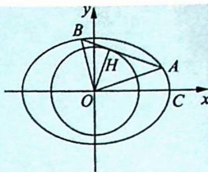
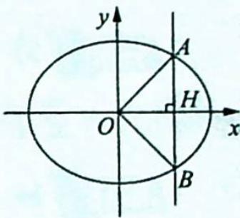
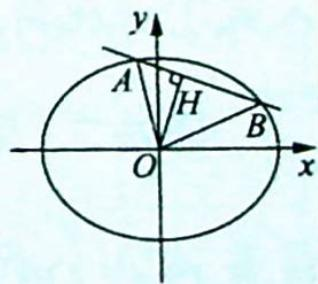

## 21.2 垂直弦模型及延伸

## 研究密钥

椭圆 $\frac{x^2}{a^2} + \frac{y^2}{b^2} = 1 (a > b > 0)$ 与直线 $l$ 交于 $A, B$ 两点，在 $\triangle ABO$ 中， $OH$ 为 $AB$ 上的高，则 $\langle \overrightarrow{OA}, \overrightarrow{OB} \rangle = \frac{\pi}{2} \Leftrightarrow \frac{1}{|OH|^2} = \frac{1}{a^2} + \frac{1}{b^2}$ .

【证明】充分性

依题意,如图1所示.

不妨设 $|OA|=m, |OB|=n, \angle A O x = \alpha$ , 则 $\angle B O x = \alpha + \frac{\pi}{2}$ , 从而 $A(m \cos \alpha, m \sin \alpha), B(n \cos (\alpha + \frac{\pi}{2}), n \sin (\alpha + \frac{\pi}{2}))$ , 即 $B(-n \sin \alpha, n \cos \alpha)$ .

由 $A, B$ 在椭圆上, 得 $\left\{ \begin{array}{l} \frac{m^2 \cos^2 \alpha}{a^2} + \frac{m^2 \sin^2 \alpha}{b^2} = 1 \\ \frac{n^2 \sin^2 \alpha}{a^2} + \frac{n^2 \cos^2 \alpha}{b^2} = 1 \end{array} \right.$ , 即 $\left\{ \begin{array}{l} \frac{\cos^2 \alpha}{a^2} + \frac{\sin^2 \alpha}{b^2} = \frac{1}{m^2} \\ \frac{\sin^2 \alpha}{a^2} + \frac{\cos^2 \alpha}{b^2} = \frac{1}{n^2} \end{array} \right.$ , 两式相加可得 $\frac{1}{m^2} + \frac{1}{n^2} = \frac{1}{a^2} + \frac{1}{b^2}$ , 又 $\frac{1}{2} |OH||AB| = \frac{1}{2} |OA||OB|$ , 即 $|OH|^2 (|OA|^2 + |OB|^2) = |OA|^2 |OB|^2$ , 所以 $\frac{1}{|OH|^2} = \frac{|OA|^2 + |OB|^2}{|OA|^2 |OB|^2} = \frac{1}{m^2} + \frac{1}{n^2} = \frac{1}{a^2} + \frac{1}{b^2}$ .

必要性

①如图2所示,直线AB的斜率不存在.

设 AB: x = m，则 $\left|OH\right| = m$ ，又因为 $\frac{1}{\left|OH\right|^{2}} = \frac{1}{a^{2}} + \frac{1}{b^{2}}$ ，所以 $\frac{1}{m^{2}} = \frac{1}{a^{2}} + \frac{1}{b^{2}}$ ， $m^{2}=\frac{a^{2}b^{2}}{a^{2}+b^{2}}.$

图2

联立方程 $\left\{ \begin{array}{l} x = m \\ \frac{x^2}{a^2} + \frac{y^2}{b^2} = 1 \end{array} \right.$ , 可得 $y^2 = b^2 - \frac{b^2}{a^2} m^2 = \frac{b^2}{a^2} (a^2 - m^2)$ , 所以 $A(m, \frac{b}{a} \sqrt{a^2 - m^2})$ , $B(m, -\frac{b}{a} \sqrt{a^2 - m^2})$ , $\overrightarrow{OA} \cdot \overrightarrow{OB} = m^2 - \frac{b^2}{a^2} (a^2 - m^2) = m^2 - b^2 + \frac{b^2}{a^2} m^2 = \frac{a^2 b^2}{a^2 + b^2} - b^2 + \frac{b^4}{a^2 + b^2} = 0$ , 所以 $\langle \overrightarrow{OA}, \overrightarrow{OB} \rangle = \frac{\pi}{2}$ .

②如图3所示,直线AB的斜率存在.

②如图3所示,直线AB的斜率存在.
设 AB: $y = kx + m$ , 则 $|OH| = \frac{|m|}{\sqrt{1 + k^{2}}}$ , 又因为 $\frac{1}{|OH|^{2}} = \frac{1}{a^{2}} + \frac{1}{b^{2}}$ , 所以 $\frac{1}{\left(\frac{|m|}{\sqrt{1+k^{2}}}\right)^{2}}=\frac{1}{a^{2}}+\frac{1}{b^{2}}$ ，即 $\frac{1+k^{2}}{m^{2}}=\frac{a^{2}+b^{2}}{a^{2}b^{2}}$ ，所以 $(1+k^{2})a^{2}b^{2}=(a^{2}+b^{2})m^{2},a^{2}b^{2}+a^{2}b^{2}k^{2}=a^{2}m^{2}+b^{2}m^{2}$ ，即 $a^{2}(m^{2}-b^{2})+b^{2}(m^{2}-a^{2}k^{2})=0.$

图3

联立方程 $\left\{\begin{aligned}y&=kx+m\\ \frac{x^{2}}{a^{2}}+\frac{y^{2}}{b^{2}}&=1\end{aligned}\right.$ ，消去x整理可得 $\left(a^{2}+\frac{b^{2}}{k^{2}}\right)y^{2}-\frac{2mb^{2}}{k^{2}}y+\frac{m^{2}b^{2}}{k^{2}}-a^{2}b^{2}=0$ ，所以 $y_{1}\cdot$

$$
y _ {2} = \frac {\frac {m ^ {2} b ^ {2}}{k ^ {2}} - a ^ {2} b ^ {2}}{a ^ {2} + \frac {b ^ {2}}{k ^ {2}}} = \frac {b ^ {2} (m ^ {2} - a ^ {2} k ^ {2})}{b ^ {2} + a ^ {2} k ^ {2}}.
$$

消去 y 整理可得 $(a^{2}k^{2}+b^{2})x^{2}+2mka^{2}x+a^{2}m^{2}-a^{2}b^{2}=0$ ，所以 $x_{1}x_{2}=\frac{a^{2}(m^{2}-b^{2})}{a^{2}k^{2}+b^{2}}$ $\overrightarrow{OA}\cdot\overrightarrow{OB}=x_{1}x_{2}+y_{1}y_{2}=\frac{a^{2}(m^{2}-b^{2})}{a^{2}k^{2}+b^{2}}+\frac{b^{2}(m^{2}-a^{2}k^{2})}{b^{2}+a^{2}k^{2}}=0$ ，所以 $\langle\overrightarrow{OA},\overrightarrow{OB}\rangle=\frac{\pi}{2}$ .

![[高中/总复习/专题/高考数学培优40讲/高考数学培优40讲-02-解析几何/第21讲_圆锥曲线中常考六大模型及延伸/21_2_垂直弦模型及延伸/例题/Q00019640.md]]
![[高中/总复习/专题/高考数学培优40讲/高考数学培优40讲-02-解析几何/第21讲_圆锥曲线中常考六大模型及延伸/21_2_垂直弦模型及延伸/例题/Q00019641.md]]
![[高中/总复习/专题/高考数学培优40讲/高考数学培优40讲-02-解析几何/第21讲_圆锥曲线中常考六大模型及延伸/21_2_垂直弦模型及延伸/例题/Q00019642.md]]
![[高中/总复习/专题/高考数学培优40讲/高考数学培优40讲-02-解析几何/第21讲_圆锥曲线中常考六大模型及延伸/21_2_垂直弦模型及延伸/例题/Q00019643.md]]
![[高中/总复习/专题/高考数学培优40讲/高考数学培优40讲-02-解析几何/第21讲_圆锥曲线中常考六大模型及延伸/21_2_垂直弦模型及延伸/例题/Q00019644.md]]
