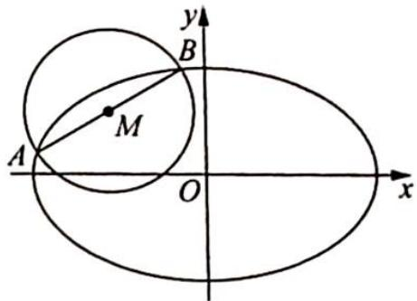

<!-- question-source:start -->
变式(1) 已知椭圆 $E: \frac{x^{2}}{a^{2}} + \frac{y^{2}}{b^{2}} = 1 (a > b > 0)$ 的半焦距为 $c$ , 原点 $O$ 到经过两点 $(c, 0), (0, b)$ 的直线的距离为 $\frac{1}{2} c$ .

(1)求椭圆 E 的离心率；

(2)如图所示, $AB$ 是圆 $M: (x + 2)^{2} + (y - 1)^{2} = \frac{5}{2}$ 的一条直径, 若椭圆 $E$ 经过 $A, B$ 两点, 求椭圆 $E$ 的方程.

(1)思路一(等面积法): 点到直线的距离理解为三角形斜边上的高, 用两种方式表示三角形的面积, 再结合 $a^{2} = b^{2} + c^{2}$ 求离心率; 思路二(方程思想): 根据公式和已知条件用两种方式表示点到直线的距离, 再结合 $a^{2} = b^{2} + c^{2}$ 求离心率. (2)根据中点弦模型可得 $k_{AB}$ , 因此可得直线 $AB$ 的方程, 与椭圆方程联立, 使用韦达定理可得弦长 $|AB|$ , $AB$ 又是圆的直径, 建立方程求出待定系数得椭圆方程.
<!-- question-source:end -->

![[高中/总复习/专题/高考数学培优40讲/高考数学培优40讲-02-解析几何/第21讲_圆锥曲线中常考六大模型及延伸/21_3_中点弦模型及延伸/例题/answers/Q00019646A1.md]]
