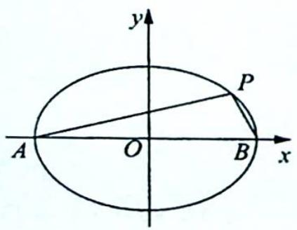
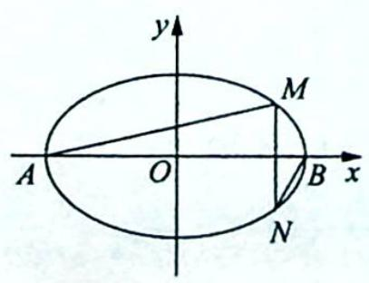
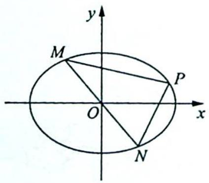

> [!faq]- 《高考数学培优40讲》例题解析
>
> > [!success]- **【答案】** 详见解析
>
> > [!note]- **【分析】**
> > 本题未单列分析。
>
> > [!note]- **【解析】**
> > 解析 ▶ (1)解法一(等面积法):依题意得 $\frac{1}{2}bc=\frac{1}{2}\sqrt{b^{2}+c^{2}}\cdot\frac{c}{2}=\frac{ac}{4}$ ,得 a=2b,所以 e= $\frac{c}{a}=\sqrt{1-\frac{b^{2}}{a^{2}}}=\frac{\sqrt{3}}{2}.$
> > 解法二(方程思想): 由题意得直线经过 $(c,0)$ ， $(0,b)$ 两点，则直线的方程为 $\frac{x}{c}+\frac{y}{b}=1$ ，即 $bx+cy-bc=0$ ，原点O到直线的距离 $d=\frac{bc}{\sqrt{b^{2}+c^{2}}}=\frac{bc}{a}=\frac{c}{2}$ ，则a=2b，故 $e=\frac{c}{a}=\sqrt{1-\frac{b^{2}}{a^{2}}}=\frac{\sqrt{3}}{2}$ .
> > (2)(利用中点弦模型求解)因为点 M 为弦 AB 的中点,所以 $k_{OM} \cdot k_{AB} = -\frac{b^{2}}{a^{2}} = -\frac{1}{4}$ .
> > 又 $M(-2,1)$ , 即 $k_{OM} = -\frac{1}{2}$ , 得 $k_{AB} = \frac{1}{2}$ , 因此 $AB$ 所在的直线方程为 $y - 1 = \frac{1}{2}(x + 2)$ , 即 $x - 2y + 4 = 0$ .
> > 联立 $\left\{\begin{aligned}x^{2}+4y^{2}&=4b^{2}\\ x-2y+4&=0\end{aligned}\right.$ ，消去x建立关于y的一元二次方程得 $(2y-4)^{2}+4y^{2}=4b^{2}$ ，化简整理得 $2y^{2}-4y+4-b^{2}=0$ 。
> > 由韦达定理可得 $y_1 + y_2 = 2$ , $y_1y_2 = \frac{4 - b^2}{2}$ , $|AB| = \sqrt{1 + \frac{1}{k_{AB}^2}} \cdot |y_1 - y_2| = \sqrt{5}\sqrt{(y_1 + y_2)^2 - 4y_1y_2} = \sqrt{5} \cdot \sqrt{4 - 2(4 - b^2)} = \sqrt{5} \cdot \sqrt{2b^2 - 4} = \sqrt{10}$ , 所以 $2b^2 - 4 = 2, b^2 = 3$ , $a^2 = 4b^2 = 12$ .
> > 故椭圆方程为 $\frac{x^{2}}{12}+\frac{y^{2}}{3}=1.$
> > ## 评注
> > 本题挖掘几何性质,利用中点弦模型 $k_{OM} \cdot k_{AB} = -\frac{b^2}{a^2}$ ,得到 $AB$ 所在直线的斜率,从而求出 $AB$ 所在直线的方程,将求解椭圆方程的问题转化到直线与椭圆相交的弦长等于圆 $M$ 的直径上来,从而求出椭圆方程,在命题意图上,命题者很好地把握了圆的几何性质以及中点弦模型的应用.在考生实际做题时,对于中点弦模型可通过点差法得到,在这里我们不再赘述,关键是通过例题及变式题的分析、研究来理解试题本身的内涵及外延,希望广大考生掌握圆锥曲线中几种常见的衍生结论,以便在考试中迅速找到解题的切入点与突破口.
> > ## 探究总结
> > ## 中点弦模型的拓展
> > 椭圆中的中点弦模型: 点 P 为弦 AB 的中点, 则 $k_{OP} \cdot k_{AB} = -\frac{b^{2}}{a^{2}}$ . 另外还有以下推广.
> > 模型演绎 1: 当 a=b 时, 椭圆演变为圆, 有 $k_{0} \cdot k = -1$ , OP 恰好是 AB 的中垂线, 在直线与圆类型的题目中, 常用这点进行解题.
> > 模型演绎 2: 类似的模型还有如下几种, 椭圆方程均为 $\frac{x^{2}}{a^{2}} + \frac{y^{2}}{b^{2}} = 1 (a > b > 0)$ .
> > (1)长轴模型:如图1所示,A,B为长轴端点,P为椭圆上异于A,B的任一点,则 $k_{PA}\cdot k_{PB}=-\frac{b^{2}}{a^{2}}$ .
> > (2)长轴模型延伸:如图2所示,A,B为长轴端点,点M,N在椭圆上,且关于x轴对称,则 $k_{AM}\cdot k_{BN}=\frac{b^{2}}{a^{2}}$ .
> > (3)中心弦模型:如图3所示,MN为过原点的弦,点P在椭圆上(异于M,N两点),且 $k_{PM},k_{PN}$ 存在,则 $k_{PM}\cdot k_{PN}=-\frac{b^{2}}{a^{2}}.$
> > 
> > 图1
> > 
> > 图2
> > 
> > 图3
