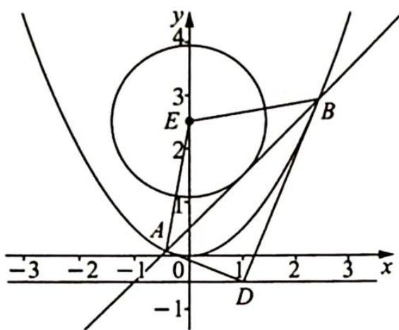

<!-- question-source:start -->
例21.13 (2019新课标全国Ⅲ卷理21)如图所示,已知曲线 $C: y = \frac{x^2}{2}$ ,点 $D$ 为直线 $y = -\frac{1}{2}$ 上的动点,过点 $D$ 作曲线 $C$ 的两条切线,切点分别为 $A, B$ .

(1) 证明: 直线 AB 过定点:

(2)若以点 $E\left(0,\frac{5}{2}\right)$ 为圆心的圆与直线 AB 相切,且切点为线段 AB 的中点,求四边形 ADBE 的面积.

<!-- question-source:end -->

![[高中/总复习/专题/高考数学培优40讲/高考数学培优40讲-02-解析几何/第21讲_圆锥曲线中常考六大模型及延伸/21_4_阿基米德三角形及延伸/21_4_1_阿基米德三角形模型及其性质/例题/answers/Q00019649A1.md]]
