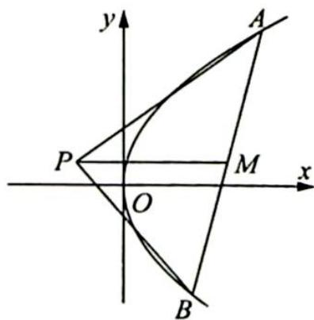

<!-- question-source:start -->
变式(2) (2018 浙江卷理 21)如图所示,已知点 $P$ 是 $y$ 轴左侧(不含 $y$ 轴)一点,抛物线 $C: y^{2} = 4x$ 上存在不同的两点 $A, B$ 满足 $PA, PB$ 的中点均在 $C$ 上.

(1)设 ${AB}$ 中点为 $M$ ,证明： ${PM}$ 垂直于 $y$ 轴；

(2) 若 $P$ 是半椭圆 $x^{2} + \frac{y^{2}}{4} = 1 (x < 0)$ 上的动点, 求 $\triangle PAB$ 面积的取值范围.
<!-- question-source:end -->

![[高中/总复习/专题/高考数学培优40讲/高考数学培优40讲-02-解析几何/第21讲_圆锥曲线中常考六大模型及延伸/21_4_阿基米德三角形及延伸/21_4_2_阿基米德三角形模型的拓展/例题/answers/Q00019653A1.md]]
