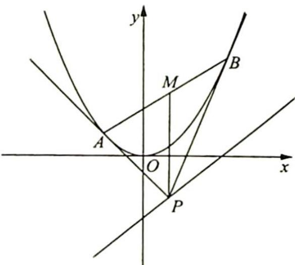
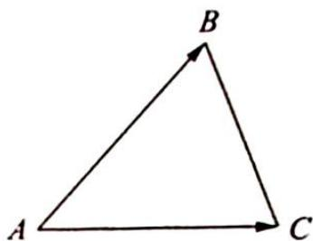

> [!faq]- 《高考数学培优40讲》例题解析
>
> > [!success]- **【答案】** 详见解析
>
> > [!note]- **【分析】**
> > 分析 (1)联立抛物线 $y = \frac{1}{2} x^2$ 在点 $A, B$ 处的切线方程，化简可得点 $P$ 的坐标，满足直线方程 $y = x - 2$ ，将化简结果代入直线 $AB$ 的方程可得定点。(2)思路一：根据模型演绎一的性质 1 可得 $\triangle PAB$ 的面积为 $\frac{|x_1 - x_2|^3}{8p}$ ；思路二：根据三角形面积公式可得 $S_{\triangle ABC} = \frac{1}{2} |x_1y_2 - x_2y_1| = \frac{|x_1 - x_2|^3}{8p}$ . 由点 $P\left(\frac{x_1 + x_2}{2}, \frac{x_1x_2}{2}\right)$ 在直线 $y = x - 2$ 上，得到 $x_1 + x_2, x_1x_2$ 的关系，从而得到 $|x_1 - x_2| = \sqrt{(x_1 + x_2)^2 - 4x_1x_2}$ 的取值范围，代入面积公式可得 $\triangle PAB$ 的面积 $S$ 的最小值.
>
> > [!note]- **【解析】**
> > 解析 (1) 设 $A\left(x_{1}, \frac{x_{1}^{2}}{2}\right), B\left(x_{2}, \frac{x_{2}^{2}}{2}\right)$ , 抛物线 $y = \frac{1}{2} x^{2}$ 在点 $A$ 处的切线方程为 $y - \frac{x_{1}^{2}}{2} = x_{1}(x - x_{1})$ , 即 $y = x_{1}x - \frac{x_{1}^{2}}{2}$ , 同理可得抛物线 $y = \frac{1}{2} x^{2}$ 在点 $B$ 处的切线方程 $y = x_{2}x - \frac{x_{2}^{2}}{2}$ , 联立得 $x_{1}x - \frac{x_{1}^{2}}{2} = x_{2}x - \frac{x_{2}^{2}}{2}$ , 故 $(x_{1} - x_{2})x = \frac{x_{1}^{2} - x_{2}^{2}}{2}$ , 即 $x = \frac{x_{1} + x_{2}}{2}$ , 代入 $y = x_{1}x - \frac{x_{1}^{2}}{2} = \frac{x_{1}x_{2}}{2}$ , 即点 $P(\frac{x_{1} + x_{2}}{2}, \frac{x_{1}x_{2}}{2})$ .
> > 由 $P$ 点在直线 $y = x - 2$ 上，即 $\frac{x_1x_2}{2} = \frac{x_1 + x_2}{2} - 2 \Leftrightarrow x_1x_2 = x_1 + x_2 - 4.$
> > 又 $AB$ 的方程 $\frac{y - \frac{x_1^2}{2}}{x - x_1} = \frac{\frac{x_1^2}{2} - \frac{x_2^2}{2}}{x_1 - x_2} = \frac{x_1 + x_2}{2}$ , 则 $y - \frac{x_1^2}{2} = \frac{x_1 + x_2}{2}x - \frac{x_1^2 + x_1x_2}{2}$ , 即 $y = \frac{x_1 + x_2}{2}x - \frac{x_1x_2}{2} = \frac{x_1 + x_2}{2}x - \frac{x_1 + x_2}{2} + 2 = \frac{x_1 + x_2}{2}(x - 1) + 2.$
> > 故直线 AB 过定点 $(1,2)$ .
> > (2)解法一(运用阿基米德三角形的性质):如图所示,过点P作y轴的平行线与AB相交于点M,则 $S_{\triangle PAB}=\frac{1}{2}|PM||x_{1}-x_{2}|$ ,又 $|PM|=|y_{M}-y_{P}|$ ,易证M为AB的中点,所以 $y_{M}=\frac{y_{1}+y_{2}}{2}=\frac{x_{1}^{2}+x_{2}^{2}}{4},y_{P}=\frac{x_{1}x_{2}}{2}$ ,因此 $|PM|=\frac{x_{1}^{2}+x_{2}^{2}}{4}-\frac{x_{1}x_{2}}{2}=\frac{(x_{1}-x_{2})^{2}}{4}$ ,那么S
> > 
> > $\frac{x_1^2 + x_2^2}{4}, y_P = \frac{x_1x_2}{2}$ , 因此 $|PM| = \frac{x_1^2 + x_2^2}{4} - \frac{x_1x_2}{2} = \frac{(x_1 - x_2)^2}{4}$ , 那么 $S_{\triangle PAB} = \frac{1}{8}|x_1 - x_2|^3$ .
> > 再看 $|x_1 - x_2|^2 = (x_1 + x_2)^2 - 4x_1x_2$ ，又 $P\left(\frac{x_1 + x_2}{2}, \frac{x_1x_2}{2}\right)$ ，且点 $P$ 在直线 $y = x - 2$ 上，不妨设 $\frac{x_1 + x_2}{2} = a$ ，则 $\frac{x_1x_2}{2} = a - 2$ ，因此 $x_1 + x_2 = 2a, x_1x_2 = 2a - 4$ .
> > 故 $(x_{1}-x_{2})^{2}=(x_{1}+x_{2})^{2}-4x_{1}x_{2}=4a^{2}-8a+16=4(a^{2}-2a+1)+12=4(a-1)^{2}+12\geqslant$ 12(当且仅当 a=1 时, 取“=”).
> > 此时， $S_{\triangle PAB}$ 的最小值为 $\frac{1}{8} \times (2\sqrt{3})^{3} = 3\sqrt{3}$ ，此时点 P 的坐标为 $(1, -1)$ .
> > 解法二(运用三角形面积公式):如图所示, $\overrightarrow{AB}=(x_{1},y_{1}),\overrightarrow{AC}=(x_{2},y_{2})$ , $S_{\triangle ABC}=\frac{1}{2}\left|x_{1}y_{2}-x_{2}y_{1}\right|$ .
> > 
> > 在本题中，设 $P(x_0, y_0), A\left(x_1, \frac{x_1^2}{2}\right), B\left(x_2, \frac{x_2^2}{2}\right)$ ，且 $x_0 = \frac{x_1 + x_2}{2}, y_0 = \frac{x_1x_2}{2}$ ，那么 $\overrightarrow{PA} = \left(x_1 - \frac{x_1 + x_2}{2}, \frac{x_1^2}{2} - \frac{x_1x_2}{2}\right) = \left(\frac{x_1 - x_2}{2}, \frac{x_1(x_1 - x_2)}{2}\right)$ ，同理 $\overrightarrow{PB} = \left(x_2 - \frac{x_1 + x_2}{2}, \frac{x_2^2}{2} - \frac{x_1x_2}{2}\right) = \left(\frac{x_2 - x_1}{2}, \frac{x_2(x_2 - x_1)}{2}\right)$ ，则 $S_{\triangle PAB} = \frac{1}{2} \left| \frac{x_2}{4}(x_1 - x_2)(x_2 - x_1) - \frac{x_1}{4}(x_2 - x_1)(x_1 - x_2) \right| = \frac{1}{8} |-x_2 (x_1 - x_2)^2 + x_1 (x_1 - x_2)^2| = \frac{1}{8} |x_1 - x_2|^3.$
> > 计算 $S_{\triangle PAB} = \frac{1}{8}\left|x_1 - x_2\right|^3$ 的最值方法同上.
> > ## 评注
> > 若 $P$ 点的运动轨迹由直线 $y = x - 2$ 变为其他曲线, 如圆、圆锥曲线等, 其方法是不变的, 只是计算的复杂度不同.
