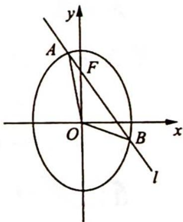

<!-- question-source:start -->
例 21.17 如图所示, 已知 $O$ 为坐标原点. $F$ 为椭圆 $C: x^{2} + \frac{y^{2}}{2} = 1$ 在 $y$ 轴正半轴上的焦点. 过 $F$ 且斜率为 $-\sqrt{2}$ 的直线 $l$ 与 $C$ 交于 $A, B$ 两点, 点 $P$ 满 $\overrightarrow{OA} + \overrightarrow{OB} + \overrightarrow{OP} = 0$ .

(1) 证明: 点 P 在 C 上;

(2)设点 $P$ 关于点 $O$ 的对称点为 $Q$ . 证明: $A, P, B, Q$ 四点在同一圆上.
<!-- question-source:end -->

![[高中/总复习/专题/高考数学培优40讲/高考数学培优40讲-02-解析几何/第21讲_圆锥曲线中常考六大模型及延伸/21_6_圆锥曲线四点共圆及延伸/21_6_2_常用方法/例题/answers/Q00019657A1.md]]
