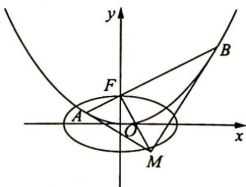

<!-- question-source:start -->
2. 如图所示, 已知抛物线 $C: x^{2} = 4y$ 的焦点为 $F$ , 过点 $F$ 作直线 $l$ 交抛物线 $C$ 于 $A, B$ 两点; 椭圆 $E$ 的中心在原点, 焦点在 $x$ 轴上, 点 $F$ 是它的一个顶点且其离心率 $e = \frac{\sqrt{3}}{2}$ .

(1)求椭圆 E 的方程；

(2)经过 $A, B$ 两点分别作抛物线 $C$ 的切线 $l_{1}, l_{2}$ , 切线 $l_{1}$ 与 $l_{2}$ 相交于点 $M$ , 求证: $AB \perp MF$ ;

(3)在椭圆 $E$ 上是否存在一点 $M'$ , 经过点 $M'$ 作抛物线 $C$ 的两条切线 $M'A', M'B'(A', B'$ 为切点), 使得直线 $A'B'$ 过点 $F$ ? 若存在, 求出抛物线 $C$ 与切线 $M'A', M'B'$ 所围成图形的面积; 若不存在, 试说明理由.

<!-- question-source:end -->

![[Q00019661A1]]
