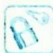
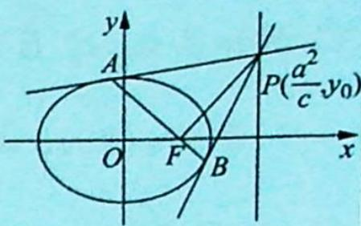
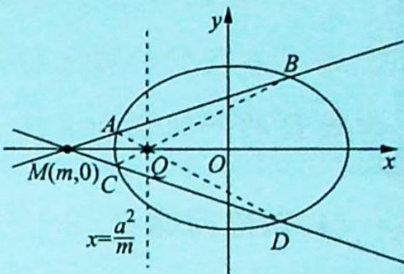
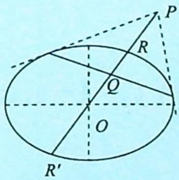
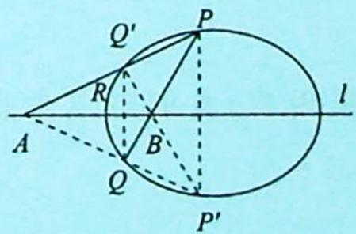

## 22.2 割线的极点极线

## 研究密钥

## 1. 自配极三角形

如图所示, 点 P 是不在圆锥曲线上的点, 过 P 点引两条割线依次交圆锥曲线于四点 E, F, G, H, 连接 EH, FG 交于 N, 连接 EG, FH 交于 M, $\triangle PMN$ 称为自配极三角形.

其中, 直线 MN 为点 P 对应的极线, 直线 PM 为点 N 对应的极线, 直线 PN 为点 M 对应的极线.

## 2. 极点极线的几何意义

(1)如图1所示,当P在圆锥曲线Γ上时,则极线l是曲线Γ在P点处的切线;

(2)如图2所示,当P在Γ外时,则极线l是曲线Γ从点P所引两条切线的切点所确定的直线(即切点弦所在直线);

(3)如图3所示,当P在Γ内时,则极线l是曲线Γ过点P的割线两端点处的切线交点的轨迹.

点在椭圆上
图1

点在椭圆外
图2

点在椭圆内
图3

## 3. 极点在特殊位置的极线方程

(1)我们所熟知的焦点和焦点对应的准线就是常见的一对极点极线.当极点在准线上时

如右图所示,切点弦一定过焦点,且满足 $PF \perp AB$ .

【证明】设 $P(\frac{a^{2}}{c}, y_{0}) \Rightarrow$ 切点弦方程为 $\frac{\frac{a^{2}}{c}x}{a^{2}} + \frac{y_{0}y}{b^{2}} = 1 \Rightarrow \frac{x}{c} + \frac{y_{0}y}{b^{2}} = 1$ ，此直线必过焦点 $F(c, 0)$ .

切点弦方程 $\frac{x}{c}+\frac{y_{0}y}{b^{2}}=1\Leftrightarrow y=-\frac{b^{2}}{cy_{0}}x+\frac{b^{2}}{y_{0}}$ ，所以 $k_{AB}=-\frac{b^{2}}{cy_{0}}$ ，而 $k_{PF}=\frac{y_{0}-0}{\frac{a^{2}}{c}-c}=\frac{y_{0}}{\frac{a^{2}-c^{2}}{c}}=$ $\frac{cy_{0}}{b^{2}}$ ，则 $k_{AB} \cdot k_{PF} = -1$ ，故 $PF \perp AB$ .

(2) 若极点在坐标轴上, 则极线垂直于该坐标轴.

如图所示,设极点 $M(m,0)\Rightarrow\frac{mx}{a^{2}}+\frac{0\cdot y}{b^{2}}=1\Rightarrow x=\frac{a^{2}}{m}$ ; 同理可得当极点为 $N(0,n)$ 时, 极线为 $y=\frac{b^{2}}{n}$ .

我们如何识别极点极线？

特别地, 当极点为 $M(m,0)$ 时, 我们容易发现 $m \cdot \frac{a^2}{m} = a^2$ , 当极点为 $N(0,n)$ 时, 极线为 $y = \frac{b^2}{n}$ , 此时 $n \cdot \frac{b^2}{n} = b^2$ .

注:如果一个点与一条线对应坐标的乘积刚好等于对应轴长的平方,那么这道题目大概率是以极点极线为背景命题的.

(3) 若两条割线对称, 则点 $Q$ 不仅在 $x = \frac{a^2}{m}$ 上, 还在 $x$ 轴上.

两个重要推论：

(1)如图4所示,设点P关于有心圆锥曲线C的调和共轭点为点Q,PQ连线经过圆锥曲线的中心O,且与C交于两点R,R′,则有 $OR^{2}=OP\cdot OQ$ ,反之若有此式成立,则点P与Q关于C调和共轭.

举例: 椭圆 $C: \frac{x^{2}}{8} + \frac{y^{2}}{4} = 1, M(4,0), M, N$ 关于曲线 $C$ 共轭, 则 $N(2,0)$ , 点 $M$ 关于椭圆的极线方程为 $x = 2$ .

图 4

图 5

(2)如图5所示,A,B是圆锥曲线C的一条对称轴l上的两点(不在C上),若A,B关于C调和共轭,过B任作C的一条割线,交C于P,Q两点,则 $\angle PAB=\angle QAB$ .

举例:(2018新课标全国I卷理19)椭圆C: $\frac{x^{2}}{2}+y^{2}=1$ ,过F(1,0)作直线l交曲线C于点P,Q,M(2,0),求证: $\angle PMO=\angle QMO$ .

## 4. 配极性质

(1)如图所示,点 P 关于圆锥曲线 $\Gamma$ 的极线 $l_{1}$ 经过点 $Q \Leftrightarrow$ 点 Q 关于圆锥曲线 $\Gamma$ 的极线 $l_{2}$ 经过点 P;

(2) 直线 $l_{1}$ 关于圆锥曲线 $\Gamma$ 的极点 $P$ 在直线 $l_{2}$ 上 $\Leftrightarrow$ 直线 $l_{2}$ 关于圆锥曲线 $\Gamma$ 的极点 $Q$ 在直线 $l_{1}$ 上. 也就是说, 点 $P$ 和点 $Q$ 是圆锥曲线 $\Gamma$ 的一组调和共轭点.

## 1. 轨迹问题

![[高中/总复习/专题/高考数学培优40讲/高考数学培优40讲-02-解析几何/第22讲_圆锥曲线的命题背景揭秘__极点与极线/22_2_割线的极点极线/例题/Q00019672.md]]
![[高中/总复习/专题/高考数学培优40讲/高考数学培优40讲-02-解析几何/第22讲_圆锥曲线的命题背景揭秘__极点与极线/22_2_割线的极点极线/例题/Q00019673.md]]
![[高中/总复习/专题/高考数学培优40讲/高考数学培优40讲-02-解析几何/第22讲_圆锥曲线的命题背景揭秘__极点与极线/22_2_割线的极点极线/例题/Q00019674.md]]
![[高中/总复习/专题/高考数学培优40讲/高考数学培优40讲-02-解析几何/第22讲_圆锥曲线的命题背景揭秘__极点与极线/22_2_割线的极点极线/例题/Q00019675.md]]
![[高中/总复习/专题/高考数学培优40讲/高考数学培优40讲-02-解析几何/第22讲_圆锥曲线的命题背景揭秘__极点与极线/22_2_割线的极点极线/例题/Q00019676.md]]
