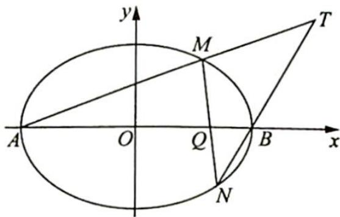

<!-- question-source:start -->
例 22.3 在平面直角坐标系 $xOy$ 中, 如图所示, 已知椭圆 $\frac{x^2}{9} + \frac{y^2}{5} = 1$ 的左、右顶点为 $A$ , $B$ , 右焦点为 $F$ . 设过点 $T(t, m)$ 的直线 $TA, TB$ 与椭圆分别交于点 $M(x_1, y_1), N(x_2, y_2)$ , 其中 $m > 0, y_1 > 0, y_2 < 0$ .

(1) 设动点 P 满足 $PF^{2}-PB^{2}=4$ ，求点 P 的轨迹方程；

(2) 设 $x_{1} = 2, x_{2} = \frac{1}{3}$ , 求点 $T$ 的坐标;

(3) 设 t=9，求证：直线 MN 必过 x 轴上的一定点（其坐标与 m 无关）.
<!-- question-source:end -->

![[高中/总复习/专题/高考数学培优40讲/高考数学培优40讲-02-解析几何/第22讲_圆锥曲线的命题背景揭秘__极点与极线/22_2_割线的极点极线/例题/answers/Q00019673A1.md]]
