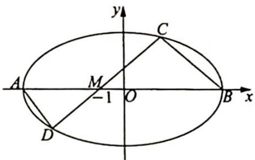

<!-- question-source:start -->
变式(1) 如图所示, $A, B$ 是椭圆 $E: \frac{x^2}{4} + y^2 = 1$ 的左、右顶点, 过点 $M(-1,0)$ 作斜率为 $k (k \neq 0)$ 的直线 $l$ 交椭圆 $E$ 于 $C, D$ 两点, 其中点 $C$ 在 $x$ 轴的上方, 设 $k_1 = k_{AD}, k_2 = k_{BC}$ , 证明: $\frac{k_1}{k_2}$ 为定值.

<!-- question-source:end -->

![[高中/总复习/专题/高考数学培优40讲/高考数学培优40讲-02-解析几何/第22讲_圆锥曲线的命题背景揭秘__极点与极线/22_2_割线的极点极线/例题/answers/Q00019674A1.md]]
