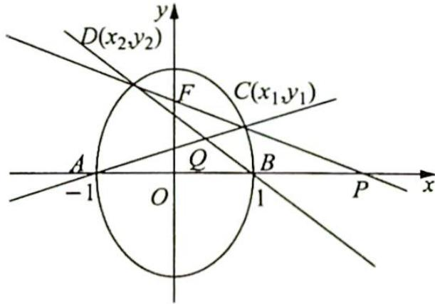

> [!faq]- 《高考数学培优40讲》例题解析
>
> > [!success]- **【答案】** 详见解析
>
> > [!note]- **【分析】**
> > 分析 ▶ (1)由题意可得椭圆方程为 $x^{2}+\frac{y^{2}}{2}=1$ , 设直线 $l$ 的方程为 $y=kx+1$ , 直线方程与椭圆方程联立, 使用弦长公式表示 $|CD|$ , 得到关于 $k$ 的方程, 解出 $k$ 可得直线 $l$ 的方程; (2)由极点极线结论可得极点 $P(-\frac{1}{k},0)$ 对应的极线方程为 $-\frac{x}{k}+\frac{y\cdot0}{2}=1$ , 解得 $x=-k$ , 所以点 $Q$ 的轨迹方程为 $x=-k$ , $\overrightarrow{OP}\cdot\overrightarrow{OQ}=1$ , 只需要证 $x_{Q}=-k$ 即可. 证明方法: 设 $C(x_{1},y_{1})$ , $D(x_{2},y_{2})$ , 表示出直线 $AC$ 和 $BD$ 的方程, 联立可表示出点 $Q$ 的横坐标, 将韦达定理代入满足 $x_{Q}+k=0$ 即可.
>
> > [!note]- **【解析】**
> > 解析 (1)根据题意可得,椭圆的焦点在 y 轴上,设椭圆方程为 $\frac{x^{2}}{a^{2}} + \frac{y^{2}}{b^{2}} = 1 (b > a > 0)$
> > $a = 1, c = 1, b = \sqrt{a^2 + c^2} = \sqrt{2}$ , 所以椭圆方程为 $x^2 + \frac{y^2}{2} = 1$ .
> > 直线 l 过点 $F(0,1)$ ，设其方程为 $y=kx+1$ ，联立 $\left\{\begin{aligned}y&=kx+1\\ x^{2}&+\frac{y^{2}}{2}=1\end{aligned}\right.$ ，可得 $(2+k^{2})x^{2}+2kx-1=0$ ，
> > 由韦达定理可得 $\left\{\begin{aligned}x_{1}+x_{2}&=\frac{-2k}{2+k^{2}}\\ x_{1}x_{2}&=\frac{-1}{2+k^{2}}\end{aligned}\right.$ ， $|CD|=\sqrt{1+k^{2}}\cdot|x_{1}-x_{2}|=\sqrt{1+k^{2}}\cdot\sqrt{(x_{1}+x_{2})^{2}-4x_{1}x_{2}}=$ $\frac{2\sqrt{2}(1+k^{2})}{2+k^{2}}=\frac{3\sqrt{2}}{2}$ ，解得 $k=\pm\sqrt{2}$ ，所以直线 l 的方程为 $y=\sqrt{2}x+1$ 或 $y=-\sqrt{2}x+1$ .
> > (2)椭圆方程为 $x^{2}+\frac{y^{2}}{2}=1$ ，直线 $l: y=kx+1 \Rightarrow P(-\frac{1}{k},0)$ ，猜测 $x_{Q}=-k$ （当极点在坐标轴上时，极点极线乘积等于对应坐标轴的平方），进而有 $\overrightarrow{OP} \cdot \overrightarrow{OQ}=1$ （在此处，我们也可以采取极限思想，如图所示，当 P, C 点无限接近 B 点时，Q 点也无限接近 B 点，此时 $\overrightarrow{OP} \cdot \overrightarrow{OQ}=\overrightarrow{OB^{2}}=1$ ）.
> > 接下来我们只需要证 $x_{Q} = -k$ 即可.
> > 接下来我们只需要证 $x_{Q} = -k$ 即可. 由 $\left\{ \begin{array}{l} l_{AC}: y = \frac{y_1}{x_1 + 1} (x + 1) \\ l_{BD}: y = \frac{y_2}{x_2 - 1} (x - 1) \end{array} \right.$ 消 $y$ 得 $y_{1}(x_{2} - 1)(x + 1) = y_{2}(x_{1} + 1)$ 1) $(x - 1) \Rightarrow x_{Q} = \frac{y_{1}(x_{2} - 1) + y_{2}(x_{1} + 1)}{y_{2}(x_{1} + 1) - y_{1}(x_{2} - 1)}.$
> > 
> > 将 $y = kx + 1$ 代入 $\Rightarrow x_{Q} = \frac{(kx_{1} + 1)(x_{2} - 1) + (kx_{2} + 1)(x_{1} + 1)}{(kx_{2} + 1)(x_{1} + 1) - (kx_{1} + 1)(x_{2} - 1)}\Rightarrow x_{Q} =$ $\frac{2kx_1x_2 + (1 - k)x_1 + (k + 1)x_2}{(1 + k)x_1 + (k - 1)x_2 + 2}$ , 则 $x_{Q} + k = \frac{2kx_{1}x_{2} + (k^{2} + 1)x_{1} + (k^{2} + 1)x_{2} + 2k}{(1 + k)x_{1} + (k - 1)x_{2} + 2} =$ $\frac{2kx_1x_2 + (k^2 + 1)(x_1 + x_2) + 2k}{(1 + k)x_1 + (k - 1)x_2 + 2}$ , 只需证明 $x_{Q} + k = \frac{2kx_{1}x_{2} + (k^{2} + 1)(x_{1} + x_{2}) + 2k}{(1 + k)x_{1} + (k - 1)x_{2} + 2} = 0$ 成立. (韦达定理代入即可) 联立 $\left\{ \begin{array}{l} y = kx + 1 \\ x^2 + \frac{y^2}{2} = 1 \end{array} \right.$ , 可得 $(2 + k^2)x^2 + 2kx - 1 = 0$ , 所以 $\left\{ \begin{array}{l} x_1 + x_2 = \frac{-2k}{2 + k^2} \\ x_1x_2 = \frac{-1}{2 + k^2} \end{array} \right.$ . 代入上式可得 $x_{Q} + k = \frac{2k\cdot\frac{-1}{2+k^{2}}+(k^{2}+1)\cdot\frac{-2k}{2+k^{2}}+2k}{(1+k)x_{1}+(k-1)x_{2}+2} = \frac{\frac{-2k}{2+k^{2}}+\frac{-2k^{3}-2k}{2+k^{2}}+\frac{2k^{3}+4k}{2+k^{2}}}{(1+k)x_{1}+(k-1)x_{2}+2} =$ 0, 即 $x_{Q} = -k$ , 所以 $\overrightarrow{OP}\cdot\overrightarrow{OQ}=1$ , 为定值.
