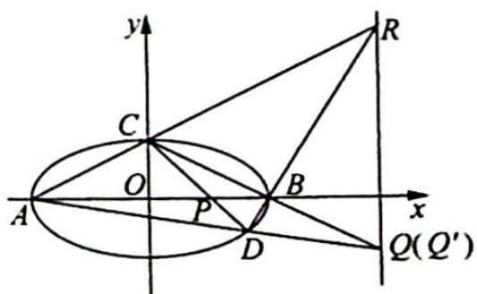

> [!faq]- 《高考数学培优40讲》例题解析
>
> > [!success]- **【答案】** 详见解析
>
> > [!note]- **【分析】**
> > 本题未单列分析。
>
> > [!note]- **【解析】**
> > 解析 (1)由题意可知 $\left\{ \begin{array}{l} b = 1 \\ \frac{c}{a} = \frac{\sqrt{3}}{2} \\ a^2 - b^2 = c^2 \end{array} \right.$ , 解得 $\left\{ \begin{array}{l} a = 2 \\ b = 1 \\ c = \sqrt{3} \end{array} \right.$ , 所以椭圆 $E$ 的方程为 $\frac{x^2}{4} + y^2 = 1$ .
> > (2) 设 $D(x_0, y_0)$ , 则直线 $CD, AD$ 的方程分别为 $y = \frac{y_0 - 1}{x_0} x + 1$ , $y = \frac{y_0}{x_0 + 2}(x + 2)$ .
> > 在直线 $CD$ 的方程中，令 $y = 0$ ，得 $x = \frac{x_0}{1 - y_0}$ ，所以 $P\left(\frac{x_0}{1 - y_0},0\right)$
> > 设 $Q(x_{Q},y_{Q})$ ，则由 $\overrightarrow{OP}\cdot \overrightarrow{OQ} = \left(\frac{x_0}{1 - y_0},0\right)\cdot (x_Q,y_Q) = 4$ ，可得 $x_{Q} = \frac{4(1 - y_{0})}{x_{0}}.$
> > 解法一: 将 $x_{Q}$ 代入直线 AD 的方程, 得 $y_{Q} = \frac{y_{0}}{x_{0} + 2} \cdot \left[ \frac{4(1 - y_{0})}{x_{0}} + 2 \right] = \frac{y_{0}(4 - 4y_{0} + 2x_{0})}{x_{0}(x_{0} + 2)}$ ,
> > $$
> > Q \left(\frac {4 (1 - y _ {0})}{x _ {0}}, \frac {y _ {0} (4 - 4 y _ {0} + 2 x _ {0})}{x _ {0} (x _ {0} + 2)}\right), k _ {B Q} = \frac {\frac {y _ {0} (4 - 4 y _ {0} + 2 x _ {0})}{x _ {0} (x _ {0} + 2)}}{\frac {4 (1 - y _ {0})}{x _ {0}} - 2} = \frac {2 y _ {0} - 2 y _ {0} ^ {2} + x _ {0} y _ {0}}{- 4 y _ {0} - x _ {0} ^ {2} + 4 - 2 x _ {0} y _ {0}}.
> > $$
> > 将 $\frac{x_0^2}{4} + y_0^2 = 1$ ，即 $x_0^2 = 4 - 4y_0^2$ 代入上式得 $k_{BQ} = \frac{2y_0 - 2y_0^2 + x_0y_0}{-4y_0 - x_0^2 + 4 - 2x_0y_0} = \frac{2y_0 - 2y_0^2 + x_0y_0}{-4y_0 + 4y_0^2 - 2x_0y_0} = -\frac{1}{2}$ .
> > 又 $k_{BC} = -\frac{1}{2}$ ，所以 $k_{BQ} = k_{BC}$ ，即 $C,B,Q$ 三点共线.
> > 解法二:如图所示,连接 AC, DB 并延长交于点 R, 连接 CB 并延长 AD, CB 交于点 $Q'$ , 则 $\triangle PRQ'$ 是自配极三角形, 所以直线 $RQ'$ 是点 P 关于椭圆的极线, 其方程为 $\frac{\frac{x_{0}}{1-y_{0}}\cdot x}{4}+0\cdot y=1$ , 即 $x=\frac{4(1-y_{0})}{x_{0}}$ , 所以点 $Q'$ 是直线 AD 和直线 $RQ'$ 的交点.
> > 
> > 因为 $x_{Q}=\frac{4(1-y_{0})}{x_{0}}$ ，所以点 Q 在直线 $RQ'$ 上，又点 Q 在直线 AD 上，所以点 Q 是直线 AD 和直线 $RQ'$ 的交点， $Q', Q$ 两点重合.
> > 故点 Q 在直线 CB 上, 即 C, B, Q 三点共线.
