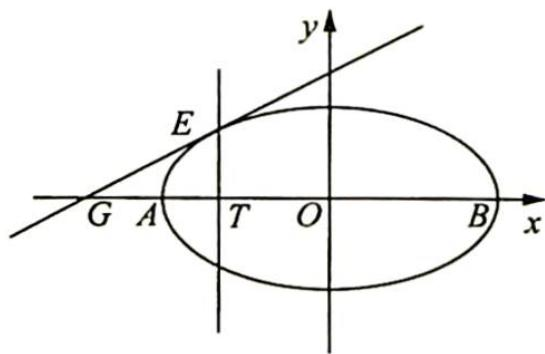

<!-- question-source:start -->
3. 如图所示, 已知椭圆 $C: \frac{x^{2}}{a^{2}} + \frac{y^{2}}{b^{2}} = 1 (a > b > 0)$ 过点 $A(-2,0), B(2,0)$ , 且离心率为 $\frac{1}{2}$ .

(1)求椭圆 C 的方程；

(2)设直线 l 与椭圆 C 有且仅有一个公共点 E，且与 x 轴交于点 $G(E, G$ 不重合）， $ET \perp x$ 轴，垂足为 T。求证： $\frac{|TA|}{|TB|} = \frac{|GA|}{|GB|}$ 。

<!-- question-source:end -->

![[Q00019689A1]]
