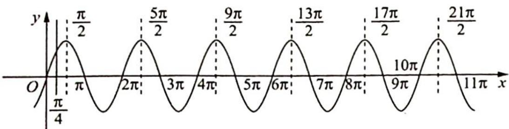
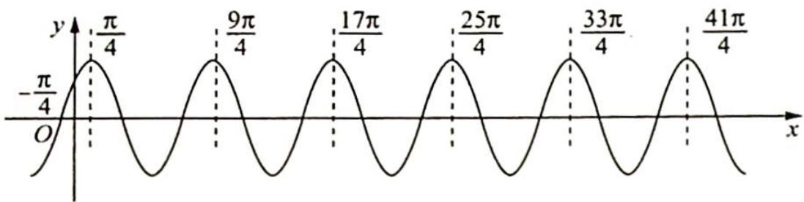
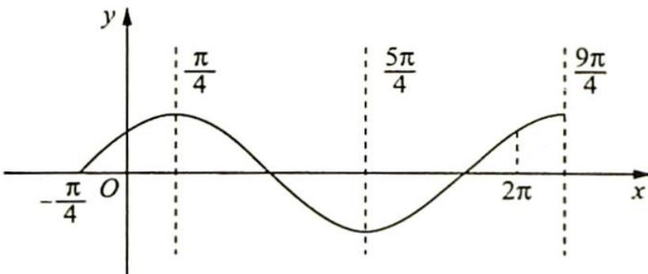
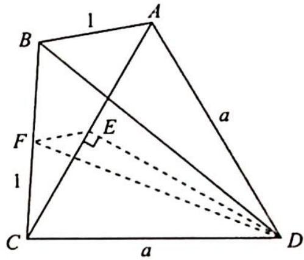
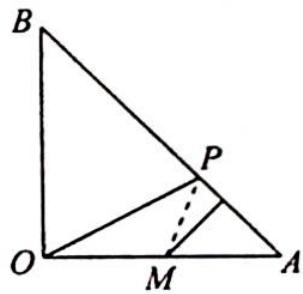
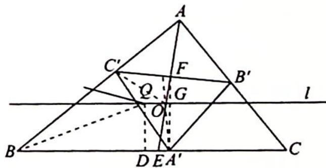

<!-- source-part:1 pages:1-200 -->

# 高考数学 培优40讲

# 三角、向量、数列、不等式与复数

## 内容简介

《高考数学培优 40 讲》针对高考数学中的重难点内容,分为四个分册:函数与导数;解析几何;三角、向量、数列、不等式与复数;立体几何与概率统计.全套书用高观点的视角、联系变化的眼光分析问题,洞悉问题背后的本质,达到“万理归一,大道至简”的境界.

本书为“三角、向量、数列、不等式与复数”分册，重点从数与形两个维度研究三角函数、向量、复数问题，并揭示其内在联系。用构造的思想方法解决不等式最值与证明问题；用类比转化或函数的视角研究数列通项及数列不等式问题。丰富的方法和技巧贯穿始末，精彩纷呈。本书适合数学成绩优秀的学生挑战高分甚至满分使用，也适合高中数学教师、高考数学研究者，以及广大数学爱好者参考使用。

本书封面贴有清华大学出版社防伪标签、封底贴有刮刮卡，无标签和刮刮卡者不得销售。

版权所有,侵权必究.举报:010-62782989,beiqinquan@tup.tsinghua.edu.cn.

图书在版编目(CIP)数据

高考数学培优 40 讲. 三角、向量、数列、不等式与复数/张永辉主编. — 北京: 清华大学出版社, 2023.5
ISBN 978-7-302-63446-1

I. ①高… Ⅱ. ①张… Ⅲ. ①中学数学课—高中—升学参考资料 Ⅳ. ①G634.603

中国国家版本馆 CIP 数据核字(2023)第 081412 号

责任编辑: 汪 操

封面设计:常雪影

责任校对:王淑云

责任印制:丛怀宇

出版发行:清华大学出版社

网址:http://www.tup.com.cn,http://www.wqbook.com

地址:北京清华大学学研大厦 A 座 邮编:100084

社总机:010-83470000 邮购:010-62786544

投稿与读者服务:010-62776969, c-service@tup.tsinghua.edu.cn

质量反馈:010-62772015,zhiliang@tup.tsinghua.edu.cn

印装者:三河市龙大印装有限公司

经销:全国新华书店

开 本:210mm×285mm

印 张：15.25

字 数:318 千字

版次:2023年5月第1版

定 价:69.00元

印 次:2023年5月第1次印刷

产品编号:099104-01

# 《高考数学培优 40 讲》编委会

主 编

张永辉

副主编

张宏卫 余臣

## 编 委

彭剑平 章世骏 蒋新峰 高艳山 张喜金 李拴柱

何龙 董家兴 周逸飞 于明辉 孙光磊 黄垠超

袁 志 颜亚冰 张 潇 李明红 赵晓翠 李艳丽

## 前言

《高考数学培优 40 讲》是一套诞生于新高考时代,面向数学培优的教辅作品.

自 2017 年教育部实行新课程标准以来,我国高中数学的教学和考试发生了根本性的变化.新课程标准明确提出将“学科素养”作为培养人、选拔人的最重要指标,无论是教学还是考试都贯穿“基础性、综合性、创新性和应用性”四大特征,这意味着未来的数学考题,将从偏重经验归纳,转向加强思维品质考查,加强考查思维的灵活性,发挥数学学科的高考选拔功能.如何在教学中渗透对数学思维的培养?这对广大教师和学生提出了新的要求.

2019 年起新教材在部分省市被陆续使用. 由于各地教学规划不同, 近几年出现了新教材新高考、老教材老高考、新教材老高考等多种教学现状, 这无疑进一步增加了教学备考的复杂度. 与此同时, 数学高考也从过去的多省市独自命题, 逐步转向教育部统一命题. 随着山东省、江苏省、浙江省等一大批高考强省陆续加入全国卷的队伍, 高考大军竞争异常激烈.

在过去的两年中,我们团队的老师们深入全国10多个省份,陆续为接近100所重点高中作了300多场数学培优讲座.在与广大一线师生的交流中,很多教师最关心的问题就是:“未来高考会怎么考,我们的数学课堂该如何教,高考培优应该讲什么?”由此可见,在新的时代背景下,如何能组织好教学过程,真正培养出国家需要的人才,让学生具备较高的数学素养,进而在高考中脱颖而出,成为了最核心的问题.

这套书最大的亮点就是完全出自教学实践。由于我们的课程是面向数学功底较好的学生开展进行，所以在300多场讲座中经历了无数次教师和学生之间、学生和学生之间的思想交锋。甚至在一些互动交流过程中，出现了学生和老师分成不同阵营，相互辩论的场面。而每一次的交流辩论都让我们更加接近数学解题的本质，更加明白数学培优课程应该讲什么、怎么讲。所以书中的内容既包含了团队老师的辛勤付出，也包含了很多一线教师和数学尖子生的集体智慧。综上所述，本套图书的内容不是一蹴而就的，它经历了原创研发——教学实践——反思优化，再教学实践——反思优化……这样一个又一个的轮回，在这样螺旋式上升的迭代过程中，内容的质量与实用性都达到了我们前所未有的高度。

本套图书的另一大亮点便是其深邃的思想性,主要体现在以下几个方面:

## 1. 启迪智慧, 知所以然

好的教育永远都不是告知,而是启发引导.在本套讲义的编写过程中充分尊重了这一规律,例如通过分而治之的策略拆分函数实现不等式证明时,我们没有止步于题目本身的解答,而是设置了一系列的问题进行反思,甚至陪同读者一起走过错路与弯路,在知识的探索与内化过程中,这些都是必经之路,通过抛出一系列的问题,引导学生的思维步步深入,达到知其然也知其所以然的境界.

## 2. 深入本质, 返璞归真

比勤奋更重要的是深度思考的能力,在纷繁复杂的题目背后抽丝剥茧或追本溯源以接近问题的本质,这是数学精神,也是在书中带领并帮助读者习得的一项能力.例如在解析几何的开篇,讲义一针见血地点明了数与形的辩证关系,即以形助数和以数化形,抓住这一本源如同获取一把钥匙.大道至简,衍化至繁,本套图书一直在通往“道”的层面上前进不息.

## 3. 引申触类, 远见卓识

在学习过程中,有纵向的“深”与横向的“伸”两个维度,本书兼顾这两个维度并加以挖掘和拓展.在许多例题后面设置了探究总结等版块,引申出了更多的定理与推论,它们将带领读者进入一个更广阔的领域.

## 4. 高数视角, 知己知彼

会当凌绝顶,一览众山小.当我们身处高一级的层面,再反观原有的层面时,我们会发现问题的布局或背景等原来看不到的事物.本书中有的内容,例如泰勒展开、极点极线等专题就是在高等数学的视角下来俯视问题,进入命题人的思维,这样真是知己知彼,百战不殆.

《高考数学培优 40 讲》共含《函数与导数》《解析几何》《三角、向量、数列、不等式与复数》以及《立体几何与概率统计》四本分册。从初稿到出版，我们不断在教学实践中调整、完善，历经了四个版本的迭代，积极采纳各方意见，数易其稿。同时，为了满足部分尖子生的学习需要，我们在内容编写的过程中，有选择地加入了一定比例的清北强基考试题目。这部分题目与高考题目相结合，呈现出更加完整且富于变化的知识体系，对培养数学思维能力和综合能力大有裨益。

在本书的创作过程中,团队的老师们付出了很多,感谢张宏卫、余臣、孙光磊、李艳丽、张潇等各位老师的不懈努力,也感谢清华大学出版社给予的大力支持.

路漫漫其修远兮，吾将上下而求索。

在追求教学创新和培优精进的道路上,注定没有尽头.限于编写水平有限,书中错漏难免.欢迎各位读者帮我们纠正错误,我们也将在后续版本中不断修订、调整.

张永辉

2023年1月

## 目录

第23讲 三角函数的图像与性质 …… 1
三角函数图像的变换及应用 …… 2
23.1 三角函数解析式 …… 2
23.2 ω 的范围 …… 4
23.3 φ 的范围 …… 11
23.4 转化中枢——对称性 …… 13
含三角函数的复合函数 …… 17
23.5 探究含三角函数的函数性质 …… 17
训练 23 …… 19
第24讲 三角恒等变换 …… 21
三角恒等变换求值 …… 22
24.1 三角恒等式的应用 …… 22
三角形中的三角恒等变换 …… 31
24.2 三角形形状的判定 …… 31
24.3 三角形中恒等式与不等式 …… 34
训练 24 …… 38
第25讲 解三角形 …… 39
25.1 解的个数 …… 40
25.2 边角互化判定形状 …… 42
25.3 三角形中的最值 …… 44
25.4 四边形问题 …… 52
训练 25 …… 56
第26讲 平面向量等值线模型与常见恒等式 …… 58
等值线模型 …… 59
26.1 等和线 …… 59

26.2 等差线 …… 64
26.3 等商线 …… 67
平面向量中的常见恒等式 …… 69
26.4 极化恒等式 …… 69
26.5 向量数乘余弦定理 …… 76
26.6 对角线向量定理 …… 77
训练 26 …… 79
第 27 讲 平面向量运算的不同境界 …… 81
27.1 从数与形看向量运算 …… 82
训练 27 …… 90
第 28 讲 三角形的四心 …… 93
奔驰定理及其应用 …… 94
28.1 “四心”定理及其推论 …… 94
28.2 奔驰定理的应用 …… 97
三角形四心的判定与性质 …… 99
28.3 外心问题 …… 99
28.4 内心问题 …… 102
28.5 垂心问题 …… 104
28.6 重心问题 …… 105
欧拉线及其应用 …… 107
28.7 欧拉线定理 …… 107
28.8 欧拉线的应用 …… 109
训练 28 …… 114
第 29 讲 复数的运算与 n 次方根 …… 116
复数运算与 n 次方根 …… 117
29.1 复数的代数运算 …… 119
29.2 复数三角形式的运算与几何意义 …… 120
29.3 复数模的最值问题 …… 123
29.4 三次单位根与 n 次单位根 …… 128
训练 29 …… 131

第30讲 基本不等式 …… 133
最值问题 …… 134
30.1 常值(等量)代换 …… 134
30.2 配凑变形 …… 136
30.3 轮换对称法 …… 141
不等式证明 …… 145
30.4 证明轮换对称不等式 …… 145
30.5 常数配凑证明不等式 …… 147
30.6 均值不等式串及其应用 …… 148
训练 30 …… 150
第31讲 柯西不等式 …… 153
柯西不等式及其变形 …… 154
31.1 二维及n维柯西不等式的多角度证明 …… 154
柯西不等式的应用 …… 158
31.2 最值问题 …… 159
31.3 证明不等式 …… 162
训练 31 …… 169
第32讲 由递推数列求通项公式 …… 171
递推关系 $a_{n+1}-a_n=d$ 的拓展 …… 172
32.1 角度1: $d\to f(n)$ …… 172
32.2 角度2: “−”→“+”“×”“÷” …… 174
32.3 角度3: $a_n\to f(a_n)$ …… 177
32.4 角度4: “=”→“<”“>“≤”“≥”“≡” …… 179
32.5 角度5: 变换系数 …… 181
其他的几种递推数列的处理方法 …… 182
32.6 含 $S_n$ 和 $a_n$ 关系式的递推数列 …… 182
32.7 常系数线性递推数列 …… 184
32.8 分式型递推数列 …… 185
训练 32 …… 188

第33讲 数列不等式的综合 …… 190
33.1 $\sum_{i=1}^{n}a_{i} < (>)f(n)$ 及 $\prod_{i=1}^{n}a_{i} < (>)f(n)$ 型不等式的证明 …… 191
33.2 $\sum_{i=1}^{n}a_{i} < (>)C$ 及 $\prod_{i=1}^{n}a_{i} < (>)C(C$ 为常数）型不等式的证明 …… 195
训练 33 …… 202
参考答案 …… 205

![[高中/总复习/专题/高考数学培优40讲/高考数学培优40讲-03-三角、向量、数列、不等式与复数/第23讲_三角函数的图像与性质/第23讲_三角函数的图像与性质.md]]
![[高中/总复习/专题/高考数学培优40讲/高考数学培优40讲-03-三角、向量、数列、不等式与复数/第24讲_三角恒等变换/第24讲_三角恒等变换.md]]
![[高中/总复习/专题/高考数学培优40讲/高考数学培优40讲-03-三角、向量、数列、不等式与复数/第25讲_解三角形/第25讲_解三角形.md]]
![[高中/总复习/专题/高考数学培优40讲/高考数学培优40讲-03-三角、向量、数列、不等式与复数/第26讲_平面向量等值线模型与常见恒等式/第26讲_平面向量等值线模型与常见恒等式.md]]
![[高中/总复习/专题/高考数学培优40讲/高考数学培优40讲-03-三角、向量、数列、不等式与复数/第_27_讲_平面向量运算的不同境界/第_27_讲_平面向量运算的不同境界.md]]
![[高中/总复习/专题/高考数学培优40讲/高考数学培优40讲-03-三角、向量、数列、不等式与复数/第_28_讲_三角形的四心/第_28_讲_三角形的四心.md]]
![[高中/总复习/专题/高考数学培优40讲/高考数学培优40讲-03-三角、向量、数列、不等式与复数/第_29_讲_复数的运算与_n_次方根/第_29_讲_复数的运算与_n_次方根.md]]
![[高中/总复习/专题/高考数学培优40讲/高考数学培优40讲-03-三角、向量、数列、不等式与复数/第30讲_基本不等式/第30讲_基本不等式.md]]
![[高中/总复习/专题/高考数学培优40讲/高考数学培优40讲-03-三角、向量、数列、不等式与复数/第31讲_柯西不等式/第31讲_柯西不等式.md]]
![[高中/总复习/专题/高考数学培优40讲/高考数学培优40讲-03-三角、向量、数列、不等式与复数/第32讲_由递推数列求通项公式/第32讲_由递推数列求通项公式.md]]
![[高中/总复习/专题/高考数学培优40讲/高考数学培优40讲-03-三角、向量、数列、不等式与复数/第33讲_数列不等式的综合/第33讲_数列不等式的综合.md]]
![[高中/总复习/专题/高考数学培优40讲/高考数学培优40讲-03-三角、向量、数列、不等式与复数/参考答案/参考答案.md]]

## 训练 23

1.【解析】解法一: 当 $x \in [0, \pi]$ 时, $\omega x - \frac{\pi}{3} \in \left[-\frac{\pi}{3}, \pi \omega - \frac{\pi}{3}\right]$ .

又 $f(x)$ 值域为 $\left[\frac{1}{2}, 1\right]$ , $f(0) = \cos \left(-\frac{\pi}{3}\right) = \frac{1}{2}$ , 所以 $0 \leqslant \pi \omega - \frac{\pi}{3} \leqslant \frac{\pi}{3}$ , 即 $\frac{1}{3} \leqslant \omega \leqslant \frac{2}{3}$ , 故选 A.

解法二:根据图像可得 $y=\cos\left(x-\frac{\pi}{3}\right)$ 的值域为 $\left[\frac{1}{2},1\right]$ . 若左端点横坐标为 0, 则右端点横坐标位于 $\frac{\pi}{3}$ 和 $\frac{2\pi}{3}$ 之间, 根据题意可得伸缩变换至少将 $\frac{\pi}{3}$ 变换至 $\pi$ , 至多将 $\frac{2\pi}{3}$ 经变换至 $\pi$ , 所以 $\omega\geqslant\frac{\frac{\pi}{3}}{\pi}=\frac{1}{3}, \omega\leqslant\frac{\frac{2\pi}{3}}{\pi}=\frac{2}{3}$ .
则 $\frac{1}{3}\leqslant\omega\leqslant\frac{2}{3}$ ，故选A.

2.【解析】设 $f_{1}(x)=\sin\left(x-\frac{\pi}{4}\right)$ ，其图像如图所示.

若函数图像伸长,则 $f(x)$ 在 $(1,2)$ 上单调递增,与题意不符,舍去.

若函数图像缩短，则 $\frac{3\pi}{4} \xrightarrow{\min} 1$ （取不到），此时 $\omega_{\max} = \frac{3\pi}{4}, \frac{3\pi}{4} \xrightarrow{\max}$

2(取不到), $\omega_{\min}=\frac{3\pi}{8}$ ,因此 $\frac{3\pi}{8}<\omega<\frac{3\pi}{4}$ .

或 $\frac{7\pi}{4} \xrightarrow{\min} 1$ (取不到), $\omega_{\max} = \frac{7\pi}{4}, \frac{7\pi}{4} \xrightarrow{\max} 2$ (取不到), $\omega_{\min} = \frac{7\pi}{8}$ , 此时 $\frac{7\pi}{8} < \omega < \frac{7\pi}{4}$ .

或 $\frac{11\pi}{4}\xrightarrow{\min}1$ （取不到）， $\omega_{\mathrm{max}} = \frac{11\pi}{4},\frac{11\pi}{4}\xrightarrow{\max}2$ （取不到）， $\omega_{\mathrm{min}} = \frac{11\pi}{8}$ ，则 $\frac{11\pi}{8} <  \omega <  \frac{11\pi}{4},\dots ,$ 依次类推.

综上所述， $\omega$ 的取值范围为 $\frac{3\pi}{8} <  \omega <  \frac{3\pi}{4}$ 或 $\omega >\frac{7\pi}{8}$ ，故选B.

3.【解析】解法一(代数法): $x \in [0,1]$ , 则 $\omega x + \frac{\pi}{4} \in \left[\frac{\pi}{4}, \omega + \frac{\pi}{4}\right]$ , 由图1可得函数 $f(x)$ 能取得到5个最大值点的区间是 $\left[\frac{17\pi}{2}, \frac{21\pi}{2}\right)$ , 所以 $\frac{17\pi}{2} \leqslant \omega + \frac{\pi}{4} < \frac{21\pi}{2}$ , 即 $\frac{33\pi}{4} \leqslant \omega < \frac{41\pi}{4}$ , 故选C.

解法二(几何法):

图1

图2

根据图2可得 $y = 2\sin \left(x + \frac{\pi}{4}\right)$ 在 $y$ 轴右侧的第5个最大值在 $x = \frac{33\pi}{4}$ 处取得，第6个最大值在 $x = \frac{41\pi}{4}$ 取得，由题意可得经压缩将 $\frac{33\pi}{4} \xrightarrow{\max} 1$ （取得到）， $\omega_{\min} = \frac{33\pi}{4}$ ； $\frac{41\pi}{4} \xrightarrow{\min} 1$ （取不到）， $\omega_{\max} = \frac{41\pi}{4}$ ，所以 $\frac{33\pi}{4} \leqslant \omega < \frac{41\pi}{4}$ ，故选C.

4.【解析】解法一:令 $t=\omega x+\frac{\pi}{4}$ ，因为 $x\in[0,2\pi]$ ， $\omega>0$ ，所以 $t\in\left[\frac{\pi}{4},2\omega\pi+\frac{\pi}{4}\right]$ ，结合 $y=\sin t$ 的图像得 $\frac{3\pi}{2}<2\omega\pi+\frac{\pi}{4}\leqslant\frac{5\pi}{2}$ ，解得 $\frac{5}{8}<\omega\leqslant\frac{9}{8}$ .

解法二(几何法): 令 $\omega=1$ , 得 $f_{1}(x)=\sin\left(x+\frac{\pi}{4}\right)$ , 其图像如图所示.

若 $f(x) = \sin \left(\omega x + \frac{\pi}{4}\right)$ 在 $[0, 2\pi]$ 上恰有两个极值点，则 $\frac{5\pi}{4} \xrightarrow{\max} 2\pi$ （取不到），且 $\frac{9\pi}{4} \xrightarrow{\min} 2\pi$ （取得到），因此 $\frac{\frac{5\pi}{4}}{2\pi} < \omega \leqslant \frac{\frac{9\pi}{4}}{2\pi}$ ，即 $\frac{5}{8} < \omega \leqslant \frac{9}{8}$ .

5.【解析】依题意可得 $\frac{\pi}{2} = \frac{T}{4}(2k - 1)(k\in \mathbf{N}^*)$ ，即 $T = \frac{2\pi}{2k - 1} (k\in \mathbf{N}^*)$

又 $f(x)$ 在区间 $\left(-\frac{\pi}{12}, \frac{\pi}{24}\right)$ 上有最小值无最大值，则 $\frac{\pi}{24} - \left(-\frac{\pi}{12}\right) \leqslant T$ ，即 $T \geqslant \frac{\pi}{8}$ ，因此 $\frac{\pi}{2} \leqslant 4T$ ，所以 $\frac{\pi}{2} = \frac{T}{4}$ ， $\frac{3T}{4}, \frac{5T}{4}, \frac{7T}{4}, \frac{9T}{4}, \frac{11T}{4}, \frac{13T}{4}, \frac{15T}{4}$ 等.

若 $\frac{\pi}{2} = \frac{15T}{4}$ 则 $T = \frac{2\pi}{15} = \frac{2\pi}{\omega}$ 可得 $\omega = 15$

$f(x) = \sin (15x + \varphi)$ 且 $f\left(-\frac{\pi}{4}\right) = \sin \left(-\frac{15\pi}{4} +\varphi\right) = 0$ ，得 $\varphi -\frac{15\pi}{4} = k\pi (k\in \mathbf{Z}),\varphi = k\pi +\frac{15\pi}{4}\in \left[-\frac{\pi}{2},\frac{\pi}{2}\right],$ 令 $k = -4,\varphi = -\frac{\pi}{4}$ ，则 $f(x) = \sin \left(15x - \frac{\pi}{4}\right).$

当 $-\frac{\pi}{12} < x < \frac{\pi}{24}$ 时， $-\frac{3\pi}{2} < 15x - \frac{\pi}{4} < \frac{3\pi}{8}$ ，函数 $f(x) = \sin \left(15x - \frac{\pi}{4}\right)$ 在 $\left(-\frac{\pi}{12}, \frac{\pi}{24}\right)$ 上有最小值无最大值，因此 $\omega = 15$ 满足题意，故选 C.

6.【解析】抓住对称性与周期和单调性与周期的关系.

由题意得 $\frac{3\pi}{8} + \frac{\pi}{8} = \frac{\pi}{2} = \frac{T}{4}(2k - 1)(k \in \mathbb{N}^*)$ ，且 $\frac{\pi}{24} + \frac{\pi}{12} = \frac{\pi}{8} \leqslant \frac{T}{2}$ ，可得 $T \geqslant \frac{\pi}{4}$ ，所以零点与对称轴之间的距离小于 $2T$ ，则满足题意的有 $\frac{T}{4}, \frac{3T}{4}, \frac{5T}{4}, \frac{7T}{4}$ .

$$
\frac {\pi}{2} = \frac {7 T}{4}
$$

$$
T = \frac {2 \pi}{7} = \frac {2 \pi}{\omega}
$$

$$
\omega = 7
$$

验证 $f(x)$ 是否在区间 $\left(-\frac{\pi}{12}, \frac{\pi}{24}\right)$ 上单调，对称轴 $x = \frac{3\pi}{8}$ 向左平移 $\frac{3T}{2}$ 即可得到 $\frac{3\pi}{8} - \frac{3\pi}{7} = -\frac{3\pi}{56} \in$ $\left(-\frac{\pi}{12}, \frac{\pi}{24}\right)$ ，不满足 $f(x)$ 在 $\left(-\frac{\pi}{12}, \frac{\pi}{24}\right)$ 上单调，故舍去.

$$
\frac {\pi}{2} = \frac {5 T}{4}
$$

$$
T = \frac {2 \pi}{5} = \frac {2 \pi}{\omega}
$$

$$
\omega = 5
$$

验证 $f(x)$ 是否在区间 $\left(-\frac{\pi}{12}, \frac{\pi}{24}\right)$ 上单调，对称轴 $x = \frac{3\pi}{8}$ 向左平移一个周期，则 $\frac{3\pi}{8} - \frac{2\pi}{5} = -\frac{\pi}{40} \in$ $\left(-\frac{\pi}{12}, \frac{\pi}{24}\right)$ ，不满足 $f(x)$ 在 $\left(-\frac{\pi}{12}, \frac{\pi}{24}\right)$ 上单调，故舍去.

③若 $\frac{\pi}{2} = \frac{3T}{4}$ , 则 $T = \frac{2\pi}{3}$ , 此时 $\omega = 3$ , 验证 $f(x)$ 是否在区间 $\left(-\frac{\pi}{12}, \frac{\pi}{24}\right)$ 上单调, 将 $x = \frac{3\pi}{8}$ 向左平移 $\frac{1}{2}$ 个周期, 得 $x = \frac{3\pi}{8} - \frac{\pi}{3} = \frac{\pi}{24}$ ; 将 $x = \frac{3\pi}{8}$ 向左平移一个周期, 得 $x = \frac{3\pi}{8} - \frac{2\pi}{3} = -\frac{7\pi}{24} < -\frac{\pi}{12}$ .

$$
\left(- \frac {\pi}{1 2}, \frac {\pi}{2 4}\right)
$$

$$
\omega = 3
$$

④若 $\frac{\pi}{2} = \frac{T}{4}$ , 则 $T = 2\pi$ , 此时 $\omega = 1$ , 验证 $f(x)$ 是否在区间 $\left(-\frac{\pi}{12}, \frac{\pi}{24}\right)$ 上单调, 将 $x = \frac{3\pi}{8}$ 向左平移 $\frac{T}{2}$ , 得 $x = \frac{3\pi}{8} - \pi = -\frac{5\pi}{8} < -\frac{\pi}{12}$ , 所以 $f(x)$ 在 $\left(-\frac{\pi}{12}, \frac{\pi}{24}\right)$ 上单调.

若 $\omega = 1, f(x) = \sin (x + \varphi), f\left(-\frac{\pi}{8}\right) = \sin \left(\varphi - \frac{\pi}{8}\right) = 0$ ，且 $|\varphi| < \frac{\pi}{2}$ ，可得 $\varphi = \frac{\pi}{8}$ ，所以 $f(x) = \sin \left(x + \frac{\pi}{8}\right)$ ， $f(0) = \sin \frac{\pi}{8}, f\left(\frac{3\pi}{4}\right) = \sin \frac{7\pi}{8} = f(0)$ .

若 $\omega = 3, f(x) = \sin (3x + \varphi), f\left(-\frac{\pi}{8}\right) = \sin \left(\varphi - \frac{3\pi}{8}\right) = 0$ ，且 $|\varphi| < \frac{\pi}{2}$ ，可得 $\varphi = \frac{3\pi}{8}$ ，所以 $f(x) = \sin \left(3x + \frac{3\pi}{8}\right) = \sin \left[3\left(x + \frac{\pi}{8}\right)\right], f(0) = \sin \frac{3\pi}{8}, f\left(\frac{3\pi}{4}\right) = \sin \frac{21\pi}{8} = \sin \frac{5\pi}{8} = f(0)$ . 因此，对于 $\omega = 1$ 或 $\omega = 3$ 而言， $f(0) = f\left(\frac{3\pi}{4}\right), \omega$ 的值只能为 1 或 3，此时 $f(x)$ 均不为偶函数，A 错误.

综上所述,故选 BCD.

7.【解析】 $f(-x)=\cos|-x|+|\cos(-x)|=\cos|x|+|\cos x|=f(x)$ ，所以 $f(x)$ 是偶函数，故①正确；当 $x\in$ $\left(-\frac{\pi}{2},0\right)$ 时， $f(x)=\cos x+\cos x=2\cos x$ ，此时 $f(x)$ 在 $\left(-\frac{\pi}{2},0\right)$ 单调递增，故②正确；当 $x\in\left[\frac{\pi}{2},\pi\right]$ 时， $f(x)=\cos x-\cos x=0$ ，此时有无数个零点，故③错误；当 $x>0$ 时， $f(x)=\cos x+|\cos x|\leqslant|\cos x|+\left|\cos x\right|\leqslant2$ ，当 $x=2k\pi(k\geqslant0,k\in\mathbf{Z})$ 时等号成立，又因为 $f(x)$ 是偶函数，所以 $f(x)$ 的最大值为 2，故④正确。综上所述，正确结论的序号有①②④，故选 A.

8.【解析】令 $\omega=1, f(x)=A\sin x$ ，运用图像伸缩变换， $x=\frac{199\pi}{2}\xrightarrow{\max}\pi$ （取得到），则 $\omega_{\min}=\frac{199}{2}$ ，所以 $\omega$ 的最小值为 $\frac{199}{2}$ .

## 训练 24

1.【解析】解法一:由已知得 $\sin \alpha \cos \beta + \cos \alpha \sin \beta + \cos \alpha \cos \beta - \sin \alpha \sin \beta = 2 (\cos \alpha - \sin \alpha) \sin \beta$ , 即 $\sin \alpha \cos \beta - \cos \alpha \sin \beta + \cos \alpha \cos \beta + \sin \alpha \sin \beta = 0, \sin (\alpha - \beta) + \cos (\alpha - \beta) = 0$ , 所以 $\tan (\alpha - \beta) = -1$ . 故选 D.

解法二（从角的关系入手）： $\sin (\alpha +\beta) + \cos (\alpha +\beta) = 2\sqrt{2}\cos \left(\alpha +\frac{\pi}{4}\right)\sin \beta$ ，得 $\sqrt{2}\sin \left(\alpha +\beta +\frac{\pi}{4}\right) =$ $2\sqrt{2}\cos \left(\alpha +\frac{\pi}{4}\right)\sin \beta$ ，即 $\sin \left[\left(\alpha +\frac{\pi}{4}\right) + \beta \right] = 2\cos \left(\alpha +\frac{\pi}{4}\right)\sin \beta ,\sin \left(\alpha +\frac{\pi}{4}\right)\cos \beta = \cos \left(\alpha +\frac{\pi}{4}\right)\sin \beta$ ，故 $\tan \left(\alpha +\frac{\pi}{4}\right) = \tan \beta$ ，所以 $\alpha +\frac{\pi}{4} = \beta +k\pi (k\in \mathbf{Z})$ ，即 $\alpha -\beta = k\pi -\frac{\pi}{4}(k\in \mathbf{Z})$ ，得 $\tan (\alpha -\beta) = \tan \left(k\pi -\frac{\pi}{4}\right) =$ -1.故选D.

2.【解析】因为 $\sin^{2}A + \sin^{2}B + \sin^{2}C = 2$ ，所以 $\cos^{2}A + \cos^{2}B - \sin^{2}(A + B) = 0$ .

$$
\begin{array}{r l} {\text {而} \cos^ {2} A + \cos^ {2} B - \sin^ {2} (A + B) = \cos^ {2} A + \cos^ {2} B - (\sin^ {2} A \cos^ {2} B + 2 \sin A \cos B \cdot \cos A \sin B + \cos^ {2} A \sin^ {2} B)} \\ & {= \cos^ {2} A (1 - \sin^ {2} B) + \cos^ {2} B (1 - \sin^ {2} A) - 2 \sin A \cos B \cdot \cos A \sin B} \\ & {= 2 \cos^ {2} A \cos^ {2} B - 2 \sin A \cos B \cdot \cos A \sin B} \\ & {= 2 \cos A \cos B (\cos A \cos B - \sin A \sin B)} \\ & {= 2 \cos A \cos B \cos (A + B) = - 2 \cos A \cos B \cos C.} \end{array}
$$

故 $-2\cos A\cos B\cos C = 0$ ，则 $\cos A, \cos B, \cos C$ 中必有一个为 $0$ ，即 $A, B, C$ 中必有一个为 $\frac{\pi}{2}$ ，所以 $\triangle ABC$ 为直角三角形。

①若 $A=\frac{\pi}{2}$ ，则 $\cos A+\cos B+2\cos C=\cos B+2\sin B=\sqrt{5}\sin(B+\varphi)$ ，其中 $\tan\varphi=\frac{1}{2}$ ， $\cos A+\cos B+2\cos C$ 的最大值为 $\sqrt{5}$ .

②若 $B=\frac{\pi}{2}$ ，同理， $\cos A+\cos B+2\cos C$ 的最大值为 $\sqrt{5}$ .

③若 $C = \frac{\pi}{2}$ , 则 $\cos A + \cos B + 2\cos C = \cos A + \sin A = \sqrt{2}\cos \left(A - \frac{\pi}{4}\right) \leqslant \sqrt{2}$ .

综上所述, $\cos A+\cos B+2\cos C$ 的最大值为 $\sqrt{5}$ ，故选B.

$$
\begin{array}{r l} & {\mathrm{3.【解析】} \tan 1 5 ^ {\circ} + 2 \sqrt {2} \sin 1 5 ^ {\circ} = \frac {\sin 1 5 ^ {\circ}}{\cos 1 5 ^ {\circ}} + 2 \sqrt {2} \sin 1 5 ^ {\circ}} \\ & {\qquad = \frac {\sin 1 5 ^ {\circ} + \sqrt {2} \sin 3 0 ^ {\circ}}{\cos 1 5 ^ {\circ}}} \\ & {\qquad = \frac {\sin 1 5 ^ {\circ} + \sqrt {2} \sin (4 5 ^ {\circ} - 1 5 ^ {\circ})}{\cos 1 5 ^ {\circ}}} \\ & {\qquad = \frac {\sin 1 5 ^ {\circ} + \sqrt {2} \left(\frac {\sqrt {2}}{2} \cos 1 5 ^ {\circ} - \frac {\sqrt {2}}{2} \sin 1 5 ^ {\circ}\right)}{\cos 1 5 ^ {\circ}}} \\ & {\qquad = \frac {\cos 1 5 ^ {\circ}}{\cos 1 5 ^ {\circ}}} \\ & {\qquad = 1.} \end{array}
$$

4.【解析】由 $\alpha,\beta\in\left(\frac{3\pi}{4},\pi\right)$ , $\cos(\alpha+\beta)=\frac{4}{5}$ 得 $\sin(\alpha+\beta)=-\frac{3}{5}$ .

因为 $\sin \left(\alpha -\frac{\pi}{4}\right) = \frac{12}{13}$ ，所以 $\cos \left(\alpha -\frac{\pi}{4}\right) = -\frac{5}{13}$ ，则 $\cos \left(\beta +\frac{\pi}{4}\right) = \cos \left[(\alpha +\beta) - \left(\alpha -\frac{\pi}{4}\right)\right] =$ $\cos (\alpha +\beta)\cos \left(\alpha -\frac{\pi}{4}\right) + \sin (\alpha +\beta)\sin \left(\alpha -\frac{\pi}{4}\right) = -\frac{56}{65}.$

5.【解析】由 $\sin\alpha+\sqrt{3}\sin\beta=1$ 和 $\cos\alpha+\sqrt{3}\cos\beta=\sqrt{3}$ 得 $\sin^{2}\alpha+3\sin^{2}\beta+2\sqrt{3}\sin\alpha\sin\beta=1,\cos^{2}\alpha+3\cos^{2}\beta+2\sqrt{3}\cos\alpha\cos\beta=3.$

将两式相加得 $4+2\sqrt{3}\cos(\alpha-\beta)=4$ ，所以 $\cos(\alpha-\beta)=0$ 。

6.【解析】原式 $= \cos \frac{\pi}{11} +\cos \frac{3\pi}{11} +\cos \frac{5\pi}{11} +\cos \frac{7\pi}{11} +\cos \frac{9\pi}{11}$ $= \frac{2\sin\frac{\pi}{11}\left(\cos\frac{\pi}{11} + \cos\frac{3\pi}{11} + \cos\frac{5\pi}{11} + \cos\frac{7\pi}{11} + \cos\frac{9\pi}{11}\right)}{2\sin\frac{\pi}{11}}$ $= \frac{\left(\sin\frac{2\pi}{11} - \sin 0\right) + \left(\sin\frac{4\pi}{11} - \sin\frac{2\pi}{11}\right) + \cdots +\left(\sin\frac{10\pi}{11} - \sin\frac{8\pi}{11}\right)}{2\sin\frac{\pi}{11}} = \frac{\sin\frac{10\pi}{11}}{2\sin\frac{\pi}{11}} = \frac{1}{2}.$

$$
\begin{array}{r l} & {7. \text {【解析】} \sin 1 2 ^ {\circ} \sin 4 8 ^ {\circ} \sin 5 4 ^ {\circ} = \frac {1}{2} (\cos 3 6 ^ {\circ} - \cos 6 0 ^ {\circ}) \cos 3 6 ^ {\circ} = \frac {1}{2} \left(\cos^ {2} 3 6 ^ {\circ} - \frac {1}{2} \cos 3 6 ^ {\circ}\right)} \\ & {\qquad = \frac {1}{4} (1 + \cos 7 2 ^ {\circ} - \cos 3 6 ^ {\circ}) = \frac {1}{4} (1 - 2 \sin 5 4 ^ {\circ} \sin 1 8 ^ {\circ})} \\ & {\qquad = \frac {1}{4} \left(1 - \frac {2 \sin 5 4 ^ {\circ} \sin 1 8 ^ {\circ} \cos 1 8 ^ {\circ}}{\cos 1 8 ^ {\circ}}\right)} \\ & {\qquad = \frac {1}{4} \left(1 - \frac {\cos 3 6 ^ {\circ} \sin 3 6 ^ {\circ}}{\cos 1 8 ^ {\circ}}\right) = \frac {1}{4} \left(1 - \frac {\sin 7 2 ^ {\circ}}{2 \cos 1 8 ^ {\circ}}\right) = \frac {1}{8}.} \end{array}
$$

8.【解析】设 $C=\theta, B=3\theta, A=9\theta$ ，由 $\theta+3\theta+9\theta=\pi$ 得 $\theta=\frac{\pi}{13}$ .

所以 $S = \cos A\cos B + \cos B\cos C + \cos C\cos A$

$$
\begin{array}{l} = \cos \frac {9 \pi}{1 3} \cos \frac {3 \pi}{1 3} + \cos \frac {3 \pi}{1 3} \cos \frac {\pi}{1 3} + \cos \frac {\pi}{1 3} \cos \frac {9 \pi}{1 3} \\ = \frac {1}{2} \left[ \left(\cos \frac {1 2 \pi}{1 3} + \cos \frac {6 \pi}{1 3}\right) + \left(\cos \frac {4 \pi}{1 3} + \cos \frac {2 \pi}{1 3}\right) + \left(\cos \frac {1 0 \pi}{1 3} + \cos \frac {8 \pi}{1 3}\right) \right]. \end{array}
$$

注意括号中的诸角度构成公差为 $\frac{2\pi}{13}$ 的等差数列，两边同乘 $4\sin \frac{\pi}{13}$ ，得到

$$
\begin{array}{r l} 4 S \cdot \sin \frac {\pi}{1 3} & = 2 \sin \frac {\pi}{1 3} \left(\cos \frac {2 \pi}{1 3} + \cos \frac {4 \pi}{1 3} + \cos \frac {6 \pi}{1 3} + \cos \frac {8 \pi}{1 3} + \cos \frac {1 0 \pi}{1 3} + \cos \frac {1 2 \pi}{1 3}\right) \\ & = \left(\sin \frac {3 \pi}{1 3} - \sin \frac {\pi}{1 3}\right) + \left(\sin \frac {5 \pi}{1 3} - \sin \frac {3 \pi}{1 3}\right) + \left(\sin \frac {7 \pi}{1 3} - \sin \frac {5 \pi}{1 3}\right) + \left(\sin \frac {9 \pi}{1 3} - \sin \frac {7 \pi}{1 3}\right) + \\ & = - \sin \frac {\pi}{1 3}. \end{array}
$$

所以 $S = -\frac{1}{4}$ .

9.【分析】思路一:已知条件为三边关系,使用余弦定理可得 $a = -b \cos C$ , 使用正弦定理边化角 $\sin A = -\sin B \cos C$ , 将 $\sin A$ 改写为 $\sin (B + C)$ , 弦化切可得 $-2 \tan B = \tan C$ , 代入三角恒等式 $\tan A + \tan B + \tan C = \tan A \tan B \tan C$ 减少变元, 将 $\tan A \tan B$ 表示为关于一元变量 $\tan B$ 的分式结构, 分子常数化可得取值范围. 思路二:使用正弦定理边化角, 可得 $3 \sin A = \sin (C - B)$ , 将 $\sin A$ 改写为 $\sin (B + C)$ , 弦化切可得 $2 \tan B = -\tan C$ , 以下步骤同思路一.

【解析】解法一:由 $3a^{2}=c^{2}-b^{2}$ 可得 $3a^{2}+b^{2}=c^{2}=a^{2}+b^{2}-2ab\cos C$ ，即 $a=-b\cos C$ ，则 $\sin A=-\sin B\cos C$ ， $\sin(B+C)=-\sin B\cos C.$ 又 $\sin C\cos B + \cos C\sin B = -\sin B\cos C$ ，即 $\sin C\cos B = -2\sin B\cos C$ ，得 $-2\tan B = \tan C$ ，由恒等式 $\tan A + \tan B + \tan C = \tan A\tan B\tan C$ ，得 $\tan A = \frac{\tan B}{1 + 2\tan^{2}B}$ ，即 $\tan A\tan B = \frac{\tan^{2}B}{1 + 2\tan^{2}B} = \frac{1}{2 + \frac{1}{\tan^{2}B}} \in \left(0, \frac{1}{2}\right).$

解法二: $3 \sin^{2} A = \sin^{2} C - \sin^{2} B = \sin (C + B) \sin (C - B) = \sin A \sin (C - B)$ , 因为 $\sin A > 0$ , 所以 $3 \sin A = \sin (C - B), 3 (\sin B \cos C + \cos B \sin C) = \sin C \cos B - \cos C \sin B, 4 \sin B \cos C = -2 \sin C \cos B, 2 \tan B = -\tan C$ , 代入三角恒等式 $\tan A + \tan B + \tan C = \tan A \tan B \tan C$ 可得 $\tan A + \tan B - 2 \tan B = \tan A \tan B (-2 \tan B)$ , $\tan A = \frac{\tan B}{1 + 2 \tan^{2} B}, \tan A \tan B = \frac{1}{\cot^{2} B + 2} \in (0, \frac{1}{2})$ .

## 训练 25

1.【解析】由正弦定理可得 $a^2 - b^2 = -bc + c^2$ $\Rightarrow a^2 = b^2 + c^2 - bc$ $\Rightarrow \cos A = \frac{b^2 + c^2 - a^2}{2bc} = \frac{1}{2} \Rightarrow A = 60^\circ$ .

另一方面， $4 = b^{2} + c^{2} - bc\geqslant bc$ ，故 $S_{\triangle ABC} = \frac{1}{2} bc\sin A = \frac{\sqrt{3}}{4} bc\leqslant \frac{\sqrt{3}}{4}\times 4 = \sqrt{3}.$

等号成立 $\Leftrightarrow b=c=2$ ，即 $\triangle ABC$ 为等边三角形，故选A.

2.【解析】设 $\angle A=\theta$ ,则 $\angle C=\pi-\theta$ ,由余弦定理可得 $BD^{2}=136^{2}+102^{2}-2\times136\times102\cos\theta,BD^{2}=80^{2}+150^{2}+2\times80\times150\cos\theta$ ,两式相减可得 $\cos\theta=0\Rightarrow\theta=90^{\circ}$ ,BD为直径, $BD^{2}=80^{2}+150^{2}=170^{2}\Rightarrow BD=170$ .故选A.

3.【解析】如图所示, 当点 $C$ 位于图中点 $C_{1}$ 的位置时, $\triangle ABC$ 只有一个解, 此时 $AC = 4\sqrt{3}$ .

当点 $C$ 位于图中点 $C_{2}$ 的位置时, $\triangle ABC$ 只有一个解, 此时 $AC = 8$ .

要使得 $\triangle ABC$ 有 2 个解, 则 $k$ 的取值范围是 $(4\sqrt{3}, 8)$ .

$$
\triangle A C D
$$

4.【解析】如图所示,记 $AC, BC$ 的中点分别为 $E, F$ , 设 $\triangle ACD$ 的边长为 $a$ .

根据题意可得 $DE = \frac{\sqrt{3}}{2} a, CE = \frac{a}{2}, EF = \frac{1}{2} AB = \frac{1}{2}, CF = \frac{1}{2} BC = 1$ , 在四边形 $CDEF$ 中, 根据托勒密定理可得 $CF \cdot DE + EF \cdot CD \geq DF \cdot CE$ , 即 $\frac{\sqrt{3}}{2} a + \frac{a}{2} \geq \frac{a}{2} \cdot DF, DF \leq 1 + \sqrt{3}$ , 当 $C, D, E, F$ 四点共圆时取得等号, 所以 $S_{\triangle BCD} \leqslant \frac{1}{2} BC \cdot (DF)_{\max} = \frac{1}{2} \times 2 \times (1 + \sqrt{3}) = 1 + \sqrt{3}$ .

5.【解析】由余弦定理 $b^{2}-a^{2}=c^{2}-2ac\cos B$ 可得 $ac=c^{2}-2ac\cos B$ ，即 $a=c-2ac\cos B$ ，所以 $\sin A=\sin(A+B)-2\sin A\cos B=\sin(B-A)$ ，则由 $b>a$ 得 $B>A, A=B-A$ ，即 $B=2A$ ，由角 $A, B, C$ 的大小成等比数列，可得 $C=4A$ 或 $A+B-A=\pi$ （舍去），所以 $B=\frac{2\pi}{7}$ .

6.【解析】易知 $h = c - a = \frac{h}{\sin A} - \frac{h}{\sin C}$ ， $\sin A \sin C = \sin C - \sin A$ ，已知 $A + C = 120^{\circ}$ ，所以 $\frac{1}{2}[\cos(C - A) - \cos120^{\circ}] = 2 \sin \frac{C - A}{2} \cos 60^{\circ}$ ，即 $\sin^{2} \frac{C - A}{2} + \sin \frac{C - A}{2} - \frac{3}{4} = 0$ ， $\sin \frac{C - A}{2} = -\frac{3}{2}$ （舍去），故 $\sin \frac{C - A}{2} = \frac{1}{2}$ .

由圆的割线定理有 $AD \cdot AB = AE \cdot AC$ , 即 $\frac{AD}{AE} = \frac{AC}{AB}$ , 且 $A$ 为公共角, 所以 $\triangle AED \sim \triangle ABC$ , $\frac{DE}{BC} = \frac{AD}{AC} = |\cos \alpha|$ .

8.【解析】(1)已知 $a=b\cos C+c\sin B$ ，边化角可得 $\sin A=\sin B\cos C+\sin C\sin B$ ，因为 $A+B+C=\pi$ ，所以 $\sin A=\sin(B+C)=\sin B\cos C+\cos B\sin C$ ，则 $\sin B=\cos B$ ，故 $B=\frac{\pi}{4}$ .

$$
B = \frac {\pi}{4}
$$

当点 B 位于点 $B_{1}$ 的位置时， $\triangle ABC$ 的面积有最大值，此时 a = c，设 a = c = x，因为 $\cos\angle45^{\circ}=\frac{a^{2}+c^{2}-b^{2}}{2ac}$ ，即 $\frac{\sqrt{2}}{2}=\frac{2x^{2}-4}{2x^{2}}=1-\frac{2}{x^{2}}$ ，所以 $x^{2}=4+2\sqrt{2}$ ， $S_{\triangle ABC}=\frac{1}{2}ac\sin B=\frac{1}{2}\cdot x^{2}\cdot\frac{\sqrt{2}}{2}=\frac{\sqrt{2}}{4}(4+2\sqrt{2})=\sqrt{2}+1.$

9.【解析】(1)已知 $\sin^{2}A - \sin^{2}B - \sin^{2}C = \sin B \sin C$ ，角化边可得 $a^{2} - b^{2} - c^{2} = bc$ ，即 $b^{2} + c^{2} - a^{2} = -bc$ ，所以 $\cos A = \frac{b^{2} + c^{2} - a^{2}}{2bc} = -\frac{1}{2}$ ，又 $A \in (0, \pi)$ ，所以 $A = \frac{2\pi}{3}$ .

(2)如图1所示,延长BA到点P,使得AP=AC,所以 $AB+AC=AB+AP=BP$ ,要使得△ABC周长最大,则需要满足BP长度最大.

将问题转化为已知一边 a=3 及其对角 $\angle P=60^{\circ}$ ，求另一边 BP 的最大值.

由图2可得，当 $BP$ 为 $\triangle BPC$ 的外接圆的直径时最大，故 $BP_{\mathrm{max}} = \frac{3}{\sin 60^{\circ}} = 2\sqrt{3}$ ，所以 $\triangle ABC$ 周长的最大值为 $C_{\triangle ABC} = 3 + 2\sqrt{3}$ .

图1

图 2

10.【解析】由条件及余弦定理可知 $\frac{a}{b} +\frac{b}{a} = 4\cdot \frac{a^2 + b^2 - c^2}{2ab}$ 化简得 $a^2 +b^2 = 2c^2$

由正弦定理可得 $\sin^{2}A + \sin^{2}B = 2\sin^{2}C$ ，而 $\sin^{2}A + \sin^{2}B = \frac{1 - \cos 2A}{2} + \frac{1 - \cos 2B}{2} = 1 - \cos (A + B)$ . $\cos(A-B)=1+\frac{1}{6}\cos C$ , 又 $\sin^{2}C=1-\cos^{2}C$ , 代入得 $1+\frac{1}{6}\cos C=2(1-\cos^{2}C)$ , 解上式可得 $\cos C=\frac{2}{3}$ 或 $\cos C=-\frac{3}{4}$ . 又由 $\cos C + \cos(A-B) = 2\sin A\sin B > 0$ , 可知 $\cos C = -\frac{3}{4}$ 不符合题意, 故 $\cos C = \frac{2}{3}$ .

## 训练 26

1.【解析】解法一(极化恒等式): 如图所示, 取 $MN$ 的中点为 $P$ , 由极化恒等式得 $\overrightarrow{CM} \cdot \overrightarrow{CN} = |\overrightarrow{CP}|^{2} - \frac{1}{4} |\overrightarrow{MN}|^{2} = |\overrightarrow{CP}|^{2} - \frac{1}{2}$ .

当 $M$ 或 $N$ 点运动到 $AB$ 中间时, 即 $P$ 为线段的 $AB$ 中点时, $\left|\overrightarrow{CP}\right|_{\min} = \left|\overrightarrow{CP_2}\right| = \frac{3}{\sqrt{2}} = \frac{3\sqrt{2}}{2}$ ; 当 $M$ 或 $N$ 点运动到 $A$ 或 $B$ 时, $\left|\overrightarrow{CP}\right|_{\max} = \left|\overrightarrow{CP_1}\right| = \sqrt{CP_2^2 + P_1P_2^2} = \frac{\sqrt{26}}{2}$ , 即 $\left|\overrightarrow{CP}\right| \in \left[\frac{3\sqrt{2}}{2}, \frac{\sqrt{26}}{2}\right]$ , 从而 $\overrightarrow{CM} \cdot \overrightarrow{CN} = \left|\overrightarrow{CP}\right|^2 - \frac{1}{2} \in [4,6]$ , 故选 D.

解法二(坐标法): 以 C 为原点, CB, CA 所在直线为 x 轴, y 轴, 建立平面直角坐标系. 设 M 在 N 的左侧, $M(x, y)$ , 则 $x + y = 3$ , 即 y = 3 - x, $M(x, 3 - x)$ .

又 $MN = \sqrt{2}$ , 所以点 $N(x + 1, 3 - x - 1)$ , 即 $N(x + 1, 2 - x), x \in [0, 2]$ , 于是 $\overrightarrow{CM} \cdot \overrightarrow{CN} = x(x + 1) +$

$\dot{m}=-1$

$(3 - x)(2 - x) = 2x^{2} - 4x + 6 = 2(x - 1)^{2} + 4(0 \leqslant x \leqslant 2)$ , 所以当 $x = 1$ 时, $\overrightarrow{CM} \cdot \overrightarrow{CN}$ 取最小值 4; 当 $x = 0$ 或 $x = 2$ 时, $\overrightarrow{CM} \cdot \overrightarrow{CN}$ 取最大值 6, 因此 $\overrightarrow{CM} \cdot \overrightarrow{CN}$ 的取值范围为 [4,6], 故选 D.

2.【解析】如图所示,由题意得 $|\overrightarrow{AB}| = 4$ ,点 $A,B$ 分别在直线 $x = 1,x = 3$ 上,则 $AB$ 的中点在 $x = 2$ 上,设 $AB$ 的中点 $M$ ,则 $|\overrightarrow{OA} +\overrightarrow{OB}| = 2|\overrightarrow{OM}|$ .
若 $|\overrightarrow{OA} +\overrightarrow{OB}|$ 取得最小值,即 $OM$ 垂直于直线 $x = 2$ 时, $AB$ 的中点 $M$ 在 $x$ 轴上,即 $M(2,0)$ .
由极化恒等式得 $\overrightarrow{OA} \cdot \overrightarrow{OB} = |\overrightarrow{OM}|^{2} - \frac{1}{4} |\overrightarrow{AB}|^{2} = 4 - \frac{1}{4} \times 4^{2} = 0$ ,故选 A.

3.【分析】由 $|\lambda| + |\mu| \leqslant 1$ 可分类讨论,再由等和线及等差线结论可求解.

【解析】因为 $|\overrightarrow{OA}| = |\overrightarrow{OB}| = \overrightarrow{OA} \cdot \overrightarrow{OB} = 2$ ,所以 $\angle AOB = \frac{\pi}{3}$ .如图所示, $\overrightarrow{OC} = -\overrightarrow{OA}, \overrightarrow{OD} = -\overrightarrow{OB}$ ,令 $\lambda + \mu = m, \lambda - \mu = n$ .

①当 $\lambda \geqslant 0, \mu \geqslant 0$ ,则 $\overrightarrow{OP} = \lambda \overrightarrow{OA} + \mu \overrightarrow{OB}, \lambda + \mu \leqslant 1$ .由等和线结论知,点集所表示的区域为 $\triangle OAB$ .

②当 $\lambda \geqslant 0, \mu \leqslant 0$ ,则 $\overrightarrow{OP} = \lambda \overrightarrow{OA} + \mu \overrightarrow{OB}, \lambda - \mu \leqslant 1$ .由等差线结论知,点集表示的区域为 $\triangle OAD$ ,同理可知,点集 $\{P | \overrightarrow{OP} = \lambda \overrightarrow{OA} + \mu \overrightarrow{OB}, |\lambda| + |\mu| \leqslant 1, \lambda, \mu \in \mathbb{R}\}$ ,所表示其内部,且为矩形.易知 $|AB| = 2, |AD| = 2\sqrt{3}$ ,则其面积为 $4\sqrt{3}$ ,故选 D.

域为 $\triangle OAD$ , 同理可知, 点集 $\{P \mid \overrightarrow{OP} = \lambda \overrightarrow{OA} + \mu \overrightarrow{OB}, |\lambda| + |\mu| \leqslant 1, \lambda, \mu \in \mathbb{R}\}$ , 所表示的区域为四边形 $ABCD$ 及其内部, 且为矩形. 易知 $|AB| = 2, |AD| = 2\sqrt{3}$ , 则其面积为 $4\sqrt{3}$ , 故选 D.

4.【解析】如图所示,作 $CE \perp BD$ 于 $E$ , 由 $\triangle CDE \sim \triangle DBA$ 可知 $\frac{CE}{DA} = \frac{CD}{BD}$ , 即 $\frac{CE}{1} = \frac{1}{\sqrt{10}}$ , 所以 $CE = \frac{\sqrt{10}}{10}$ .

于点 $H$ ，显然 $DH = 2CE = \frac{\sqrt{10}}{5}$ ，由 $\triangle DFH \sim \triangle BDA$ 得 $\frac{DF}{BD} = \frac{DH}{BA}$ ，即 $\frac{DF}{\sqrt{10}} = \frac{\frac{\sqrt{10}}{5}}{3}$ ，所以 $DF = \frac{2}{3}$ 。过点 $P$ 作直线 $l \parallel BD$ ，交 $AD$ 的延长线于点 $M$ ，设 $t = \frac{AM}{AD}$ ，则 $x + y = t$ ，由图形知“等和线” $l$ 可从直线 $BD$ 的位置平移至直线 $FH$ 的位置（不包括 $BD$ 和 $FH$ ），由平面几何知识可得 $1 = \frac{AD}{AD} < \frac{AM}{AD} < \frac{AF}{AD} = \frac{5}{3}$ ，即 $1 < t < \frac{5}{3}$ ，故 $x + y$ 的取值范围是 $(1, \frac{5}{3})$ 。

5.【解析】解法一(向量运算,柯西不等式):根据题意可得条件 $|xe_{1}+ye_{2}|=1$ 等价于 $x^{2}+y^{2}+xy=1$ ,于是 $\left(y+\frac{x}{2}\right)^{2}+\left(\frac{\sqrt{3}}{2}x\right)^{2}=1$ ,则x的最大值为 $\frac{2\sqrt{3}}{3}$ ,选项A错误,选项B正确.

再由柯西不等式可得 $x + y = 1 \times \left(y + \frac{x}{2}\right) + \frac{1}{\sqrt{3}} \times \frac{\sqrt{3}}{2} x \leqslant \sqrt{\left[1^2 + \left(\frac{1}{\sqrt{3}}\right)^2\right]\left[\left(y + \frac{x}{2}\right)^2 + \left(\frac{\sqrt{3}}{2}x\right)^2\right]} = \sqrt{\frac{4}{3}} = \frac{2\sqrt{3}}{3}$ , 当 $x = y = \frac{\sqrt{3}}{3}$ 时取得等号, 选项 C 错误, 选项 D 正确. 故选 BD.

解法二(从几何入手):如图1所示,令 $\overrightarrow{OA}=e_{1},\overrightarrow{OB}=e_{2},\overrightarrow{OP}=xe_{1}+ye_{2}$ ,则 $|\overrightarrow{OP}|=1$ ,即点P是圆O上动点.
由等和线平行差向量知,过P作 $l_{1}\parallel AB$ ,交射线OA于点 $A_{1},\overrightarrow{OA_{1}}=k\overrightarrow{OA},x+y$ 的最大值即为k的最大值.由图1可知,当 $l_{1}$ 过劣弧AB的中点 $P_{0}$ ,即与 $\odot O$ 相切时, $k_{max}=\frac{2}{\sqrt{3}}$ .故选项D正确.
根据向量加法的平行四边形法则,过P作 $l_{2}\parallel OB$ ,交射线OA于 $A_{2}$ 点,过P作 $l_{3}\parallel OA$ ,交射线BO于 $B_{2}$ 点,则 $\overrightarrow{OA_{2}}=\lambda\overrightarrow{OA},x$ 的最大值即为 $\lambda$ 的最大值;由图2可知,当 $l_{2}$ 与圆O相切时, $\lambda_{max}=\frac{2}{\sqrt{3}}$ ,故选项B正确.
综上,正确答案为BD.

图1

图2

$$
\overrightarrow {B A} \cdot \overrightarrow {C A} = \overrightarrow {A B} \cdot \overrightarrow {A C} = | \overrightarrow {A D} | ^ {2} - | \overrightarrow {B D} | ^ {2} = 4, \overrightarrow {B F} \cdot \overrightarrow {C F} = \overrightarrow {F B} \cdot \overrightarrow {F C} = | \overrightarrow {F D} | ^ {2} - | \overrightarrow {B D} | ^ {2} =
$$

$$
\frac {1}{9} | \overrightarrow {A D} | ^ {2} - | \overrightarrow {B D} | ^ {2} = - 1
$$

$$
\mid \overrightarrow {A D} \mid^ {2} = \frac {4 5}{8}, \mid \overrightarrow {B D} \mid^ {2} = \frac {1 3}{8}
$$

$$
\overrightarrow {B E} \cdot \overrightarrow {C E} = \overrightarrow {E B} \cdot \overrightarrow {E C} = | \overrightarrow {E D} | ^ {2} - | \overrightarrow {B D} | ^ {2} = \frac {4}{9} | \overrightarrow {A D} | ^ {2} - | \overrightarrow {B D} | ^ {2} = \frac {7}{8}
$$

【评注】本题用坐标法(以 D 为原点, BC 所在的直线为 x 轴, 过点 D 且与 BC 垂直的直线为 y 轴)、基底法(选 $\overrightarrow{FD}, \overrightarrow{BC}$ 为基底)亦可求解, 两种解法具体过程略.

7.【解析】设 $MN$ 的中点为 $Q$ , 连接 $OQ$ , 则 $OQ \perp MN$ , 又因为 $PM \perp MN$ , 所以 $OQ \parallel PM$ , 则直线 $PM$ 是一条等

差线. 由研究密钥的结论知 $|k| = \frac{|\overrightarrow{OM}|}{|\overrightarrow{OM}|} = 1$ 且方向相同, 所以 $k = 1, k = x - y = 1$ .

8.【解析】解法一(极化恒等式):如图1所示,过点C作 $CD\perp AB$ ,垂足为D,则点D是AB的中点,连接FD,所以 $AB=AC=BC=2\sqrt{3}$ .

由极化恒等式得 $\overrightarrow{FA} \cdot \overrightarrow{FB} = |\overrightarrow{FD}|^2 - \frac{1}{4} |\overrightarrow{BA}|^2 = |\overrightarrow{FD}|^2 - 3$ ，因为点 $F$ 在劣弧 $\widehat{BC}$ 上，所以 $|\overrightarrow{FD}| \in [\sqrt{3}, 3]$ （点 $F$ 在点 $C$ 处达到最大，在点 $B$ 处最小），所以 $\overrightarrow{FA} \cdot \overrightarrow{FB} \in [0, 6]$ .

图 1

解法二(坐标法): 建立如图 2 所示的平面直角坐标系, 则 $A(-\sqrt{3}, -1)$ , $B(\sqrt{3}, -1)$ , $C(0, 2)$ .

设 $F(2\cos \alpha, 2\sin \alpha), \alpha \in \left[-\frac{\pi}{6}, \frac{\pi}{2}\right]$ , 所以 $\overrightarrow{FA} \cdot \overrightarrow{FB} = (-\sqrt{3} - 2\cos \alpha, -1 - 2\sin \alpha) \cdot (\sqrt{3} - 2\cos \alpha, -1 - 2\sin \alpha) = -3 + 4\cos^2 \alpha + 1 + 4\sin \alpha + 4\sin^2 \alpha = 2 + 4\sin \alpha$ , 又 $\alpha \in \left[-\frac{\pi}{6}, \frac{\pi}{2}\right]$ , 所以 $\sin \alpha \in \left[-\frac{1}{2}, 1\right], \overrightarrow{FA} \cdot \overrightarrow{FB} \in [0, 6]$ .

9.【解析】如图所示,取 CD 中点 G, 设 AB 中点为 O, 由极化恒等式得 $\overrightarrow{PD} \cdot \overrightarrow{PC} = |\overrightarrow{PG}|^{2}$

图 2

$$
- \frac {1}{4} | \overrightarrow {C D} | ^ {2} = | \overrightarrow {P G} | ^ {2} - 4.
$$

当 $O, P, G$ 三点共线时， $|\overrightarrow{PG}|$ 最小，此时 $P'G = 2$ ，且 $\left|\overrightarrow{PG}\right|_{\max} = BG = 2\sqrt{5}$ ，所以 $\left|\overrightarrow{PG}\right| \in [2, 2\sqrt{5}], \overrightarrow{PD} \cdot \overrightarrow{PC} = |\overrightarrow{PG}|^2 - 4 \in [0, 16]$ .

角坐标系, 则 $C(2,4), D(-2,4), P(2\cos \alpha, 2\sin \alpha), \alpha \in [0, \pi]$ , 由向量坐标运算求出 $\overrightarrow{PD} \cdot \overrightarrow{PC}$ . 这里省略.

10.【解析】设 $\overrightarrow{OA}=a,\overrightarrow{OB}=b$ ，且 $OA\perp OB$ ，根据题目的条件，可知c的终点C应该落在以A为圆心，3为半径的圆和以B为圆心，1为半径的圆的交点上（如图所示），而 $|c-a-b|$ 即为线段CD的长度。
由 $OC^{2} + CD^{2} = CA^{2} + CB^{2}$ 得到 $CD^{2} = 10 - OC^{2}$ ，因为 $OC = |c| \in [1, \sqrt{5}]$ ，所以 $|c - a - b| = CD \in [\sqrt{5}, 3]$ .

11.【解析】设 $\angle AOB=\alpha$ ，因为 $AO=BO=1$ ，所以 $S_{\triangle AOB}=\frac{1}{2}\sin\alpha.$

因此，当 $\alpha = \frac{\pi}{2}$ ，即 $AO \perp BO$ 时，面积最大。如图所示，取 $AO$ 的中点 $M$ ，所以 $\overrightarrow{AO} \cdot \overrightarrow{AP} - \overrightarrow{AP^2} = \overrightarrow{AP} \cdot \overrightarrow{PO} = -\overrightarrow{PA} \cdot \overrightarrow{PO} = -\left(|\overrightarrow{PM}|^2 - \frac{1}{4} |\overrightarrow{AO}|^2\right) = \frac{1}{4} - |\overrightarrow{PM}|^2$ ，此时 $|\overrightarrow{PM}|$ 的最小值为 $\frac{OA}{2\sqrt{2}} = \frac{\sqrt{2}}{4}$ ，故 $\overrightarrow{AO} \cdot \overrightarrow{AP} - \overrightarrow{AP^2}$ 的最大值是 $\frac{1}{4} - \frac{1}{8} = \frac{1}{8}$ 。

12.【解析】由已知得在 Rt△ABC 中, AB=5, 设内切圆半径为 r, 则由△ABC 的周长和面积的关系, 可求得 $r=\frac{3\times4}{3+4+5}=1$ , 即 PQ=2. $\overrightarrow{BP} \cdot \overrightarrow{CQ} = (\overrightarrow{BC} + \overrightarrow{CP}) \cdot \overrightarrow{CQ} = \overrightarrow{BC} \cdot \overrightarrow{CQ} + \overrightarrow{CP} \cdot \overrightarrow{CQ}$ , 由极化恒等式 $\overrightarrow{CP} \cdot \overrightarrow{CQ} = |\overrightarrow{CO}|^{2} - \frac{1}{4} |\overrightarrow{PQ}|^{2} = 2 - 1 = 1$ , 而 $\overrightarrow{BC} \cdot \overrightarrow{CQ} = -\overrightarrow{CB} \cdot \overrightarrow{CQ} = -|\overrightarrow{CB}| |\overrightarrow{CQ}| \cos \angle QCB = -|\overrightarrow{CB}| |\overrightarrow{CQ'}| = -4 |\overrightarrow{CQ'}| (Q' \text{ 为 } Q \text{ 在 } \overrightarrow{CB} \text{ 上的投影})$ , 由投影的知识可知 $|\overrightarrow{CQ'}| \in [0, 2]$ , 则 $\overrightarrow{BC} \cdot \overrightarrow{CQ} = -4 |\overrightarrow{CQ'}| \in [-8, 0]$ , $\overrightarrow{BP} \cdot \overrightarrow{CQ} = \overrightarrow{BC} \cdot \overrightarrow{CQ} + \overrightarrow{CP} \cdot \overrightarrow{CQ} \in [-7, 1]$ .

【评注】此题用极化恒等式处理的是不共起点的向量,需将其转移到共起点后再进一步处理.

13.【解析】先依据条件进行构图, 设 $\overrightarrow{OC} = c$ , 那么根据题意, $a - c$ 和 $b - c$ 的终点 $A, B$ 落在以点 $C$ 为圆心, 5 为半径的一个圆上, 且 $OA \perp OB$ (如图所示). 以 $OA, OB$ 为邻边构造矩形 $OADB$ , 由 $OC^2 + CD^2 = CA^2 + CB^2$ , 计算可得 $CD = 7$ . 由 $|a - b| = |\overrightarrow{BA}| = |\overrightarrow{OD}|$ 可知, 问题的目标即求 $OD$ 长度的最大值. 由图易得 $OD \leqslant OC + CD = 8$ , 即 $|a - b|$ 的最大值为 8.

## 训练 27

1.【解析】解法一:设 $a=(1,0)$ ，则由 $ab=\frac{1}{2}$ 和 $|b|=1$ 得 $b=\left(\frac{1}{2},\frac{\sqrt{3}}{2}\right)$ ，则 $c=(x,y)$ 符合 $\left(x-\frac{3}{4}\right)^{2}+\left(y-\frac{\sqrt{3}}{4}\right)^{2}=$ $\left(\frac{1}{2}\right)^{2}$ ，故 c 的终点的轨迹为一个圆，其半径为 $r_{1}=\frac{1}{2}$ ，设其圆心为 C.

又因 $|c - d| = 1$ ，向量 $\pmb{d}$ 的终端也在一个圆上，其半径 $r_2 = 1$ ，故 $|\pmb {d}|_{\max} = OC + r_1 + r_2 = \frac{\sqrt{3}}{2} +\frac{1}{2} +1 = \frac{\sqrt{3} + 3}{2}.$

解法二:如图所示,设 $\overrightarrow{OA}=a,\overrightarrow{OB}=b,\overrightarrow{OC}=c,\overrightarrow{OD}=d.$

因为 $|a| = |b| = 1, ab = \frac{1}{2}$ , 所以 $\angle AOB = \frac{\pi}{3}$ , 即 $\triangle AOB$ 为等边三角形, 边长为 1.

又 $(a-c)\cdot(b-c)=0$ ，所以 $CA\perp CB$ ，即 $\triangle ACB$ 为直角三角形，斜边长为1，又 $|c-d|=1$ ，所以 $|CD|=1,D$ 在以C为圆心，1为半径的圆上.

设 $AB$ 中点为 $Q$ , 则 $|\overrightarrow{OC}| \leqslant |\overrightarrow{OQ}| + |\overrightarrow{CQ}| = \frac{\sqrt{3}}{2} + \frac{1}{2}$ .

所以 $|d| = |\overrightarrow{OD}| \leqslant |\overrightarrow{OC}| + |\overrightarrow{CD}| \leqslant \frac{\sqrt{3}}{2} + \frac{1}{2} + 1 = \frac{3 + \sqrt{3}}{2}$ , 即 $|d|$ 的最大值为 $\frac{3 + \sqrt{3}}{2}$ .

2.【解析】如图所示, 设 $BD, BC$ 的中点分别为 $E, O$ , 则由极化恒等式 (三角形模式), 可知 $\overrightarrow{AB} \cdot \overrightarrow{AD} = \overrightarrow{AE}^2 - \frac{1}{4}\overrightarrow{BD}^2 = \overrightarrow{AO}^2 + \overrightarrow{EO}^2 - \frac{1}{4}\overrightarrow{BD}^2 = \left(\frac{3\sqrt{3}}{2}\right)^2 + 1 - \frac{1}{4} = \frac{15}{2}$ . 故 $\overrightarrow{AB} \cdot \overrightarrow{AD}$ 的值为 $\frac{15}{2}$ .

3.【解析】 $\overrightarrow{AD} \cdot \overrightarrow{BC} = \frac{1}{2} (\overrightarrow{AB} + \overrightarrow{AC}) \cdot (\overrightarrow{AC} - \overrightarrow{AB}) = \frac{1}{2} (\overrightarrow{AC}^{2} - \overrightarrow{AB}^{2}) = \frac{1}{2}(9 - 4) = \frac{5}{2}$ ，即 $\overrightarrow{AD} \cdot \overrightarrow{BC}$ 的值为 $\frac{5}{2}$ .

4.【解析】 $(\overrightarrow{OA}+\overrightarrow{OC})\cdot(\overrightarrow{OB}-\overrightarrow{OD})=(\overrightarrow{OE}+\overrightarrow{EA}+\overrightarrow{OE}+\overrightarrow{EC})\cdot(\overrightarrow{OB}-\overrightarrow{OD})$ $=2\overrightarrow{OE}\cdot(\overrightarrow{OB}-\overrightarrow{OD})+(\overrightarrow{EA}+\overrightarrow{EC})\cdot\overrightarrow{DB}$ $=(\overrightarrow{OB}+\overrightarrow{OD})\cdot(\overrightarrow{OB}-\overrightarrow{OD})+0=\overrightarrow{OB}^{2}-\overrightarrow{OD}^{2}=16.$

故 $(\overrightarrow{OA} +\overrightarrow{OC})\cdot (\overrightarrow{OB} -\overrightarrow{OD})$ 的值为16.

5.【解析】可用极化恒等式, 设 $AC$ 中点为 $M$ , 则 $4 \overrightarrow{PA} \cdot \overrightarrow{PC} = 4 |\overrightarrow{PM}|^2 - |\overrightarrow{AC}|^2 = 4 |\overrightarrow{PM}|^2 - 2$ , 注意到 $1 \leqslant |\overrightarrow{PM}|^2 \leqslant \frac{3}{2}$ , 因此, 答案为 $\frac{1}{2} \leqslant \overrightarrow{PA} \cdot \overrightarrow{PC} \leqslant 1$ .

6.【解析】设 $OF$ 的中点为 $M$ , 则由极化恒等式, 有 $\overrightarrow{OP} \cdot \overrightarrow{FP} = |\overrightarrow{PM}|^2 - \frac{1}{4} |\overrightarrow{OF}|^2 = |\overrightarrow{PM}|^2 - \frac{1}{4}$ , 易知 $P$ 点到 $M$ 点的最大值为 $\frac{5}{2}$ , 即 $P$ 点为椭圆右顶点时取得. 因此, 所求最大值为 6.

7.【解析】设 $\overrightarrow{AB},\overrightarrow{AD}$ 的夹角为 $\theta$ ，由余弦定理易得 $\cos\theta=\frac{1}{4}$ .

由 $\frac{2\overrightarrow{AB}}{|\overrightarrow{AB}|} +\frac{3\overrightarrow{AD}}{|\overrightarrow{AD}|} = \frac{4\overrightarrow{AC}}{|\overrightarrow{AC}|}$ 得 $\overrightarrow{AC} = \frac{|\overrightarrow{AC}|}{2|\overrightarrow{AB}|}\overrightarrow{AB} +\frac{3}{4}\frac{|\overrightarrow{AC}|}{|\overrightarrow{AD}|}\overrightarrow{AD}$ ，又由向量加法的平行四边形法则有 $\overrightarrow{AC} =$

$$
\overrightarrow {A B} + \overrightarrow {A D}.
$$

所以由共面向量基本定理得 $\left\{\begin{aligned}\frac{|\overrightarrow{AC}|}{2|\overrightarrow{AB}|}&=1\\ \frac{3}{4}\frac{|\overrightarrow{AC}|}{|\overrightarrow{AD}|}&=1\end{aligned}\right.$ ，又 $|\overrightarrow{AB}|=4$ ，解得 $|\overrightarrow{AD}|=6$ ，则 $\overrightarrow{AB}\cdot\overrightarrow{AD}=$ $|\overrightarrow{AB}||\overrightarrow{AD}|\cos\theta=4\times6\times\frac{1}{4}=6.$ 【评注】也可利用极化恒等式求解： $\overrightarrow{AB}\cdot\overrightarrow{AD}=\overrightarrow{AO}^{2}-\overrightarrow{OB}^{2}$ （O为BD的中点），故有 $\overrightarrow{AB}\cdot\overrightarrow{AD}=\overrightarrow{AO}^{2}-\overrightarrow{OB}^{2}=6.$ 【解析】 $\overrightarrow{AB}\cdot\overrightarrow{AC}=\overrightarrow{AO}^{2}-\overrightarrow{OB}^{2}=7$ （O为BC的中点），因为 $|\overrightarrow{AB}-\overrightarrow{AC}|=6$ ，即 $|\overrightarrow{OB}|=3$ ，所以 $|\overrightarrow{AO}|=4$ ，显然当AO为BC边上的高时，△ABC的面积达到最大为12.

9.【解析】如图所示,取 $BC$ 的中点 $D$ . 由极化恒等式知 $\overrightarrow{AB} \cdot \overrightarrow{AC} = AD^{2} - DC^{2} = AD^{2}-1$ , 而 $\triangle ABC$ 内接于圆 $O$ , 其中 $\angle BOC = \frac{2\pi}{3}$ , 点 $A$ 在劣弧 $\widehat{BC}$ 上运动, 所以当 $AD \perp BC$ 时, $AD$ 有最小值, 为 $\frac{\sqrt{3}}{3}$ , 故 $\overrightarrow{AB} \cdot \overrightarrow{AC}$ 的最小值为 $-\frac{2}{3}$ .

10.【解析】取 $MN$ 的中点 $Q$ , 由极化恒等式知, $\overrightarrow{PM} \cdot \overrightarrow{PN} = PQ^2 - QM^2 = PQ^2 - 2$ , 而 $PQ \leqslant OQ + 2 = \sqrt{2} + 2$ , 所以 $\overrightarrow{PM} \cdot \overrightarrow{PN}$ 的最大值为 $4 + 4\sqrt{2}$ .

## 训练 28

1.【解析】设△BOC 的面积为 x，可知△AOC 和 △BOA 的面积分别为 2x, 3x，从而△ABC 的面积为 6x，故 △ABC 的面积与 △AOC 的面积之比为 3，故选 C.

2.【解析】已知等式 $\overrightarrow{AM}=\frac{1}{4}\overrightarrow{AB}+\frac{1}{5}\overrightarrow{AC}$ 可化为 $\frac{11}{20}\overrightarrow{MA}+\frac{1}{4}\overrightarrow{MB}+\frac{1}{5}\overrightarrow{MC}=0$ ，故 $S_{\triangle BMC}:S_{\triangle AMC}:S_{\triangle AMB}=\frac{11}{20}:\frac{1}{4}$ $\frac{1}{5},\frac{S_{\triangle AMB}}{S_{\triangle ABC}}=\frac{\frac{1}{5}}{\frac{11}{20}+\frac{1}{4}+\frac{1}{5}}=\frac{1}{5}$ ，故选 A.

3.【解析】H 为垂心, $AH \perp BC$ , 所以 $\overrightarrow{AH} \cdot \overrightarrow{BC} = 0$ , A 正确.

设 D 是 BC 中点, 则 A, G, D 共线, $OD \perp BC$ , $\overrightarrow{AG} \cdot \overrightarrow{BC} = \frac{2}{3}\overrightarrow{AD} \cdot \overrightarrow{BC} = \frac{2}{3} \times \frac{1}{2} (\overrightarrow{AB} + \overrightarrow{AC}) \cdot (\overrightarrow{AC} - \overrightarrow{AB}) = \frac{1}{3} (\overrightarrow{AC}^2 - \overrightarrow{AB}^2) = \frac{1}{3} \times (3^2 - 2^2) = \frac{5}{3}$ , B 错误.

由 B 的推导过程得 $\overrightarrow{AO} \cdot \overrightarrow{BC} = (\overrightarrow{AD} + \overrightarrow{DO}) \cdot \overrightarrow{BC} = \overrightarrow{AD} \cdot \overrightarrow{BC} = \frac{1}{2} (\overrightarrow{AB} + \overrightarrow{AC}) \cdot (\overrightarrow{AC} - \overrightarrow{AB}) = \frac{1}{2} (\overrightarrow{AC}^2 - \overrightarrow{AB}^2) = \frac{5}{2}$ , C 正确.

由 $AH // OD$ 得 $\frac{AH}{OD} = \frac{AG}{GD} = 2$ , 所以 $AH = 2OD$ , $\overrightarrow{OH} - \overrightarrow{OA} = \overrightarrow{AH} = 2\overrightarrow{OD} = \overrightarrow{OB} + \overrightarrow{OC}$ , 即 $\overrightarrow{OH} = \overrightarrow{OA} + \overrightarrow{OB} + \overrightarrow{OC}$ ,

D 正确.

综上所述,故选 ACD.

4.【解析】由 $\overrightarrow{OA}+2\overrightarrow{OB}+3\overrightarrow{OC}=0$ 可得 $S_{\triangle OBC}:S_{\triangle OAC}:S_{\triangle OAB}=1:2:3$ ，又点O在△ABC内部，故 $S_{\triangle ABC}:S_{\triangle OBC}=6:1$ .

5.【解析】已知等式 $2 \overrightarrow{PA} + 3 \overrightarrow{PB} + 6 \overrightarrow{PC} = 0$ ，可得 $\frac{S_{\triangle BPC}}{2} = \frac{S_{\triangle APC}}{3} = \frac{S_{\triangle APB}}{6}$ ，因此 $S_{\triangle APB} : S_{\triangle BPC} : S_{\triangle APC} = 6 : 2 : 3$ .

6.【解析】已知等式 $3 \overrightarrow{PA} + 4 \overrightarrow{PB} + 5 \overrightarrow{PC} = 0$ ，可得 $S_{\triangle PBC}: S_{\triangle PAC}: S_{\triangle PAB} = 3: 4: 5$ 。故 $\triangle PAB, \triangle PBC, \triangle PCA$ 的面积之比为 5:3:4。

7.【解析】当 $\lambda=0$ 时， $\overrightarrow{AO}=\frac{1}{2}\overrightarrow{AC}$ ，这说明三角形的外心 O 为边 AC 的中点，所以 $\triangle ABC$ 为直角三角形，且 $\angle ABC=90^{\circ}$ ，此时 $BC=\sqrt{4^{2}-3^{2}}=\sqrt{7}$ ，所以 $S_{\triangle ABC}=\frac{1}{2}AB\cdot BC=\frac{3}{2}\sqrt{7}$ .

当 $\lambda\neq0$ 时, 设边 AC 的中点为 D, 则 $\overrightarrow{AC}=2\overrightarrow{AD}$ .

由 $\overrightarrow{AO} = \lambda \overrightarrow{AB} +\frac{1 - \lambda}{2}\overrightarrow{AC}\Leftrightarrow \overrightarrow{AO} = \lambda \overrightarrow{AB} +(1 - \lambda)\overrightarrow{AD}\Leftrightarrow B,O,D$ 三点共线，由 $O$ 是 $\triangle ABC$ 的外心即得 $OD\bot$ $AC$ ，故 $BD = \sqrt{AB^2 - AD^2} = \sqrt{3^2 - 2^2} = \sqrt{5}$ ，所以 $S_{\triangle ABC} = \frac{1}{2} AC\cdot BD = 2\sqrt{5}$

综上所述， $\triangle ABC$ 的面积为 $2\sqrt{5}$ 或 $\frac{3}{2}\sqrt{7}$ .

【评注】本题需要依据△ABC的外心O是在三角形内( $\lambda\neq0$ )还是在三角形的边上( $\lambda=0$ )分情况讨论.

8.【解析】解法一:由于 P 为 $\triangle ABC$ 的外心,故由推论 4 知 $\sin2A\cdot\overrightarrow{OA}+\sin2B\cdot\overrightarrow{OB}+\sin2C\cdot\overrightarrow{OC}=0$ ,又据题设知 $\overrightarrow{PA}+\overrightarrow{PB}=\lambda\overrightarrow{PC}$ , 即 $\overrightarrow{PA}+\overrightarrow{PB}-\lambda\overrightarrow{PC}=0$ , 比较两式可知 $\sin2A:\sin2B:\sin2C=1:1:(-\lambda)$ , 得到 $\sin2A=\sin2B$ , 所以 $2\angle A=2\angle B$ 或 $2\angle A=\pi-2\angle B$ .

若 $2\angle A = \pi - 2\angle B$ ，则 $\angle A + \angle B = \frac{\pi}{2}$ ，此时 $\triangle ABC$ 为直角三角形，点 $P$ 在 $AB$ 的中点处， $\angle C = \frac{\pi}{2}$ ，与 $\tan \angle C = \frac{12}{5}$ 矛盾。

若 $2\angle A = 2\angle B$ ，则 $\angle A = \angle B$ ，由 $\angle A + \angle B + \angle C = \pi$ 知， $2\angle A = \pi -\angle C,\sin 2A = \sin (\pi -\angle C) = \sin C.$

由 $\sin 2A: \sin 2B: \sin 2C = 1:1:(-\lambda)$ 可得 $\lambda = -\frac{\sin 2C}{\sin 2A} = -\frac{\sin 2C}{\sin C} = -2\cos C.$

由 $\tan \angle C = \frac{12}{5}$ 可得 $\cos C = \frac{5}{13},\lambda = -\frac{10}{13}.$

解法二:如图所示,设 AB 的中点为 D, 因为 P 为 $\triangle ABC$ 的外心, 故 $\overrightarrow{PA} + \overrightarrow{PB} = 2\overrightarrow{PD}$ .

又 $\overrightarrow{PA} +\overrightarrow{PB} = \lambda \overrightarrow{PC}$ ，故 $2\overrightarrow{PD} = \lambda \overrightarrow{PC},\overrightarrow{PD} = \frac{\lambda}{2}\overrightarrow{PC}$ ，由此知 $P,D,C$ 三点共线，且 $PD\bot AB$

$$
\frac {\lambda}{2} = - \frac {| \overrightarrow {P D} |}{| \overrightarrow {P C} |} = - \frac {| \overrightarrow {P D} |}{| \overrightarrow {P A} |} = - \cos \angle A P D = - \cos C.
$$

由 $\tan \angle C = \frac{12}{5}$ 可得 $\cos C = \frac{5}{13},\lambda = -2\cos C = -\frac{10}{13}.$

9.【解析】 $\overrightarrow{OP}=\overrightarrow{OA}+\lambda\left(\frac{\overrightarrow{AB}}{|\overrightarrow{AB}|}+\frac{\overrightarrow{AC}}{|\overrightarrow{AC}|}\right)\Rightarrow\overrightarrow{AP}=\lambda\left(\frac{\overrightarrow{AB}}{|\overrightarrow{AB}|}+\frac{\overrightarrow{AC}}{|\overrightarrow{AC}|}\right)$ ，而 $\left(\frac{\overrightarrow{AB}}{|\overrightarrow{AB}|}+\frac{\overrightarrow{AC}}{|\overrightarrow{AC}|}\right)$ 为棱长为1的菱形对角线的向量，且 $\lambda\in[0,+\infty)$ ，所以 $\lambda\left(\frac{\overrightarrow{AB}}{|\overrightarrow{AB}|}+\frac{\overrightarrow{AC}}{|\overrightarrow{AC}|}\right)$ 表示 $\angle BAC$ 的角平分线上的一个向量。因此，P点的轨迹为 $\angle BAC$ 的角平分线。

10.【解析】(1)三角形外心是三边中垂线的交点,由已知条件知顶点 $A(2,0), B(0,4)$ , 则 $AB$ 中点坐标为 (1, 2), $k_{AB} = \frac{4 - 0}{0 - 2} = -2$ , 所以 $AB$ 边上的中垂线方程为 $y - 2 = \frac{1}{2}(x - 1)$ , 化简得 $x - 2y + 3 = 0$ . 又因为三角形的外心在欧拉线上, 联立 $\left\{ \begin{array}{l} x - 2y + 3 = 0 \\ x - y + 2 = 0 \end{array} \right.$ , 解得 $\left\{ \begin{array}{l} x = -1 \\ y = 1 \end{array} \right.$ , 所以 $\triangle ABC$ 外心 $F$ 的坐标为 (-1, 1). (2) 设 $C(m,n)$ , 则 $\triangle ABC$ 的重心坐标为 $\left(\frac{m+2}{3}, \frac{n+4}{3}\right)$ , 由题意可知重心在欧拉线上, 故满足 $\frac{m+2}{3} - \frac{n+4}{3} + 2 = 0$ , 化简得 $m - n + 4 = 0$ . 由 (1) 得 $\triangle ABC$ 外心 $F$ 的坐标为 (-1, 1), 则 $CF = AF$ , 即 $\sqrt{(m+1)^2 + (n-1)^2} = \sqrt{(2+1)^2 + (0-1)^2}$ , 整理得 $m^2 + 2m + n^2 - 2n = 8$ . 联立 $\left\{ \begin{array}{l} m - n + 4 = 0 \\ m^2 + 2m + n^2 - 2n = 8 \end{array} \right.$ , 解得 $\left\{ \begin{array}{l} m = -4 \\ n = 0 \end{array} \right.$ 或 $\left\{ \begin{array}{l} m = 0 \\ n = 4 \end{array} \right.$ .

当 m=0, n=4 时，点 C 与点 B 重合，故舍去，所以顶点 C 的坐标为 $(-4,0)$ .

11.【解析】由题意可得 $|\overrightarrow{OA}| = |\overrightarrow{OB}| = |\overrightarrow{OC}| = 2$ ，所以点 $O$ 是 $\triangle ABC$ 的外心，且 $\overrightarrow{OA} + \overrightarrow{OB} + \overrightarrow{OC} = 0$ ，点 $O$ 是 $\triangle ABC$ 的重心，故 $\triangle ABC$ 是等边三角形。

故可设 $A(2\cos \theta ,2\sin \theta),B\left(2\cos \left(\theta +\frac{2\pi}{3}\right),2\sin \left(\theta +\frac{2\pi}{3}\right)\right),C\left(2\cos \left(\theta +\frac{4\pi}{3}\right),2\sin \left(\theta +\frac{4\pi}{3}\right)\right).$ 于是 $x_{1}^{2} + x_{2}^{2} + x_{3}^{2} = 4\left[\cos^{2}\theta +\cos^{2}\left(\theta +\frac{2\pi}{3}\right) + \cos^{2}\left(\theta +\frac{4\pi}{3}\right)\right]$ $= 2\left[3 + \cos 2\theta +\cos \left(2\theta +\frac{4\pi}{3}\right) + \cos \left(2\theta +\frac{8\pi}{3}\right)\right]$ $= 2\left(3 + \cos 2\theta +2\cos 2\theta \cos \frac{2\pi}{3}\right) = 6.$

同理， $y_{1}^{2}+y_{2}^{2}+y_{3}^{2}=6.$

综上所述，有 $x_{1}^{2} + x_{2}^{2} + x_{3}^{2} = y_{1}^{2} + y_{2}^{2} + y_{3}^{2} = 6.$

12.【解析】如图所示, 射线 AO 分别交 BC, $B^{\prime}C^{\prime}$ 于 E, F, 连接 $OA^{\prime}, OC^{\prime}, A^{\prime}F, A^{\prime}F$ 交 l 于 G, 作边 BC 的中垂线交 l 于 Q、交 BC 于 D, 连接 QB.

易知 $BD = \frac{1}{2} BC, AO$ 垂直平分 $B'C', F$ 为 $B'C'$ 的中点. 又 $O$ 是 $\triangle A'B'C'$ 的外心, 则 $O$ 点在欧拉线 $l$ 上. 由于 $A'F$ 是 $\triangle A'B'C'$ 的中线, 因此, $A'F$ 与 $l$ 的交点 $G$ 必是 $\triangle A'B'C'$ 的重心,此时,由 $l \parallel BC$ ,即 $OG \parallel BC$ 知 $\frac{OF}{OE} = \frac{GF}{GA'} = \frac{1}{2}$ .

记 $R, r$ 分别表示 $\triangle ABC$ 的外接圆半径、内切圆半径，由 $OC' \perp AC'$ ， $C'F \perp OA$ 知 $\angle OC'F = \frac{A}{2}$ ，故 $OF = r\sin \frac{A}{2}, OE = 2r\sin \frac{A}{2}$ .

因为 O 为 $\triangle ABC$ 的内心，所以 $\angle BAE = \frac{A}{2}$ ，则 $OE\sin\left(B + \frac{A}{2}\right) = OA' = r \Rightarrow 2\sin\frac{A}{2}\sin\left(B + \frac{A}{2}\right) = 1 \Rightarrow \cos B - \cos(B + A) = 1 \Rightarrow \cos B + \cos C = 1.$

由恒等式 $\cos A + \cos B + \cos C = 1 + 4\sin \frac{A}{2}\sin \frac{B}{2}\sin \frac{C}{2} \Rightarrow \cos A = 4\sin \frac{A}{2}\sin \frac{B}{2}\sin \frac{C}{2} \Rightarrow r = 4R\sin \frac{A}{2}\sin \frac{B}{2} \cdot$ $\sin \frac{C}{2} = R\cos A \Rightarrow DQ = r = R\cos A.$

又点 $Q$ 在边 $BC$ 的中垂线上, 因此, $Q$ 必是 $\triangle ABC$ 的外心, 即 $l$ 通过 $\triangle ABC$ 的外心.

【评注】在求解过程中用到了 $r = 4R\sin \frac{A}{2}\sin \frac{B}{2}\sin \frac{C}{2}$ 这个恒等式. 其证明过程如下:

设 $BC = a$ ，则 $r\cot \frac{B}{2} + r\cot \frac{C}{2} = a, r = \frac{a}{\cot \frac{B}{2} + \cot \frac{C}{2}} = \frac{2R\sin A}{\frac{\cos\frac{B}{2}}{\sin\frac{B}{2}} + \frac{\cos\frac{C}{2}}{\sin\frac{C}{2}}} = \frac{2R\sin A\sin\frac{B}{2}\sin\frac{C}{2}}{\sin\frac{B + C}{2}} =$

$$
\frac {4 R \sin \frac {A}{2} \cos \frac {A}{2} \sin \frac {B}{2} \sin \frac {C}{2}}{\cos \frac {A}{2}} = 4 R \sin \frac {A}{2} \sin \frac {B}{2} \sin \frac {C}{2}.
$$

## 训练 29

1.【解析】由题意知 $z^3 = 1$ 且 $z \neq 1$ , 则 $z^2 + z + 1 = 0, z^3 + \frac{z^2}{z^2 + z + 2} = 1 + \frac{-z - 1}{1} = -z = \frac{1}{2} - \frac{\sqrt{3}}{2}\mathrm{i}$ , 故选 C.

2.【解析】 $\frac{13-|z_{1}+iz_{2}|^{2}}{|z_{1}-iz_{2}|}=\frac{13-|\sin\alpha-\cos\alpha+3i|^{2}}{|\sin\alpha+\cos\alpha+i|}$ $=\frac{13-(\sin\alpha-\cos\alpha)^{2}-9}{\sqrt{(\sin\alpha+\cos\alpha)^{2}+1}}=\frac{3+2\sin\alpha\cos\alpha}{\sqrt{2+2\sin\alpha\cos\alpha}}$ $=\frac{3+\sin2\alpha}{\sqrt{2+\sin2\alpha}}=\sqrt{2+\sin2\alpha}+\frac{1}{\sqrt{2+\sin2\alpha}}\geqslant2.$

当且仅当 $\sqrt{2 + \sin 2\alpha} = \frac{1}{\sqrt{2 + \sin 2\alpha}}$ ，即 $\sin 2\alpha = -1$ 时等号成立，故选B.

3.【解析】解法一: 设 $z = r(\cos\theta + \mathrm{i}\sin\theta)$ ，其中 $r \geqslant 0, \theta = \arg(z) \in [0, 2\pi)$ ，由 $|z^{2} + 1| = |z| \Leftrightarrow \left|z + \frac{1}{z}\right| = 1$ 得 $\left|\left(r + \frac{1}{r}\right)\cos\theta + \mathrm{i}\left(r - \frac{1}{r}\right)\sin\theta\right| = 1$ ，所以 $\left(r + \frac{1}{r}\right)^{2}\cos^{2}\theta + \left(r - \frac{1}{r}\right)^{2}\sin^{2}\theta = 1$ ，化简得 $r^{2} + \frac{1}{r^{2}} + 2\cos2\theta = 1$ 。

一方面，由 $r^2 + \frac{1}{r^2} = 1 - 2\cos 2\theta \geqslant 2$ 得 $\cos 2\theta \leqslant -\frac{1}{2}$ ，所以 $\theta \in \left[\frac{\pi}{3}, \frac{2\pi}{3}\right] \cup \left[\frac{4\pi}{3}, \frac{5\pi}{3}\right]$ ；另一方面，由 $2\cos 2\theta = 1 - (r^2 + \frac{1}{r^2}) \geqslant -2$ ，得 $r^2 + \frac{1}{r^2} \leqslant 3$ ，解得 $\frac{3 - \sqrt{5}}{2} \leqslant r^2 \leqslant \frac{3 + \sqrt{5}}{2}$ ，所以 $\frac{\sqrt{5} - 1}{2} \leqslant r \leqslant \frac{\sqrt{5} + 1}{2}$ ，故选AC. 解法二：因为 $\left|z\right| - \frac{1}{|z|} \leqslant \left|z + \frac{1}{z}\right| = 1$ ，所以 $\frac{\sqrt{5} - 1}{2} \leqslant |z| \leqslant \frac{\sqrt{5} + 1}{2}, \arg(z)$ 的求法同解法一，故选AC.

4.【解析】由题意知 $z_{1}$ 是由 $z_{2}$ 逆时针旋转 $\frac{3\pi}{4}$ 得到的，所以 $z_{1} = r\left[\cos \left(\varphi +\frac{3\pi}{4}\right) + \mathrm{i}\sin \left(\varphi +\frac{3\pi}{4}\right)\right]$

又因为 $z_{1} = 2\sin \theta +\mathrm{i}\cos \theta$ ，所以 $\left\{ \begin{array}{l}r\cos \left(\varphi +\frac{3\pi}{4}\right) = 2\sin \theta \\ r\sin \left(\varphi +\frac{3\pi}{4}\right) = \cos \theta \end{array} \right.$ ，两式相除得 $\tan \left(\varphi +\frac{3\pi}{4}\right) = \frac{1}{2\tan\theta}$ 即 $\frac{\tan\varphi - 1}{\tan\varphi + 1} = \frac{1}{2\tan\theta},$ 化简得 $\tan \varphi = \frac{2\tan\theta + 1}{2\tan\theta - 1}$ 故选A.

5.【解析】设 $z_{1}=x_{1}+y_{1}i, z_{2}=x_{2}+y_{2}i, x=x_{1}-x_{2}, y=y_{1}-y_{2}(x_{1},x_{2},x,y_{1},y_{2},y\in\mathbb{R})$ ，则 $x_{1}^{2}+(y_{1}-3)^{2}=4, (x_{2}-8)^{2}+y_{2}^{2}=1$ .
令 $\left\{\begin{aligned}x_{1}&=2\cos\alpha\\ y_{1}&=3+2\sin\alpha\end{aligned}\right.$ ， $\left\{\begin{aligned}x_{2}&=8+\cos\beta\\ y_{2}&=\sin\beta\end{aligned}\right.$ ，所以 $\left\{\begin{aligned}x&=2\cos\alpha-8-\cos\beta\\ y&=3+2\sin\alpha-\sin\beta\end{aligned}\right.$ ，即 $\left\{\begin{aligned}x+8&=2\cos\alpha-\cos\beta\\ y&-3=2\sin\alpha-\sin\beta\end{aligned}\right.$ ，所以 $(x+8)^{2}+(y-3)^{2}=5-4\cos(\alpha-\beta)$ ，即 $z_{1}-z_{2}$ 对应的点 $(x,y)$ 在以点 $(-8,3)$ 为圆心，半径在1与3之间的圆环内，所以图形的面积为 $9\pi-\pi=8\pi$ ，故选B.

6.【解析】令 $z=x+yi$ ，则 $2z\overline{z}+(1+\sqrt{3}i)z+(1-\sqrt{3}i)\overline{z}\leqslant0$ 可化为 $2x^{2}+2y^{2}+2x-2\sqrt{3}y\leqslant0$ ，即 $\left(x+\frac{1}{2}\right)^{2}+\left(y-\frac{\sqrt{3}}{2}\right)^{2}\leqslant1$ ，因此 $\Omega$ 表示以点 $\left(-\frac{1}{2},\frac{\sqrt{3}}{2}\right)$ 为圆心，1 为半径的圆及其内部，所以面积为 $\pi$ .

又 $|z - 1 + \sqrt{3}\mathrm{i}|$ 表示 $\Omega$ 内的点到点 $(1, -\sqrt{3})$ 的距离，所以最大值为 $3 + 1 = 4$ ，最小值为 $3 - 1 = 2$ ，故选C.

7.【解析】设 $z=r(\cos\theta+\mathrm{i}\sin\theta)$ ，则 $\overline{z}=r(\cos\theta-\mathrm{i}\sin\theta)$ ， $|z-\overline{z}|=2r|\sin\theta|=2\sqrt{3}$ ，可得 $r|\sin\theta|=\sqrt{3}$ ①，且 $\frac{z}{z^{2}}=\frac{r(\cos\theta+\mathrm{i}\sin\theta)}{r^{2}[\cos(-2\theta)+\mathrm{i}\sin(-2\theta)]}=\frac{1}{r}(\cos3\theta+\mathrm{i}\sin3\theta)$ 为纯虚数，则 $\cos3\theta=0$ ，即 $3\theta=k\pi+\frac{\pi}{2}(k\in\mathbf{Z})$ ， $\theta=\frac{k\pi}{3}+\frac{\pi}{6}(k\in\mathbf{Z})$ .
又 $|z|=r=\frac{\sqrt{3}}{|\sin\theta|}=\frac{\sqrt{3}}{\left|\sin\left(\frac{k\pi}{3}+\frac{\pi}{6}\right)\right|}(k\in\mathbf{Z}),\left|\sin\left(\frac{k\pi}{3}+\frac{\pi}{6}\right)\right|=\frac{1}{2}$ 或 1，因此 $|z|=\sqrt{3}$ 或 $2\sqrt{3}$ .

8.【解析】由 $|z|=1$ , 可令 $z=\cos \theta+\mathrm{i}\sin \theta$ , 则 $f(z)=z^{2}+\frac{1}{z^{2}}=z^{2}+\overline{z^{2}}=(\cos 2 \theta+\mathrm{i}\sin 2 \theta)+(\cos 2 \theta-\mathrm{i}\sin 2 \theta)=2 \cos 2 \theta$ . 故当 $\cos 2 \theta=-1$ (或 $z=\pm i$ ) 时, 函数 $f(z)$ 有最小值 -2.

9.【分析】考虑两个复数的模长为1,借助三角恒等变换可以简便计算.

【解析】设 $z_{1}=\cos\alpha+i\sin\alpha,z_{2}=\cos\beta+i\sin\beta$ ，则 $\sqrt{(\cos\alpha+1)^{2}+(\sin\alpha+1)^{2}}+\sqrt{(\cos\alpha-1)^{2}+(\sin\alpha-1)^{2}}=$

$2\sqrt{3}$ , 整理可得 $\sqrt{3 + 2(\cos\alpha + \sin\alpha)} + \sqrt{3 - 2(\cos\alpha + \sin\alpha)} = 2\sqrt{3}$ , 解得 $\sin\alpha + \cos\alpha = 0$ . 同理可得 $\sin\beta + \cos\beta = 0$ , 所以 $\alpha = \frac{3\pi}{4} + 2k_1\pi, \beta = \frac{7\pi}{4} + 2k_2\pi (k_1, k_2 \in \mathbf{Z})$ . 故 $z_1z_2 = \cos(\alpha + \beta) + \mathrm{i}\sin(\alpha + \beta) = \mathrm{i}$ .

## 训练 30

1.【解析】因为 x>1，所以 x-1>0，又 y>0，且 $\frac{1}{x-1}+\frac{2}{y}=1$ ，所以 $x+2y-1=\left[(x-1)+2y\right]\left(\frac{1}{x-1}+\frac{2}{y}\right)=5+\frac{2y}{x-1}+\frac{2(x-1)}{y}\geqslant5+2\sqrt{\frac{2y}{x-1}\cdot\frac{2(x-1)}{y}}=9$ ，当且仅当 $\frac{2y}{x-1}=\frac{2(x-1)}{y}$ ，即 x=4, y=3 时等号成立。
所以 $x+2y-1$ 的最小值为 9，故选 A.

2.【解析】猜想当 $x=y=z=\frac{1}{3}$ 时取得最大值，此时 $\sqrt{4x+1}=\sqrt{4y+1}=\sqrt{4z+1}=\sqrt{\frac{7}{3}}$ ，最大值为 $\sqrt{21}$ ，故选 A.

【评注】本题可进行以下证明：因为 $2\times\sqrt{\frac{7}{3}}\times\sqrt{4x+1}\leqslant\frac{7}{3}+4x+1$ ，所以 $\sqrt{4x+1}\leqslant\sqrt{\frac{3}{7}}(2x+\frac{5}{3})$ ，同理 $\sqrt{4y+1}\leqslant\sqrt{\frac{3}{7}}(2y+\frac{5}{3}),\sqrt{4z+1}\leqslant\sqrt{\frac{3}{7}}(2z+\frac{5}{3})$ ，上述三式相加，并将 $x+y+z=1$ 代入化简即得证。另外，本题也可以用琴生不等式来证。

3.【解析】因为 $4(a+b)=4ab+3$ ，所以 $4ab-4a-4b+3=0$ ，配凑得 $4ab-4a-4b+4=1$ ，两边同时除以 4 得 $ab-a-b+1=\frac{1}{4}$ ，即 $(1-a)(1-b)=\frac{1}{4}$ .

令 $x = 1 - a > 0, y = 1 - b > 0$ ，则 $a = 1 - x, b = 1 - y, y = \frac{1}{4x}$ ，所以 $a + 2b = 1 - x + 2(1 - y) = -x - 2y + 3 = -x - \frac{1}{2x} + 3 = -\left(x + \frac{1}{2x}\right) + 3 \leqslant -2\sqrt{x \cdot \frac{1}{2x}} + 3 = 3 - \sqrt{2}$ ，当且仅当 $x = \frac{1}{2x}$ ，即 $x = \frac{\sqrt{2}}{2}$ 时，等号成立，所以 $a + 2b$ 的最大值为 $3 - \sqrt{2}$ ，故选 C.

4.【解析】 $a, b \in \mathbb{R}_{+}$ , 且 $(a + b)(a + 2b) + a + b = 9$ , 即有 $(a + b)(a + 2b + 1) = 9$ , $(2a + 2b)(a + 2b + 1) = 18$ , 可得 $3a + 4b + 1 = (2a + 2b) + (a + 2b + 1) \geqslant 2\sqrt{(2a + 2b)(a + 2b + 1)} = 6\sqrt{2}$ , 当且仅当 $2a + 2b = a + 2b + 1$ 时, 即 $a = 1, b = \frac{3\sqrt{2} - 2}{2}$ 时取得等号.

故 $3a+4b$ 的最小值为 $6\sqrt{2}-1$ .

5.【解析】根据均值不等式: $a^2 + b^2 \geqslant 2ab, a^2 + c^2 \geqslant 2ac, c^2 + b^2 \geqslant 2cb$ , 故 $ab + ac + bc \leqslant \frac{2a^2 + 2b^2 + 2c^2}{2} = 10$ , 当且仅当 $a = b = c$ 时取等号.

又因为 $\frac{1}{2} a^2 + xb^2 \geqslant \sqrt{2x} ab (0 \leqslant x \leqslant 1)$ , $\frac{1}{2} a^2 + yc^2 \geqslant \sqrt{2y} ac (0 \leqslant y \leqslant 1)$ , $(1 - x)b^2 + (1 - y)c^2 \geqslant 2\sqrt{(1 - x)(1 - y)}bc$ , 令 $\sqrt{2x} = \sqrt{2y} = \sqrt{(1 - x)(1 - y)}$ , 即 $x = y = 2 - \sqrt{3}$ , 将上面的三个不等式左右两边分别相加，故此时有 $a^2 + b^2 + c^2 \geqslant (\sqrt{3} - 1)(ab + ac + 2bc)$ ，即 $ab + ac + 2bc \leqslant 5\sqrt{3} + 5$ ，当且仅当 $\frac{\sqrt{2}}{2} a = (\sqrt{2 - \sqrt{3}})b = (\sqrt{2 - \sqrt{3}})c$ 时取等号.

综上所述， $ab+ac+bc$ 的最大值为 10， $ab+ac+2bc$ 的最大值为 $5\sqrt{3}+5$ .

6.【解析】 $\frac{xy+yz+zw}{x^{2}+y^{2}+z^{2}+w^{2}}=\frac{xy+yz+zw}{x^{2}+\lambda y^{2}+(1-\lambda)y^{2}+(1-\lambda)z^{2}+\lambda z^{2}+w^{2}}\leqslant\frac{xy+yz+zw}{2\sqrt{\lambda}xy+2(1-\lambda)yz+2\sqrt{\lambda}zw}\quad(\lambda\in(0,1))$ .
令 $\sqrt{\lambda}=1-\lambda\Leftrightarrow\lambda^{2}-3\lambda+1=0\Rightarrow\lambda=\frac{3-\sqrt{5}}{2}$ 或 $\lambda=\frac{3+\sqrt{5}}{2}$ （舍去），所以 $\frac{xy+yz+zw}{x^{2}+y^{2}+z^{2}+w^{2}}\leqslant\frac{1}{2\left(1-\frac{3-\sqrt{5}}{2}\right)}$ $\frac{xy+yz+zw}{xy+yz+zw}=\frac{1}{\sqrt{5}-1}=\frac{\sqrt{5}+1}{4}.$

7.【解析】(1)由 a, b, c 均为正实数，且满足 $a + b + c = 3$ , $(\sqrt{a} + \sqrt{c})^{2} = a + c + 2\sqrt{ac} \leqslant 2(a + c)$ ，可得 $\sqrt{a} + \sqrt{c} \leqslant \sqrt{2(a + c)} = \sqrt{2(3 - b)}$ ，当且仅当 a = c 时取得等号.
则 $\sqrt{ab} + \sqrt{bc} = \sqrt{b} (\sqrt{a} + \sqrt{c}) \leqslant \sqrt{\frac{2}{2}} (b + 3 - b) = \frac{3\sqrt{2}}{2}$ ，当且仅当 $b = \frac{3}{2}$ , $a = c = \frac{3}{4}$ 时取得等号.
(2)由 a, b, c 均为正实数，且满足 $a + b + c = 3$ , $\frac{a^{2}}{b + c} + \frac{b + c}{4} \geqslant 2\sqrt{\frac{a^{2}}{b + c} \cdot \frac{b + c}{4}} = a$ ，可得当且仅当 $2a = b + c$ 时取得等号.
同理可得 $\frac{b^{2}}{c+a}+\frac{c+a}{4}\geqslant b$ ，当且仅当 $2b=a+c$ 取得等号； $\frac{c^{2}}{a+b}+\frac{a+b}{4}\geqslant c$ ，当且仅当 $2c=b+a$ 取得等号.
上面三式相加可得 $\frac{a^{2}}{b+c}+\frac{b^{2}}{c+a}+\frac{c^{2}}{a+b}\geqslant\frac{a+b+c}{2}=\frac{3}{2}$ ，当且仅当 a=b=c=1 时取得等号.

8.【解析】(1)由题意得 $a+b+c \geqslant 3\sqrt[3]{abc}$ (当且仅当 a=b=c 时取等号)，所以 $3abc \geqslant 3\sqrt[3]{abc}$ ，解得 $abc \geqslant 1$ ，当且仅当 a=b=c=1 时取等号。
又 $ab + bc + ca \geqslant 3\sqrt[3]{(abc)^2}$ 且 $abc \geqslant 1$ ，所以 $ab + bc + ca \geqslant 3$ ，当且仅当 a = b = c = 1 时取等号。
(2)由 $\frac{1}{a^{2}}+\frac{1}{b^{2}}\geqslant\frac{2}{ab}$ ，当且仅当 a=b 时取等号； $\frac{1}{b^{2}}+\frac{1}{c^{2}}\geqslant\frac{2}{bc}$ ，当且仅当 b=c 时取等号； $\frac{1}{c^{2}}+\frac{1}{a^{2}}\geqslant\frac{2}{ca}$ ，当且仅当 c=a 时取等号。
三式相加得 $2\left(\frac{1}{a^{2}}+\frac{1}{b^{2}}+\frac{1}{c^{2}}\right)\geqslant2\left(\frac{1}{ab}+\frac{1}{bc}+\frac{1}{ca}\right)$ ，所以 $\frac{1}{a^{2}}+\frac{1}{b^{2}}+\frac{1}{c^{2}}\geqslant\frac{1}{ab}+\frac{1}{bc}+\frac{1}{ca}$ ，又 $\frac{1}{ab}+\frac{1}{bc}+\frac{1}{ca}=\frac{a+b+c}{abc}=$ $\frac{3abc}{abc}=3$ ，所以 $\frac{1}{a^{2}}+\frac{1}{b^{2}}+\frac{1}{c^{2}}\geqslant3$ ，当且仅当 a=b=c=1 时取等号。

9.【解析】因为 $a + b + c = 1$ ，所以 $\left(\frac{1}{a} - 1\right)\left(\frac{1}{b} - 1\right)\left(\frac{1}{c} - 1\right) = \left(\frac{a + b + c}{a} - 1\right)\left(\frac{a + b + c}{b} - 1\right)\left(\frac{a + b + c}{c} - 1\right) = \left(\frac{b + c}{a}\right)\left(\frac{a + c}{b}\right)\left(\frac{a + b}{c}\right)$ .

又实数 $a, b, c$ 均为正实数，所以 $b + c \geqslant 2\sqrt{bc}, a + c \geqslant 2\sqrt{ac}, a + b \geqslant 2\sqrt{ab}$ ，当且仅当 $a = b = c = \frac{1}{3}$ 时，等号成立。

此时 $\left(\frac{1}{a} - 1\right)\left(\frac{1}{b} - 1\right)\left(\frac{1}{c} - 1\right) = \left(\frac{b + c}{a}\right)\left(\frac{a + c}{b}\right)\left(\frac{a + b}{c}\right) \geqslant \frac{2\sqrt{bc} \cdot 2\sqrt{ac} \cdot 2\sqrt{ab}}{abc} = 8.$ 证毕.

10.【解析】(1)因为 a, b, c 是△ABC 的三边长，所以 $a + b > c, a + c > b, b + c > a$ ，又 $a = \frac{(a + c - b) + (a + b - c)}{2} \geqslant \sqrt{(a + c - b)(a + b - c)}$ .

同理 $b \geqslant \sqrt{(b + c - a)(a + b - c)}, c \geqslant \sqrt{(b + c - a)(a + c - b)}$ ，所以 $abc \geqslant (b + c - a)(c + a - b)(a + b - c)$ ，当且仅当 $a = b = c$ 时取等号。

(2)因为 $\triangle ABC$ 的周长为3,又 $\frac{a^{2}}{b}+b\geqslant2a,\frac{b^{2}}{c}+c\geqslant2b,\frac{c^{2}}{a}+a\geqslant2c$ ,所以 $\frac{a^{2}}{b}+\frac{b^{2}}{c}+\frac{c^{2}}{a}+a+b+c\geqslant2(a+b+c)$ ,即 $\frac{a^{2}}{b}+\frac{b^{2}}{c}+\frac{c^{2}}{a}\geqslant a+b+c=3$ ,当且仅当 $a=b=c$ 时取等号,故 $\frac{a^{2}}{b}+\frac{b^{2}}{c}+\frac{c^{2}}{a}\geqslant3$ .

11.【解析】(1)证明:由 x>0, y>0 得 $\frac{y}{x^{2}}+\frac{1}{y}\geqslant2\sqrt{\frac{y}{x^{2}}\cdot\frac{1}{y}}=\frac{2}{x}$ ，即 $\frac{y}{x^{2}}+\frac{1}{y}\geqslant\frac{2}{x}$ ，同理 $\frac{z}{y^{2}}+\frac{1}{z}\geqslant\frac{2}{y}$ ， $\frac{x}{z^{2}}+\frac{1}{x}\geqslant\frac{2}{z}$ 。
以上三式相加，可得 $\frac{y}{x^{2}} + \frac{z}{y^{2}} + \frac{x}{z^{2}} + \frac{1}{y} + \frac{1}{z} + \frac{1}{x} \geqslant \frac{2}{y} + \frac{2}{z} + \frac{2}{x}$ ，当且仅当 x = y = z 时取等号，故 $\frac{y}{x^{2}} + \frac{z}{y^{2}} + \frac{x}{z^{2}} \geqslant \frac{1}{x} + \frac{1}{y} + \frac{1}{z}$ 成立.

$$
\log_ {b} a \cdot \log_ {2} a + \log_ {c} b \cdot \log_ {2} b + \log_ {a} c \cdot \log_ {2} c = \frac {\log_ {2} ^ {2} a}{\log_ {2} b} + \frac {\log_ {2} ^ {2} b}{\log_ {2} c} + \frac {\log_ {2} ^ {2} c}{\log_ {2} a} = \frac {\log_ {b} 2}{\log_ {a} ^ {2} 2} + \frac {\log_ {c} 2}{\log_ {b} ^ {2} 2} + \frac {\log_ {a} 2}{\log_ {c} ^ {2} 2}. \tag {2}
$$

根据(1)可得 $\frac{\log_b2}{\log_a^22} +\frac{\log_c2}{\log_b^22} +\frac{\log_a2}{\log_c^22}\geqslant \frac{1}{\log_a2} +\frac{1}{\log_b2} +\frac{1}{\log_c2} = \log_2a + \log_2b + \log_2c = \log_2abc = \log_28 = 3$ ，所以 $k\leqslant 3$ ，故实数 $k$ 的最大值为3.

12.【解析】(1)证明: $(a+b+c)^{2}=a^{2}+b^{2}+c^{2}+2ab+2bc+2ca=1+2ab+2bc+2ca\geqslant0$ , 得 $ab+bc+ca\geqslant-\frac{1}{2}$ .
另一方面， $a^{2}+b^{2}\geqslant2ab,b^{2}+c^{2}\geqslant2bc,c^{2}+a^{2}\geqslant2ca$ ，所以 $2a^{2}+2b^{2}+2c^{2}\geqslant2ab+2bc+2ca$ ，即 $ab+bc+ca\leqslant$ 1. 故 $-\frac{1}{2} \leqslant ab + bc + ca \leqslant 1$ .

(2)证明: $a^2 (b^2 + c^2) + b^2 (c^2 + a^2) + c^2 (a^2 + b^2) = a^2 (1 - a^2) + b^2 (1 - b^2) + c^2 (1 - c^2) = 1 - (a^4 + b^4 + c^4)$ . 因为 $a^4 + b^4 + c^4 = (a^2 + b^2 + c^2)^2 - 2a^2b^2 - 2b^2c^2 - 2c^2a^2 \geqslant 1 - (a^4 + b^4 + b^4 + c^4 + c^4 + a^4)$ , 即 $3(a^4 + b^4 + c^4) \geqslant 1$ , 则 $a^4 + b^4 + c^4 \geqslant \frac{1}{3}$ , 所以 $a^2(b^2 + c^2) + b^2(c^2 + a^2) + c^2(a^2 + b^2) \leqslant \frac{2}{3}$ , 当且仅当 $a^2 = b^2 = c^2 = \frac{1}{3}$ 时等号成立. 证毕.

## 训练 31

1.【解析】由柯西不等式得 $\sqrt{a^{2}+x^{2}}\cdot\sqrt{a^{2}+b^{2}}\geqslant a^{2}+bx,\sqrt{b^{2}+y^{2}}\cdot\sqrt{b^{2}+a^{2}}\geqslant b^{2}+ay.$

则 $f(x,y) = a\sqrt{a^2 + x^2} +b\sqrt{b^2 + y^2}\geqslant a\frac{a^2 + bx}{\sqrt{a^2 + b^2}} +b\frac{b^2 + ay}{\sqrt{a^2 + b^2}} = \frac{a^3 + b^3 + ab(x + y)}{\sqrt{a^2 + b^2}} = \frac{a^3 + b^3 + ab(a + b)}{\sqrt{a^2 + b^2}} =$ $(a + b)\sqrt{a^2 + b^2}.$

当且仅当 $x = b, y = a$ 时，等号成立. 故答案为 $(a + b)\sqrt{a^2 + b^2}$ .

2.【解析】由柯西不等式得 $(x_{1}+3x_{2}+5x_{3})(x_{1}+\frac{x_{2}}{3}+\frac{x_{3}}{5})\geqslant\left(\sqrt{x_{1}}\sqrt{x_{1}}+\sqrt{3x_{2}}\sqrt{\frac{x_{2}}{3}}+\sqrt{5x_{3}}\sqrt{\frac{x_{3}}{5}}\right)^{2}=(x_{1}+$ $x_{2}+x_{3})^{2}=1$ ，当 $x_{1}=1, x_{2}=0, x_{3}=0$ 时，上式等号成立，故最小值为1.
又 $(x_{1} + 3x_{2} + 5x_{3}) \left(x_{1} + \frac{x_{2}}{3} + \frac{x_{3}}{5}\right) = \frac{1}{5} (x_{1} + 3x_{2} + 5x_{3}) \left(5x_{1} + \frac{5x_{2}}{3} + x_{3}\right) \leqslant \frac{1}{5} \times$ $\frac{1}{4}\left[(x_{1}+3x_{2}+5x_{3})+\left(5x_{1}+\frac{5x_{2}}{3}+x_{3}\right)\right]^{2}=\frac{1}{20}\left(6x_{1}+\frac{14}{3}x_{2}+6x_{3}\right)^{2}\leqslant\frac{1}{20}(6x_{1}+6x_{2}+6x_{3})^{2}=\frac{9}{5}$ ，当 $x_{1}=\frac{1}{2}, x_{2}=0, x_{3}=\frac{1}{2}$ 时，上式等号成立，故最大值为 $\frac{9}{5}$ .

3.【解析】证法一:因为 $\frac{a}{b+c}+\frac{b}{c+a}+\frac{c}{a+b}+3=\left(\frac{a}{b+c}+1\right)+\left(\frac{b}{c+a}+1\right)+\left(\frac{c}{a+b}+1\right)=(a+b+c)\left(\frac{1}{b+c}+\frac{1}{c+a}+\frac{1}{a+b}\right)=\frac{1}{2}\left[(b+c)+(c+a)+(a+b)\right]\left(\frac{1}{b+c}+\frac{1}{c+a}+\frac{1}{a+b}\right)\geqslant\frac{1}{2}(1+1+1)^{2}=\frac{9}{2}$ .

所以 $\frac{a}{b+c}+\frac{b}{c+a}+\frac{c}{a+b}\geqslant\frac{9}{2}-3=\frac{3}{2}$ .

证法二: $\left(\frac{a}{b+c}+\frac{b}{c+a}+\frac{c}{a+b}\right)\left[a(b+c)+b(a+c)+c(a+b)\right]\geqslant(a+b+c)^{2}$ ,所以 $\left(\frac{a}{b+c}+\frac{b}{c+a}+\frac{c}{a+b}\right)\geqslant\frac{(a+b+c)^{2}}{a(b+c)+b(a+c)+c(a+b)}=\frac{a^{2}+b^{2}+c^{2}+2ab+2ac+2bc}{2(ab+ac+bc)}$ .

又因为 $a^{2}+b^{2}+c^{2}\geqslant ab+ac+bc$ ,所以 $\frac{a}{b+c}+\frac{b}{c+a}+\frac{c}{a+b}\geqslant\frac{3(ab+ac+bc)}{2(ab+ac+bc)}=\frac{3}{2}$ .

4.【解析】 $1-\frac{1}{2}+\frac{1}{3}-\frac{1}{4}+\cdots+\frac{1}{2n-1}-\frac{1}{2n}=\left(1+\frac{1}{2}+\frac{1}{3}+\cdots+\frac{1}{2n}\right)-2\left(\frac{1}{2}+\frac{1}{4}+\frac{1}{6}+\cdots+\frac{1}{2n}\right)=$ $\left(1+\frac{1}{2}+\frac{1}{3}+\cdots+\frac{1}{2n}\right)-\left(1+\frac{1}{2}+\frac{1}{3}+\cdots+\frac{1}{n}\right)=\frac{1}{n+1}+\frac{1}{n+2}+\cdots+\frac{1}{2n}$ ，等价于证明 $\frac{1}{n+1}+\frac{1}{n+2}+\cdots+\frac{1}{2n}<\frac{\sqrt{2}}{2}$ 根据柯西不等式，有 $\left(\frac{1}{n+1}+\frac{1}{n+2}+\cdots+\frac{1}{2n}\right)^{2}<\left(1^{2}+1^{2}+\cdots+1^{2}\right)\left[\frac{1}{(n+1)^{2}}+\frac{1}{(n+2)^{2}}+\cdots+\frac{1}{(2n)^{2}}\right)<$ $n\left[\frac{1}{n(n+1)}+\frac{1}{(n+1)(n+2)}+\cdots+\frac{1}{(2n-1)2n}\right]=n\left[\left(\frac{1}{n}-\frac{1}{n+1}\right)+\left(\frac{1}{n+1}-\frac{1}{n+2}\right)+\cdots+\left(\frac{1}{2n-1}-\frac{1}{2n}\right)\right]=$ $n\left(\frac{1}{n}-\frac{1}{2n}\right)=\frac{1}{2}$ 所以 $\frac{1}{n+1}+\frac{1}{n+2}+\cdots+\frac{1}{2n}<\frac{\sqrt{2}}{2}$ ，故原不等式成立。

5.【解析】证明：由柯西不等式易得 $\left[\sum_{k=1}^{n-2}(a_k^2 + a_{k+1}^2 + a_{k+2}^2)\right]\left[\sum_{k=1}^{n-2}(a_k^2 + a_{k+1}^2 + a_{k+2}^2)^{-1}\right] \geqslant (n-2)^2$ ，则 $\sum_{k=1}^{n-2}(a_k^2 + a_{k+1}^2 + a_{k+2}^2)^{-1} \geqslant \frac{(n-2)^2}{3\sum_{k=1}^{n}a_k^2 - 2(a_1^2 + a_n^2) - (a_2^2 + a_{n-1}^2)} > (n-2)^2 \left(3\sum_{k=1}^{n}a_k^2\right)^{-1} = \frac{2(n-2)^2}{n(n+1)(2n+1)}.$

## 训练 32

1.【解析】因为 $a_{n} = n(a_{n + 1} - a_{n})$ ，所以 $\frac{a_{n + 1}}{a_n} = \frac{n + 1}{n}$

又有 $a_{n} = a_{1}\frac{a_{2}}{a_{1}}\frac{a_{3}}{a_{2}}\dots \frac{a_{n}}{a_{n - 1}} (a_{n}\neq 0,n\geqslant 2) = 1\times \frac{2}{1}\times \frac{3}{2}\times \dots \times \frac{n}{n - 1} = n$ ，当 $n = 1$ 时， $a_1 = 1$ ，满足 $a_{n} = n$ ，所以 $a_{n} = n(n\in \mathbf{N}^{*})$ ，故选A.

2.【解析】因为 $a_{n+1} = \frac{1}{2} a_n + \frac{1}{2^n}$ ，所以 $2^{n+1}a_{n+1} = 2^n a_n + 2$ 。

令 $b_{n+1} = 2^{n+1}a_{n+1}$ , 则 $b_{n+1} = b_n + 2$ , 即 $\{b_n\}$ 是以 2 为公差, $b_1 = 2a_1 = 2$ 为首项的等差数列, 故有 $b_n = 2 + (n - 1) \times 2 = 2n$ , 从而 $a_n = \frac{b_n}{2^n}$ , 即 $a_n = \frac{n}{2^{n-1}} (n \in \mathbb{N}^*)$ , 故选 A.

3.【解析】由 $a_{n+1}=\frac{n(a_{n}+1)}{n+1}$ 得 $(n+1)a_{n+1}-na_{n}=n$ ，所以 $na_{n}=na_{n}-(n-1)a_{n-1}+(n-1)a_{n-1}-(n-2)a_{n-2}+\cdots+2a_{2}-a_{1}+a_{1}$ ，则 $na_{n}=(n-1)+(n-2)+\cdots+1+1=\frac{(1+n-1)(n-1)}{2}+1=\frac{n(n-1)}{2}+1$ ，所以 $a_{n}=\frac{n-1}{2}+\frac{1}{n}=\frac{n}{2}+\frac{1}{n}-\frac{1}{2}\geqslant2\sqrt{\frac{1}{2}}-\frac{1}{2}$ ，当且仅当 $n=\sqrt{2}$ 时等号成立，因为 $n\in N^{*}$ ，故取 $a_{1}$ 或 $a_{2}$ 最小，又 $a_{1}=a_{2}=1$ ，所以 $a_{n}$ 的最小值为 1，故选 B.

4.【解析】 $a_{2n+1}=a_{2n}+3^{n}=a_{2n-1}+(-1)^{n}+3^{n}$ ，即 $a_{2n+1}-a_{2n-1}=(-1)^{n}+3^{n}$ .

$$
\begin{array}{r l} & {a _ {2 n - 1} = (a _ {2 n - 1} - a _ {2 n - 3}) + (a _ {2 n - 3} - a _ {2 n - 5}) + \dots + (a _ {3} - a _ {1}) + a _ {1}} \\ & {\qquad = [ (- 1) ^ {n - 1} + 3 ^ {n - 1} ] + [ (- 1) ^ {n - 2} + 3 ^ {n - 2} ] + \dots + [ - 1 + 3 ] + 1 = \frac {3 ^ {n} - 3}{2} - \frac {1 - (- 1) ^ {n - 1}}{2} + 1} \\ & {\qquad = \frac {3 ^ {n} + (- 1) ^ {n - 1}}{2} - 1 = \frac {3 ^ {n}}{2} + \frac {(- 1) ^ {n - 1}}{2} - 1, n \geqslant 2, a _ {1} = 1 \text {也满足上式}.} \\ & {a _ {2 n} = a _ {2 n - 1} + (- 1) ^ {n} = \frac {3 ^ {n}}{2} + \frac {(- 1) ^ {n - 1}}{2} - 1 + (- 1) ^ {n}} \\ & {\qquad = \frac {3 ^ {n}}{2} + \frac {1}{2} (- 1) ^ {n} - 1.} \\ & {\text {故} S _ {2 0 2 3} = (a _ {1} + a _ {3} + \dots + a _ {2 0 2 3}) + (a _ {2} + a _ {4} + \dots + a _ {2 0 2 2})} \\ & {\qquad = \left(\frac {3 ^ {1}}{2} + \frac {(- 1) ^ {0}}{2} - 1 + \frac {3 ^ {2}}{2} + \frac {(- 1) ^ {1}}{2} - 1 + \dots + \frac {3 ^ {1 0 1 2}}{2} + \frac {(- 1) ^ {1 0 1 1}}{2} - 1\right) +} \\ & {\qquad \left(\frac {3}{2} + \frac {1}{2} (- 1) - 1 + \frac {3 ^ {2}}{2} + \frac {1}{2} (- 1) ^ {2} - 1 + \dots + \frac {3 ^ {1 0 1 1}}{2} + \frac {1}{2} (- 1) ^ {1 0 1 1} - 1\right)} \\ & {\qquad = 3   \frac {1 - 3 ^ {1 0 1 1}}{1 - 3} + \frac {3 ^ {1 0 1 2}}{2} - \frac {1}{2} - 2 0 2 3 = 3 ^ {1 0 1 2} - 2 0 2 5. \text {故选A}.} \end{array}
$$

5.【解析】由题可知 $a_{n+2} = \frac{2}{3} a_{n+1} + \frac{1}{3} a_n$ ，两边同减去 $a_{n+1}$ 得 $a_{n+2} - a_{n+1} = -\frac{1}{3}(a_{n+1} - a_n)$ ，所以数列 $\{a_{n+1} - a_n\}$ 是首项为 1，公比为 $-\frac{1}{3}$ 的等比数列，所以 $a_{n+1} - a_n = \left(-\frac{1}{3}\right)^{n-1}$ .

连加得 $a_{n}=(a_{n}-a_{n-1})+(a_{n-1}-a_{n-2})+\cdots+(a_{2}-a_{1})+a_{1}=1+\frac{3}{4}\left[1-(-\frac{1}{3})^{n-1}\right](n\in\mathbb{N}^{*})$ .

6.【解析】其特征方程为 $4x^{2}=4x-1$ ，解得 $x_{1}=x_{2}=\frac{1}{2}$ ，令 $a_{n}=(c_{1}+nc_{2})\left(\frac{1}{2}\right)^{n}$ ，由 $\left\{\begin{aligned}a_{1}&=(c_{1}+c_{2})\times\frac{1}{2}=1\\ a_{2}&=(c_{1}+2c_{2})\times\frac{1}{4}=2\end{aligned}\right.$ 得 $\left\{\begin{aligned}c_{1}&=-4\\ c_{2}&=6\end{aligned}\right.$ ，所以 $a_{n}=\frac{3n-2}{2^{n-1}}(n\in\mathbb{N}^{*})$ .

7.【解析】由于递推式为 $a_{n+1}=\frac{a_{n}^{2}+2}{2a_{n}}$ ，对应的递推函数是 $f(x)=\frac{x^{2}+2}{2x}$ ，令 $f(x)=x$ ，可得不动点 $x=\pm\sqrt{2}$ ，所以有 $a_{n+1}+\sqrt{2}=\frac{a_{n}^{2}+2+2\sqrt{2}a_{n}}{2a_{n}}=\frac{(a_{n}+\sqrt{2})^{2}}{2a_{n}},a_{n+1}-\sqrt{2}=\frac{a_{n}^{2}+2-2\sqrt{2}a_{n}}{2a_{n}}=\frac{(a_{n}-\sqrt{2})^{2}}{2a_{n}}$ .

两式相除得 $\frac{a_{n+1}+\sqrt{2}}{a_{n+1}-\sqrt{2}}=\left(\frac{a_{n}+\sqrt{2}}{a_{n}-\sqrt{2}}\right)^{2}$ ，两边取对数有 $\lg\left(\frac{a_{n+1}+\sqrt{2}}{a_{n+1}-\sqrt{2}}\right)=2\lg\left(\frac{a_{n}+\sqrt{2}}{a_{n}-\sqrt{2}}\right)$ ，所以 $\left\{\lg\left(\frac{a_{n}+\sqrt{2}}{a_{n}-\sqrt{2}}\right)\right\}$ 是以 $\lg\left(\frac{a_{1}+\sqrt{2}}{a_{1}-\sqrt{2}}\right)=2\lg(\sqrt{2}+1)$ 为首项，公比为 2 的等比数列.

则 $\lg\left(\frac{a_{n}+\sqrt{2}}{a_{n}-\sqrt{2}}\right)=2^{n}\lg(\sqrt{2}+1)$ ，从而有 $\frac{a_{n}+\sqrt{2}}{a_{n}-\sqrt{2}}=(1+\sqrt{2})^{2^{n}}$ ，解得 $a_{n}=\frac{\sqrt{2}\left[\left(\sqrt{2}+1\right)^{2^{n}}+1\right]}{\left(\sqrt{2}+1\right)^{2^{n}}-1}(n\in\mathbb{N}^{*})$ .

8.【解析】由 $n^{2}a_{n+1}-a_{n}^{2}=n^{2}a_{n}$ 得 $a_{n+1}=a_{n}+\frac{a_{n}^{2}}{n^{2}}$ ，所以 $\{a_{n}\}$ 为正项递增数列.

等式两边同时除以 $a_{n}a_{n+1}$ 可得 $\frac{1}{a_{n}}-\frac{1}{a_{n+1}}=\frac{a_{n}}{n^{2}a_{n+1}}=\frac{a_{n}}{n^{2}\left(a_{n}+\frac{a_{n}^{2}}{n^{2}}\right)}=\frac{a_{n}}{n^{2}a_{n}+a_{n}^{2}}=\frac{1}{n^{2}+a_{n}}<\frac{1}{n^{2}}<\frac{1}{n^{2}-1}=\frac{1}{2}\left(\frac{1}{n-1}-\frac{1}{n+1}\right)$ ，其中 $n\geqslant2$ 且 $n\in N^{*}$ .

所以 $\frac{1}{a_{2}}-\frac{1}{a_{3}}<\frac{1}{2}\left(1-\frac{1}{3}\right),\frac{1}{a_{3}}-\frac{1}{a_{4}}<\frac{1}{2}\left(\frac{1}{2}-\frac{1}{4}\right),\cdots,\frac{1}{a_{n}}-\frac{1}{a_{n+1}}<\frac{1}{2}\left(\frac{1}{n-1}-\frac{1}{n+1}\right)$ ，累加得 $\frac{1}{a_{2}}-\frac{1}{a_{n+1}}<\frac{1}{2}\left(1+\frac{1}{2}-\frac{1}{n}-\frac{1}{n+1}\right)$ ，且由已知可得 $a_{2}=\frac{4}{9}$ ，所以 $\frac{1}{a_{n+1}}>9/4-\frac{1}{2}\times\frac{3}{2}+\frac{1}{2n}+\frac{1}{2(n+1)}>6/4=\frac{3}{2}$ ，则 $\frac{1}{a_{n+1}}>3/2,a_{n+1}<\frac{2}{3}$ .

对于 $\frac{1}{a_{n}}-\frac{1}{a_{n+1}}=\frac{1}{n^{2}+a_{n}}>0>\frac {1}{n^{2}+1}\geqslant0>\frac {1}{n(n+1)}=\frac {1}{n}-\frac {1}{n+1}$ ，所以 $\frac {1}{a _ { 1 }}-\frac { 1 } { a _ { 2 }}>0>\frac { 1 } { a _ { 3 }}>\frac { 1 } { a _ { 4 }}>\frac { 1 } { a _ { 5 }}>\frac { 1 } { a _ { 6 }}>\cdots,\cdots,\cdots,\cdots,\cdots,\cdots,\cdots,\cdots,\cdots,\cdots,\cdots,\cdots,\cdots,\cdots,\cdots,\cdots,\cdots,\cdots,\cdots,\cdots,\cdots,\cdots,\cdots,\cdots,$ 9.【解析】（1）当 $n\geqslant2$ 时， $a_{n}=S_{n}-S_{n-1}$ ，因为 $a_{n}=\sqrt {S _ { n }}+\sqrt {S _ { n - 1 }}$ ，所以 $S _ { n }-S _ { n - 1 }=\sqrt {S _ { n }}+\sqrt {S _ { n - 1 }}$ ，即 $(\sqrt {S _ { n }}+\sqrt {S _ { n - 1 }})(\sqrt {S _ { n }}-\sqrt {S _ { n - 1 }})=\sqrt {S _ { n }}+\sqrt {S _ { n - 1 }}$ .

因为数列 $\left\{\begin{aligned}&a _ { n }\end{aligned}\right.$ 各项为正，所以 $\sqrt {S _ { n }}+\sqrt {S _ { n - 1 }}>0$ ，即 $\sqrt {S _ { n }}-\sqrt {S _ { n - 1 }}=1$ ，则数列 $\left\{\begin{aligned}&\sqrt {S _ { n }}\\\end{aligned}\right.$ 是以 $\sqrt {S _ { 1 }}=\sqrt {a _ { 1 }}=1$ 为首项，公差 d 为 1 的等差数列，所以 $\sqrt {S _ { n }}=n$ ，即 $S _ { n }=n^{2}$ .

故当 $n \geqslant 2$ 时, $a_{n} = S_{n} - S_{n-1} = 2n - 1$ , 经检验 $n = 1$ 成立, 所以 $a_{n} = 2n - 1 (n \in \mathbb{N}^{*})$ .

(2) 因为 $\frac{1}{a_n} + 1 = \frac{2n}{2n-1} < \frac{2n+1}{2n-1}$ , 数列 $\left\{\frac{1}{a_n} + 1\right\}$ 前 $n$ 项积为 $T_n$ , 所以 $T_n = \left(\frac{1}{a_1} + 1\right)\left(\frac{1}{a_2} + 1\right)\left(\frac{1}{a_3} + 1\right) \cdots$ $\left(\frac{1}{a_n} + 1\right) < \frac{3}{1} \times \frac{5}{3} \times \frac{7}{5} \times \cdots \times \frac{2n+1}{2n-1} = 2n+1$ .

因为 $\frac{1}{a_n} + 1 = \frac{2n}{2n - 1} > \frac{\sqrt{2n + 1}}{\sqrt{2n - 1}}$ ，所以 $T_n = \left(\frac{1}{a_1} + 1\right)\left(\frac{1}{a_2} + 1\right)\left(\frac{1}{a_3} + 1\right) \cdots \left(\frac{1}{a_n} + 1\right) > \frac{\sqrt{3}}{1} \times \frac{\sqrt{5}}{\sqrt{3}} \times \frac{\sqrt{7}}{\sqrt{5}} \times \cdots \times \frac{\sqrt{2n + 1}}{\sqrt{2n - 1}} = \sqrt{2n + 1}$ ，则 $\sqrt{2n + 1} < T_n < 2n + 1 (n \in \mathbb{N}^*)$ 。

## 训练 33

1.【解析】(1)由 $4S_{n} \cdot f\left(\frac{1}{a_{n}}\right)=1$ 可得 $4S_{n} \cdot \frac{1}{2a_{n}-2a_{n}^{2}}=1$ , 即 $2S_{n}=a_{n}-a_{n}^{2}$ , 且 $a_{n} \neq 0, 1$ , 递推得 $2S_{n-1}=a_{n-1}-a_{n-1}^{2}(n \geqslant 2)$ , 可得 $2a_{n}=2S_{n}-2S_{n-1}=(a_{n}-a_{n}^{2})-(a_{n-1}-a_{n-1}^{2})$ , 化简得 $a_{n}^{2}+a_{n}+a_{n-1}-a_{n-1}^{2}=0$ , 即 $(a_{n}+a_{n-1})(a_{n}-a_{n-1}+1)=0$ , 由数列 $\{a_{n}\}$ 各项都小于零得 $a_{n}+a_{n-1} \neq 0$ , 故 $a_{n}-a_{n-1}+1=0$ , 即 $a_{n}-a_{n-1}=-1$ , $a_{n}=a_{1}+(n-1)d$ .

在 $2S_{n}=a_{n}-a_{n}^{2}$ 中, 令 $n=1$ , 得 $a_{1}=-1, a_{n}=-n$ . 故所求证的不等式可变形为 $\frac{1}{1+n}<\ln\left(1+\frac{1}{n}\right)<\frac{1}{n}$ , 恰好为数列形式的经典不等式, 原不等式得证.

(2)利用上述经典不等式得 $\frac{1}{2}<\ln\left(1+\frac{1}{1}\right), \frac{1}{3}<\ln\left(1+\frac{1}{2}\right), \cdots, \frac{1}{2023}<\ln\left(1+\frac{1}{2022}\right)$ , 所以 $\frac{1}{2}+\frac{1}{3}+\cdots+\frac{1}{2023}<\ln\frac{2}{1}+\ln\frac{3}{2}+\cdots+\ln\frac{2023}{2022}=\ln 2023$ . $\ln\left(1+\frac{1}{2022}\right)<\frac{1}{2022}, \ln\left(1+\frac{1}{2021}\right)<\frac{1}{2021}, \cdots, \ln\left(1+\frac{1}{1}\right)<\frac{1}{1}$ , 故 $\ln\frac{2}{1}+\ln\frac{3}{2}+\cdots+\ln\frac{2023}{2022}<1+\frac{1}{2}+\cdots+\frac{1}{2022}$ , 即 $\ln 2023<1+\frac{1}{2}+\cdots+\frac{1}{2022}$ .

因此 $\frac{1}{2}+\frac{1}{3}+\cdots+\frac{1}{2023}<\ln 2023<1+\frac{1}{2}+\cdots+\frac{1}{2022}$ .

2.【解析】(1)由题意知 $a_1 = S_1 = \frac{1}{6} (a_1 + 1)(a_1 + 2)$ , 解得 $a_1 = 1$ 或 $a_1 = 2$ . 由已知 $a_1 = S_1 > 1$ , 故舍去, 因此 $a_1 = 2$ . 又由 $a_{n+1} = S_{n+1} - S_n$ 得 $a_{n+1} = \frac{1}{6} (a_{n+1} + 1)(a_{n+1} + 2) - \frac{1}{6} (a_n + 1)(a_n + 2)$ , 化简得 $a_{n+1} - a_n = 3$ , 从而数列 $\{a_n\}$ 是公差为 3, 首项为 2 的等差数列, 则数列 $\{a_n\}$ 的通项为 $a_n = 3n - 1 (n \in \mathbb{N}^*)$ .

(2)证法一:由 $a_{n}(2^{b_{n}}-1)=1$ 可解得 $b_{n}=\log_{2}\left(1+\frac{1}{a_{n}}\right)=\log_{2}\frac{3n}{3n-1}$ ，从而 $T_{n}=b_{1}+b_{2}+\cdots+b_{n}=$ $\log_{2}\left(\frac{3}{2}\times\frac{6}{5}\times\cdots\times\frac{3n}{3n-1}\right)$ .

因此 $3T_{n} + 1 - \log_{2}(a_{n} + 3) = \log_{2}\left[\left(\frac{3}{2}\times \frac{6}{5}\times \dots \times \frac{3n}{3n - 1}\right)^{3}\times \frac{2}{3n + 2}\right].$

令 $f(n)=\left(\frac{3}{2}\times\frac{6}{5}\times\cdots\times\frac{3n}{3n-1}\right)^{3}\times\frac{2}{{3n+2}}$ ，则 $\frac{f(n+1)}{f(n)}=\frac{3n+2}{3n+5}\left(\frac{3n+3}{3n+2}\right)^{3}=\frac{(3n+3)^{3}}{(3n+5)(3n+2)^{2}}$ .
因为 $(3n+3)^{3}-(3n+5)(3n+2)^{2}=9n+7>0$ ，故 $f(n+1)>f(n)$ .
特别地， $f(n)\geqslant f(1)=\frac{27}{20}>1$ 。从而 $3T_{n}+1-\log_{2}(a_{n}+3)=\log_{2}f(n)>0$ ，即 $3T_{n}+1>\log_{2}(a_{n}+3)(n\in\mathbb{N}^{*})$ 。
证法二：同证法一，求得 $b_{n}$ 及 $T_{n}$ 由二项式定理知当 c>0 时，不等式 $(1+c)^{3}>1+3c$ 成立。
由此不等式有 $3T_{n}+1=\log_{2}\left[2\left(1+\frac{1}{2}\right)^{3}\left(1+\frac{1}{5}\right)^{3}\cdots\left(1+\frac{1}{3n-1}\right)^{3}\right]>\log_{2}\left[2\left(1+\frac{3}{2}\right)\left(1+\frac{3}{5}\right)\cdots\left(1+\frac{3}{3n-1}\right)\right]=\log_{2}\left(2\times\frac{5}{2}\times\frac{8}{5}\times\cdots\times\frac{3n+2}{3n-1}\right)=\log_{2}(3n+2)=\log_{2}(a_{n}+3)$ 证法三：同证法一，求得 $b_{n}$ 及 $T_{n}$ 。欲证 $3T_{n}+1>\log_{2}(a_{n}+3)(n\in\mathbb{N}^{*})$ ，即证明 $\log_{2}\left(\frac{3}{2}\times\frac{6}{5}\times\cdots\times\frac{3n}{3n-1}\right)^{3}>$ $\log_{2}\frac{3n+2}{2}$ ，亦即证明 $\left(\frac{3}{2}\times\frac{6}{5}\times\cdots\times\frac{3n}{3n-1}\right)^{3}>\frac{3n+2}{2}$ 令 $\prod_{i=1}^{n}c_{i}=\frac{3n+2}{2}$ ，则 $c_{n}=\frac{3n+2}{3n-1}(n\geqslant2,n\in\mathbb{N}^{*})$ ，又 $c_{1}=\frac{5}{2}$ 也满足上式，则 $c_{n}=\frac{3n+2}{3n-1}(n\in\mathbb{N}^{*})$ ，因此只需证明 $\left(\frac{3n}{3n-1}\right)^{3}>\frac{3n+2}{3n-1}$ .
因为 $\left(\frac{3n}{3n-1}\right)^{3}-\frac{3n+2}{3n-1}=\frac{9n-2}{(3n-1)^{3}}>0$ ，所以 $\left(\frac{3}{2}\times\frac{6}{5}\times\cdots\times\frac{3n}{3n-1}\right)^{3}>\frac{5}{2}\times\frac{8}{5}\times\cdots\times\frac{3n+2}{3n-1}=\frac{3n+2}{2}$ 成立。

3.【分析】(1)根据已知条件构造等价的关系式,结合 \( S\_{n} \) 与 \( a\_{n} \) 的关系求解;(2)由(1)的结论先求出数列 \( \{b\_{n}\} \) 的通项公式,根据裂项求和法求出其前n项和,通过放缩法证明不等式.

【解析】(1)由 \( S\_{n}^{2}-(n^{2}+n-1)S\_{n}-(n^{2}+n)=0 \) 得 \( [S\_{n}-(n^{2}+n)](S\_{n}+1)=0 \) .

由于数列 \( \{a\_{n}\} \) 是正项数列,所以 \( S\_{n}>0,S\_{n}=n^{2}+n \) ,于是 \( a\_{1}=S\_{1}=2 \) .

当 \( n\geqslant2 \) 时, \( a\_{n}=S\_{n}-S\_{n-1}=n^{2}+n-(n-1)^{2}-(n-1)=2n \) .

综上可知,数列 \( \{a\_{n}\} \) 的通项公式 \( a\_{n}=2n(n\in\mathbb{N}^{\*}) \) .

(2)由于 \( a\_{n}=2n,b\_{n}=\frac{n+1}{(n+2)^{2}a\_{n}^{2}} \) ,则 \( b\_{n}=\frac{n+1}{4n^{2}(n+2)^{2}}=\frac{1}{16}\left[\frac{1}{n^{2}}-\frac{1}{(n+2)^{2}}\right] \) .

\( T\_{n}=\frac{1}{16}\left[1-\frac{1}{3^{2}}+\frac{1}{2^{2}}-\frac{1}{4^{2}}+\frac{1}{3^{2}}-\frac{1}{5^{2}}+\cdots+\frac{1}{(n-1)^{2}}-\frac{1}{(n+1)^{2}}+\frac{1}{n^{2}}-\frac{1}{(n+2)^{2}}\right] \)

\( =\frac{1}{16}\left[1+\frac{1}{2^{2}}-\frac{1}{(n+1)^{2}}-\frac{1}{(n+2)^{2}}\right]<\( \frac{1}{16}\left(1+\frac{1}{2^{2}}\right)=\frac{5}{64}. \)

4.【分析】所证不等式 $a_{n} < \mathrm{e}^{2}$ , 右边为 $\mathrm{e}^{2}$ , 显然将不等式两边取自然对数来证明.

【解析】(1)依题意得 $a_{n} > 0 (n \in \mathbb{N}^{*})$ , $\frac{a_{n+1}}{a_{n}} = \left(1 + \frac{1}{n^{2} + n}\right) + \frac{1}{2^{n} a_{n}} > 1$ ，故 $a_{n+1} > a_{n}$ ，数列 $\{a_{n}\}$ 为递增数列。由 $a_{1} = 1, a_{2} = 2$ ，故 $a_{n} \geqslant a_{2} = 2 (n \geqslant 2, n \in \mathbb{N}^{*})$ 。

(2)由已知当 $n = 1$ 时， $a_1 = 1 < \mathrm{e}^2$ ，由递推公式 $a_{n+1} = \left(1 + \frac{1}{n^2 + n}\right)a_n + \frac{1}{2^n}$ 及 $a_n \geqslant 2$ 得 $a_{n+1} = \left(1 + \frac{1}{n^2 + n}\right)a_n +$

$$
\frac {1}{2 ^ {n}} \leqslant \Big (1 + \frac {1}{n ^ {2} + n} + \frac {1}{2 ^ {n}} \Big) a _ {n} (n \geqslant 2, n \in \mathbf {N} ^ {*}).
$$

两边取对数得 $\ln a_{n+1} \leqslant \ln \left[ \left(1 + \frac{1}{n^{2} + n} + \frac{1}{2^{n}}\right)a_{n} \right]$ ，再利用经典不等式 $\ln(1 + x) < x (x > 0)$ ，可得 $\ln a_{n+1} \leqslant \left(\frac{1}{n^{2} + n} + \frac{1}{2^{n}}\right) + \ln a_{n}$ ，所以 $\ln a_{n+1} - \ln a_{n} \leqslant \frac{1}{n^{2} + n} + \frac{1}{2^{n}} = \frac{1}{n(n+1)} + \frac{1}{2^{n}}$ ， $\ln a_{n} - \ln a_{n-1} \leqslant \frac{1}{(n-1)n} + \frac{1}{2^{n-1}}$ ， $\ln a_{n-1} - \ln a_{n-2} \leqslant \frac{1}{(n-2)(n-1)} + \frac{1}{2^{n-2}}$ ， $\cdots, \ln a_{2} - \ln a_{1} \leqslant \frac{1}{1 \times 2} + \frac{1}{2^{1}}.$

将以上 $n - 1$ 个式子相加，可得 $\ln a_{n} - \ln a_{1}\leqslant 1 - \frac{1}{n} +\frac{\frac{1}{2} - \frac{1}{2^{n}}}{1 - \frac{1}{2}},\ln a_{n}\leqslant 1 - \frac{1}{n} +1 - \frac{1}{2^{n - 1}} = 2 - \frac{1}{n} -\frac{1}{2^{n - 1}} < 2$ ，即 $\begin{aligned} & \ln a_n <   2,\\ & \text{故} a_n <   \mathrm{e}^2 (n\geqslant 2,n\in \mathbf{N}^*) .\\ & \text{综上所述},a_n <   \mathrm{e}^2 (n\in \mathbf{N}^*) . \end{aligned}$

5.【解析】(1) $f'(x)=\mathrm{e}^{x}-1$ ，令 $f'(x)=0$ ，得x=0。

当 $x < 0$ 时, $f'(x) < 0$ , 函数 $f(x)$ 在 $(- \infty, 0)$ 上单调递减; 当 $x > 0$ 时, $f'(x) > 0$ , 函数 $f(x)$ 在 $(0, +\infty)$ 上单调递增.

故函数 $f(x)$ 在 x=0 处取得最小值 $f(0)=1$ .

(2)由(1)知 $e^{x} \geqslant x + 1 (x \in \mathbb{R})$ 恒成立, 所以对任意正整数 n 有 $0 < 1 - \frac{i}{2n} \leqslant e^{-\frac{i}{2n}}$ , 即对任意正整数 n, 有 $0 < \left(1 - \frac{i}{2n}\right)^{n} \leqslant e^{-\frac{i}{2}}$ , 其中 $i = 1, 3, \cdots, 2n - 1$ .

所以 $\left(\frac{1}{2n}\right)^n +\left(\frac{3}{2n}\right)^n +\left(\frac{5}{2n}\right)^n +\cdots +\left(\frac{2n - 1}{2n}\right)^n = \left(1 - \frac{2n - 1}{2n}\right)^n +\left(1 - \frac{2n - 3}{2n}\right)^n +\cdots +\left(1 - \frac{1}{2n}\right)^n <   \mathrm{e}^{-\frac{2n - 1}{2}}+$ $\mathrm{e}^{-\frac{2n - 3}{2}} + \dots +\mathrm{e}^{-\frac{1}{2}} = \frac{\mathrm{e}^{-\frac{1}{2}}(1 - \mathrm{e}^{-n})}{1 - \mathrm{e}^{-1}} <   \frac{\mathrm{e}^{-\frac{1}{2}}}{1 - \mathrm{e}^{-1}} = \frac{\sqrt{\mathrm{e}}}{\mathrm{e} - 1},$ 即 $\left(\frac{1}{2n}\right)^n +\left(\frac{3}{2n}\right)^n +\left(\frac{5}{2n}\right)^n +\dots +\left(\frac{2n - 1}{2n}\right)^n <$ $\frac{\sqrt{\mathrm{e}}}{\mathrm{e} - 1}(n\in \mathbf{N}^*)$

6.【解析】(1) $f(x)=2\sin^{3}x\cos x$ , $f'(x)=2\sin^{2}x(3\cos^{2}x-\sin^{2}x)=-8\sin^{2}x\sin\left(x+\frac{\pi}{3}\right)\sin\left(x-\frac{\pi}{3}\right)$ .

当 $x \in \left(0, \frac{\pi}{3}\right)$ 时， $f'(x) > 0$ ， $f(x)$ 单调递增；当 $x \in \left(\frac{\pi}{3}, \frac{2\pi}{3}\right)$ 时， $f'(x) < 0$ ， $f(x)$ 单调递减；当 $x \in \left(\frac{2\pi}{3}, \pi\right)$ 时， $f'(x) > 0$ ， $f(x)$ 单调递增.

(2)由 $f(x) = 2\sin^3 x\cos x$ ，可得 $f^{2}(x) = 4\sin^{6}x\cos^{2}x = 4(1 - \cos^{2}x)^{3}\cos^{2}x = \frac{4(1 - \cos^{2}x)^{3}\cdot 3\cos^{2}x}{3}\leqslant$ $\frac{4}{3}\left(\frac{3 - 3\cos^2x + 3\cos^2x}{4}\right)^4 = \left(\frac{3}{4}\right)^3$ ，当 $1 - \cos^2 x = 3\cos^2 x$ ，即 $\cos x = \pm \frac{1}{2}$ 时等号成立.所以 $|f(x)|\leqslant \frac{3\sqrt{3}}{8}$

(3)由(2)知 $|\sin^2 x\sin 2x| \leqslant \frac{3\sqrt{3}}{8}$ , 所以 $|\sin^2 2x\sin 4x| \leqslant \frac{3\sqrt{3}}{8}, \cdots, |\sin^2 2^{n-1} x\sin 2^n x| \leqslant \frac{3\sqrt{3}}{8}$ , 所以 $|\sin^2 x\sin^3 2x\sin^3 4x \cdots \sin^3 2^{n-1} x\sin 2^n x| \leqslant \left(\frac{\sqrt{3}}{2}\right)^{3n}, |\sin^3 x\sin^3 2x\sin^3 4x \cdots \sin^3 2^n x| \leqslant \left(\frac{\sqrt{3}}{2}\right)^{3n} |\sin x| |\sin^2 2^n x|$ ,则 $|\sin^2 x\sin^2 2x\cdots \sin^2 2^n x| \leqslant \left(\frac{3}{4}\right)^n |\sin x|^{\frac{2}{3}} |\sin^2 2^n x|^{\frac{2}{3}} \leqslant \left(\frac{3}{4}\right)^n.$

7.【分析】角度 2+角度 3+角度 4, $x_{n}=x_{n+1}+\ln(1+x_{n+1})\rightarrow x_{n+1}>\frac{1}{2}x_{n}$ (放缩), $\frac{x_{n}x_{n+1}}{2}\geqslant2x_{n+1}-x_{n}\rightarrow$ $\frac{\frac{1}{x_{n+1}}-\frac{1}{2}}{\frac{1}{x_{n}}-\frac{1}{2}}\geqslant2\rightarrow\left\{\frac{1}{x_{n}}-\frac{1}{2}\right\}$ 等比数列.

【解析】(1) $x_{n}-x_{n+1}=\ln(1+x_{n+1})<x_{n+1}$ , 即 $x_{n+1}>\frac{1}{2}x_{n}$ , 又因为 $x_{1}=1>0$ , 所以 $x_{n+1}>\frac{1}{2}x_{n}>\left(\frac{1}{2}\right)^{2}x_{n-1}>\left(\frac{1}{2}\right)^{3}x_{n-2}>\cdots>\left(\frac{1}{2}\right)^{n}x_{1}=\left(\frac{1}{2}\right)^{n}$ , 即 $0<x_{n+1}$ .

又 $x_{n}=x_{n+1}+\ln(1+x_{n+1})>x_{n+1}$ , 所以 $x_{n+1}<x_{n}$ .

综上, $0<x_{n+1}<x_{n}$ .

(2)解法一(将二元不等式问题转化为一元不等式问题):由 $x_{n}=x_{n+1}+\ln(1+x_{n+1})$ ，可得 $x_{n}(x_{n+1}+2)=(x_{n+1}+2)[x_{n+1}+\ln(1+x_{n+1})]$ ，即 $x_{n}x_{n+1}-4x_{n+1}+2x_{n}=x_{n+1}^{2}-2x_{n+1}+(x_{n+1}+2)\ln(1+x_{n+1})$ .
记函数 $f(x)=x^{2}-2x+(x+2)\ln(1+x)(x>0)$ ，则 $f'(x)=\frac{2x^{2}+x}{x+1}+\ln(1+x)>0$ ，所以函数 $f(x)$ 在 $[0, +\infty)$ 上单调递增， $f(x)\geqslant f(0)=0$ ，因此 $x_{n+1}^{2}-2x_{n+1}+(x_{n+1}+2)\ln(1+x_{n+1})=f(x_{n+1})\geqslant0$ ，故 $x_{n}x_{n+1}-4x_{n+1}+2x_{n}\geqslant0,2x_{n+1}-x_{n}\leqslant\frac{x_{n}x_{n+1}}{2}(n\in\mathbb{N}^{*})$ .

解法二(利用不等式放缩证明):由 $2x_{n+1}-x_{n}=2x_{n+1}-x_{n+1}-\ln(1+x_{n+1})=x_{n+1}-\ln(1+x_{n+1})$ ，所以原不等式证明可转化为 $x_{n+1}-\ln(1+x_{n+1})<\frac{x_{n+1}^{2}}{2}$ ，构造函数 $f(x)=x-\ln(1+x)-\frac{x^{2}}{2}(x>0)$ .
因为 $f'(x)=1-\frac{1}{1+x}-x=\frac{x}{1+x}-x=x\left(\frac{1}{1+x}-1\right)=x\cdot\frac{-x}{1+x}=\frac{-x^{2}}{1+x}<0,f(x)$ 在 $(0,+\infty)$ 上单调递减，
则 $f(x)<f(0)=0$ ，所以 $x_{n+1}-\ln(1+x_{n+1})<\frac{x_{n+1}^{2}}{2}$ 。故 $2x_{n+1}-x_{n}<\frac{x_{n+1}^{2}}{2}<\frac{x_{n}x_{n+1}}{2}$

(3) 因为 $x_{n} = x_{n+1} + \ln (1 + x_{n+1}) \leqslant x_{n+1} + x_{n+1} = 2x_{n+1}$ , 即 $\frac{x_{n+1}}{x_n} \geqslant \frac{1}{2}$ , 所以 $x_{n} = \frac{x_{n}}{x_{n-1}} \cdot \frac{x_{n-1}}{x_{n-2}} \cdot \cdots \cdot \frac{x_{2}}{x_1} \cdot x_1 \geqslant \frac{1}{2^{n-1}}$ .

由 $\frac{x_n x_{n+1}}{2} \geqslant 2x_{n+1} - x_n$ 得 $\frac{1}{x_{n+1}} - \frac{1}{2} \geqslant 2\left(\frac{1}{x_n} - \frac{1}{2}\right) > 0$ ，所以 $\frac{\frac{1}{x_{n+1}} - \frac{1}{2}}{\frac{1}{x_n} - \frac{1}{2}} \geqslant 2$ ，则 $\frac{1}{x_n} - \frac{1}{2} \geqslant \frac{1}{2} \cdot 2^{n-1} = 2^{n-2}, \frac{1}{x_n} \geqslant 2^{n-2} + \frac{1}{2} = \frac{2^n + 2}{4}, x_n \leqslant \frac{4}{2^n + 2} = \frac{1}{2^{n-2} + \frac{1}{2}} \leqslant \frac{1}{2^{n-2}}.$ 综上所述， $\frac{1}{2^{n-1}} \leqslant x_n \leqslant \frac{1}{2^{n-2}} (n \in \mathbb{N}^*)$ .
