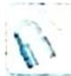

## 23.1 三角函数解析式

## 研究密钥

结合图像求三角函数解析式,即求 $A, \omega, \varphi$ 的值,最主要的是看图像上的关键点和特殊点. A 值的确定方法:图像中最高点的纵坐标减去最低点的纵坐标所得差的一半.

$\omega$ 值的确定方法: ①代数法: 求出 $A, \varphi$ 的值之后, 可由特殊点的坐标确定 $\omega$ 的值; ②几何法: 利用 $\omega$ 的几何意义, 特殊点伸缩变换前后对应点横坐标的比值即为 $\omega$ .

![[高中/总复习/专题/高考数学培优40讲/高考数学培优40讲-03-三角、向量、数列、不等式与复数/第23讲_三角函数的图像与性质/三角函数图像的变换及应用/23_1_三角函数解析式/例题/Q00019691.md]]
![[高中/总复习/专题/高考数学培优40讲/高考数学培优40讲-03-三角、向量、数列、不等式与复数/第23讲_三角函数的图像与性质/三角函数图像的变换及应用/23_1_三角函数解析式/例题/Q00019692.md]]
![[高中/总复习/专题/高考数学培优40讲/高考数学培优40讲-03-三角、向量、数列、不等式与复数/第23讲_三角函数的图像与性质/三角函数图像的变换及应用/23_1_三角函数解析式/例题/Q00019693.md]]
