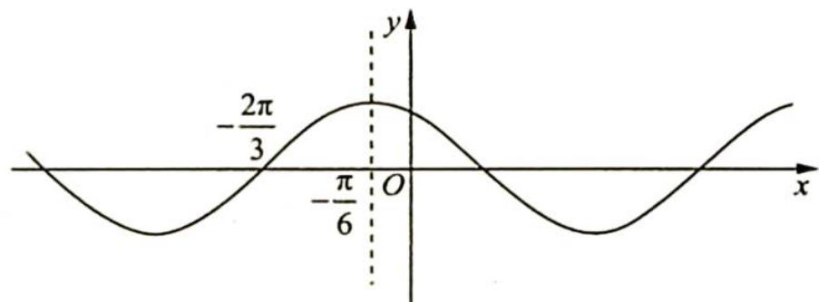

> [!faq]- 《高考数学培优40讲》例题解析
>
> > [!success]- **【答案】** C
>
> > [!note]- **【分析】**
> > 分析 ▶ 思路一(代数法):从函数图像与 x 轴的交点可以看出 $f(x)$ 的周期大于 $\pi$ 小于 $2\pi$ , 所以 $1<|\omega|<2$ ; 再根据特殊点 $\left(-\frac{4\pi}{9},0\right)$ 可得 $-\frac{4\pi}{9}\omega+\frac{\pi}{6}=-\frac{\pi}{2}+2k\pi(k\in\mathbb{Z})$ , 表示出 $\omega$ ; 最后结合范围可求出 $\omega$ 的值, 最小正周期 $T=\frac{2\pi}{\omega}$ .
> >
> > 思路二(几何法): 若 $\omega=1$ , 则图中的点 $\left(-\frac{4\pi}{9},0\right)$ 伸缩前对应点为 $\left(-\frac{2\pi}{3},0\right)$ , 根据 $\omega$ 的几何
> >
> > 意义可得 $\omega = \frac{-\frac{2\pi}{3}}{-\frac{4\pi}{9}}$ ，代入 $T = \frac{2\pi}{\omega}$ .
>
> > [!note]- **【解析】**
> > 解析 ▶ 解法一(代数法): 由图像可得 $f(x)$ 的周期大于 $\pi$ 小于 $2\pi$ , 所以 $\pi < \left|\frac{2\pi}{\omega}\right| < 2\pi$ , $1 < |\omega| < 2$ . 函数图像过点 $\left(-\frac{4\pi}{9}, 0\right)$ , 所以 $-\frac{4\pi}{9}\omega + \frac{\pi}{6} = -\frac{\pi}{2} + 2k\pi (k \in \mathbf{Z})$ , $\omega = \frac{3}{2} - \frac{9}{2}k$ , $1 < \frac{3}{2} - \frac{9}{2}k < 2$ , 可得 $-\frac{1}{9} < k < \frac{1}{9}(k \in \mathbf{Z})$ , 则 $k = 0$ , 此时 $\omega = \frac{3}{2}$ , 所以最小正周期 $T = \frac{2\pi}{\frac{3}{2}} = \frac{4\pi}{3}$ , 故选 C.
> > 解法二(几何法): 令 $\omega=1$ , 则 $f(x)=\cos\left(x+\frac{\pi}{6}\right)$ , 如图所示.
> > 因为 $\omega = 1$ ，所以 $\left(-\frac{2\pi}{3}, 0\right)$ 经过伸缩变换以后对应点 $\left(-\frac{4\pi}{9}, 0\right)$ ，根据 $\omega$ 的几何意义知 $\omega = -\frac{2\pi}{3} - \frac{4\pi}{9} = \frac{3}{2}$ ，则 $T = \frac{2\pi}{\frac{3}{2}} = \frac{4\pi}{3}$ ，故选 C.
> > 
