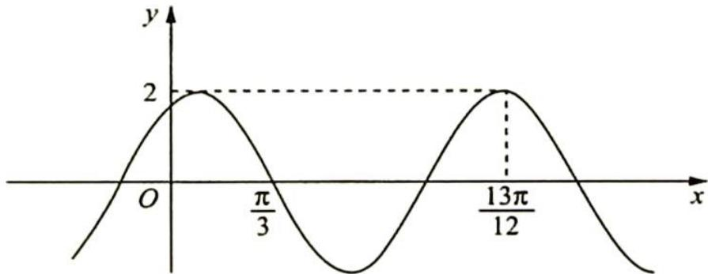
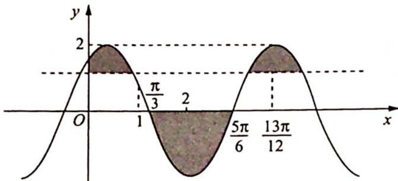

> [!faq]- 《高考数学培优40讲》例题解析
>
> > [!success]- **【答案】** 详见解析
>
> > [!note]- **【分析】**
> > 本题未单列分析。
>
> > [!note]- **【解析】**
> > 
> > 解析 由图可得 $\frac{3T}{4} = \frac{13\pi}{12} - \frac{\pi}{3} = \frac{3\pi}{4}$ , 所以 $T = \pi, \omega = 2, f\left(-\frac{7\pi}{4}\right) = f\left(\frac{\pi}{4}\right) > 0, f\left(\frac{4\pi}{3}\right) = f\left(\frac{\pi}{3}\right) = 0, \left(f(x) - f\left(-\frac{7\pi}{4}\right)\right)\left(f(x) - f\left(\frac{4\pi}{3}\right)\right) > 0$ 等价于 $\left(f(x) - f\left(\frac{\pi}{4}\right)\right)f(x) > 0$ , 显然不等式的解集应为如图所示阴影部分区域.
> > 由 $\frac{\pi}{4} < 1 < \frac{\pi}{3}, \frac{\pi}{3} < 2 < \frac{5\pi}{6}$ 得满足不等式的最小正整数 $x$ 为 2.
> > 
