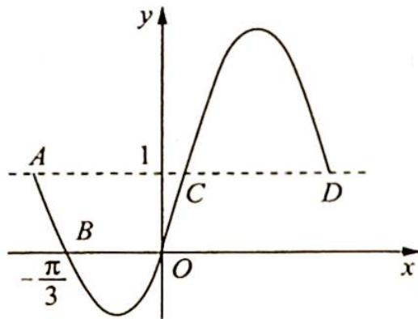

> [!faq]- 《高考数学培优40讲》例题解析
>
> > [!success]- **【答案】** C
>
> > [!note]- **【分析】**
> > 本题未单列分析。
>
> > [!note]- **【解析】**
> > 
> > D. ${1012\pi }$
> > 解析 由题意易知 $y = 1$ 是 $f(x)$ 的中轴线, 则 $|AC|$ 为 $\frac{T}{2} = \frac{\pi}{\omega}$ , 则有 $|OB| = \frac{\pi}{3} < \frac{\pi}{\omega} \Rightarrow 0 < \omega < 3$ , 进而 $f(0) = 2\sin (\omega \cdot 0 + \varphi) + 1 = 0$ , $\sin \varphi = -\frac{1}{2}$ , 且 $|\varphi| < \frac{\pi}{2}$ , 可得 $\varphi = -\frac{\pi}{6}$ .
> > 又由 $2\sin \left(-\frac{\pi}{3}\omega -\frac{\pi}{6}\right) + 1 = 0$ 得 $-\frac{\pi}{3}\omega -\frac{\pi}{6} = -\frac{\pi}{6} +2k\pi (k\in \mathbf{Z})$ 或 $-\frac{\pi}{3}\omega -\frac{\pi}{6} = \frac{7\pi}{6} +2k\pi (k\in$ $\mathbf{Z})$ ，即 $\omega = -6k$ 或 $-6k - 4(k\in \mathbf{Z})$
> > 因为 $0 < \omega < 3$ , 所以 $\omega = 2$ , 则 $T = \pi$ , 相邻 2 个零点的距离有两种 $\frac{\pi}{3}$ 和 $\frac{2\pi}{3}$ , 则当 $b - a$ 为 1012 个 $\frac{\pi}{3}$ 与 1013 个 $\frac{2\pi}{3}$ 的和时最大, 为 $\frac{3038\pi}{3}$ ,
> >
> > 故选 **C**.
