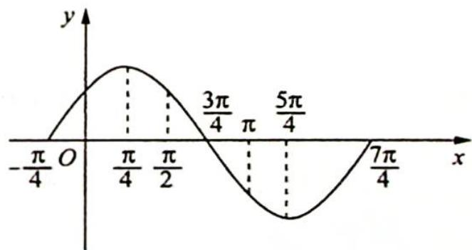

> [!faq]- 《高考数学培优40讲》例题解析
>
> > [!success]- **【答案】** A
>
> > [!note]- **【分析】**
> > 分析 ▶ 思路一(代数法):根据单调区间的长度可得 $\pi - \frac{\pi}{2} \leqslant \frac{T}{2}$ ，所以 $0 < \omega \leqslant 2$ 。又 $f(x)$ 在区间 $\left[\frac{\pi}{2}, \pi\right]$ 上单调递减，则 $\frac{\pi}{2} + 2k\pi \leqslant \frac{\pi}{2}\omega + \frac{\pi}{4} < \pi\omega + \frac{\pi}{4} \leqslant \frac{3\pi}{2} + 2k\pi (k \in \mathbb{Z})$ ，取交集可得 $\omega$ 的取值范围。
> >
> > 思路二(几何法): $f(x) = \sin \left( x + \frac{\pi}{4} \right)$ 的单调递减区间 $\frac{\pi}{4} \leqslant x \leqslant \frac{5\pi}{4}$ 经过伸缩以后落到区间 $\left[\frac{\pi}{2},\pi\right]$ 内，根据 $\omega$ 的几何意义可得 $\omega_{\min}=\frac{\frac{\pi}{4}}{\frac{\pi}{2}}=\frac{1}{2},\omega_{\max}=\frac{\frac{5\pi}{4}}{\pi}=\frac{5}{4}.$
>
> > [!note]- **【解析】**
> > 解析 ▶ 解法一(代数法): 因为 $f(x)$ 在区间 $\left[\frac{\pi}{2}, \pi\right]$ 上单调, 所以 $\pi - \frac{\pi}{2} \leqslant \frac{T}{2}$ , 可得 $0 < \omega \leqslant 2$ .
> > 当 $x \in \left[\frac{\pi}{2}, \pi\right]$ 时， $\omega x + \frac{\pi}{4} \in \left[\frac{\pi}{2}\omega + \frac{\pi}{4}, \pi\omega + \frac{\pi}{4}\right]$ .
> > 要使得 $f(x)$ 在区间 $\left[\frac{\pi}{2},\pi\right]$ 上单调递减，需要满足 $\frac{\pi}{2} + 2k\pi \leqslant \frac{\pi}{2}\omega + \frac{\pi}{4} < \pi\omega + \frac{\pi}{4} \leqslant \frac{3\pi}{2} + 2k\pi (k \in \mathbb{Z})$ ，解得 $\frac{1}{2} + 4k \leqslant \omega \leqslant \frac{5}{4} + 2k$ ，令 $k = 0$ ，则 $\frac{1}{2} \leqslant \omega \leqslant \frac{5}{4}$ ，故选A.
> > 解法二(几何法): 令 $\omega = 1$ , 则 $f(x) = \sin \left(x + \frac{\pi}{4}\right)$ , 其图像如右图所示.
> > 
> > 若将 $f(x) = \sin \left(x + \frac{\pi}{4}\right)$ 的图像伸长至 $f(x) = \sin \left(\omega x + \frac{\pi}{4}\right)$ ,
> > 使得 $f(x)$ 在区间 $\left[\frac{\pi}{2},\pi\right]$ 上单调递减，则 $\frac{\pi}{4} \xrightarrow{\max} \frac{\pi}{2}$ ，可得 $\omega_{\min} = \frac{\frac{\pi}{4}}{\frac{\pi}{2}} = \frac{1}{2}$ ；若将 $f(x) = \sin \left(x + \frac{\pi}{4}\right)$
> > 的图像缩短至 $f(x) = \sin \left(\omega x + \frac{\pi}{4}\right)$ , 使得 $f(x)$ 在区间 $\left[\frac{\pi}{2}, \pi\right]$ 上单调递减, 则 $\frac{5\pi}{4} \xrightarrow{\min} \pi$ , 可得 $\omega_{\max} = \frac{5}{4}$ . 所以 $\frac{1}{2} \leqslant \omega \leqslant \frac{5}{4}$ ,
> >
> > 故选 **A**.
