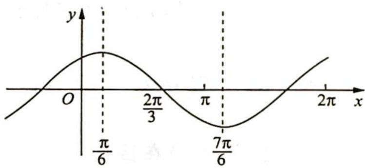

> [!faq]- 《高考数学培优40讲》例题解析
>
> > [!success]- **【答案】** A
>
> > [!note]- **【分析】**
> > 本题未单列分析。
>
> > [!note]- **【解析】**
> > 解析 ▶ 解法一(代数法): 因为 $f(x)$ 在区间 $(\pi,2\pi)$ 内没有最值, 所以 $f(x)$ 在 $(\pi,2\pi)$ 内单调, 即 $\frac{T}{2} \geqslant 2\pi - \pi, \frac{\pi}{\omega} \geqslant \pi$ , 则 $0 < \omega \leqslant 1$ .
> > 当 $x \in (\pi, 2\pi)$ 时， $\omega x + \frac{\pi}{3} \in \left( \pi \omega + \frac{\pi}{3}, 2\pi \omega + \frac{\pi}{3} \right)$ ，所以 $k\pi - \frac{\pi}{2} \leqslant \pi \omega + \frac{\pi}{3} < 2\pi \omega + \frac{\pi}{3} \leqslant k\pi + \frac{\pi}{2}(k \in \mathbf{Z})$ ，即 $k - \frac{5}{6} \leqslant \omega \leqslant \frac{k}{2} + \frac{1}{12}$ .
> > 由 $\left\{\begin{aligned}\frac{k}{2}+\frac{1}{12}&\geqslant k-\frac{5}{6}\\ \frac{k}{2}+\frac{1}{12}&>0\end{aligned}\right.$ 解得 $-\frac{1}{6}<k\leqslant\frac{11}{6}(k\in\mathbf{Z})$ ，所以k=0或k=1。
> > 当 $k = 0$ 时， $-\frac{5}{6} \leqslant \omega \leqslant \frac{1}{12}$ ，又因为 $\omega > 0$ ，所以 $0 < \omega \leqslant \frac{1}{12}$ ；当 $k = 1$ 时， $\frac{1}{6} \leqslant \omega \leqslant \frac{7}{12}$ ，故选A.
> > 解法二(几何法): $f_{1}(x) = \sin \left(x + \frac{\pi}{3}\right)$ 的图像如右图所示, 若 $f(x) = \sin \left(\omega x + \frac{\pi}{3}\right)$ 在 $(\pi, 2\pi)$ 内没有最值, 则 $f(x)$ 在区间 $(\pi, 2\pi)$ 上单调, $\pi \leqslant \frac{T}{2}$ , 即 $T \geqslant 2\pi$ , 可得 $0 < \omega \leqslant 1$ . 显然将
> > 
> > 函数 $f_{1}(x)$ 的图像伸长到 $f(x)$ , 则 $\frac{\pi}{6} \xrightarrow{\min} 2\pi$ , 可得 $0 < \omega \leqslant \frac{1}{12}$ 或 $\frac{\pi}{6} \xrightarrow{\max} \pi, \omega_{\min} = \frac{1}{6}, \frac{7\pi}{6} \xrightarrow{\min} 2\pi$ , 可得 $\omega_{\max} = \frac{7}{12}$ , 则 $\omega$ 的取值范围为 $\left(0, \frac{1}{12}\right] \cup \left[\frac{1}{6}, \frac{7}{12}\right]$ , 故选 A.
> > ## 2. 对称性(对称中心和对称轴)⇒周期性
> > 研究密钥
> > $f(x)=A\sin(\omega x+\varphi)\left(\omega>0,0<\varphi<\frac{\pi}{2}\right)$ 在区间内有几个对称轴、对称中心(零点)，关注区间的端点.
> > 方法一(代数法):根据区间长度可以初步确定 $\omega$ 的范围:
> > 如果函数在区间 $(x_{1}, x_{2})$ 内没有最大值点, 则 $\frac{\pi}{2} + 2n\pi < \omega x_{i} + \varphi < \frac{5\pi}{2} + 2n\pi (n \in \mathbf{Z}, i = 1, 2)$ . 如果函数在区间 $(0, \pi]$ 内至少有 $n$ 个最大值点, 则 $\omega \pi + \varphi \geqslant \frac{\pi}{2} + 2(n - 1)\pi (n \in \mathbf{N}^{*})$ . 如果函数在区间 $(0, \pi]$ 内恰好有 $n$ 个最大值点, 则 $\frac{\pi}{2} + 2n\pi > \omega \pi + \varphi \geqslant \frac{\pi}{2} + 2(n - 1)\pi (n \in \mathbf{N}^{*})$ . 如果函数在区间 $(0, \pi]$ 内至多有 $n$ 个最大值点, 则 $\omega \pi + \varphi \leqslant \frac{\pi}{2} + 2(n - 1)\pi (n \in \mathbf{N}^{*})$ .
> > 方法二(几何法): 将 $f(x) = A \sin (x + \varphi)$ 的对称轴或对称中心(零点)伸缩变换至区间端点处, 若包含这个点则变换至区间内, 若不包含则变换至区间外, 根据变换前后横坐标的比值确定 $\omega$ .
