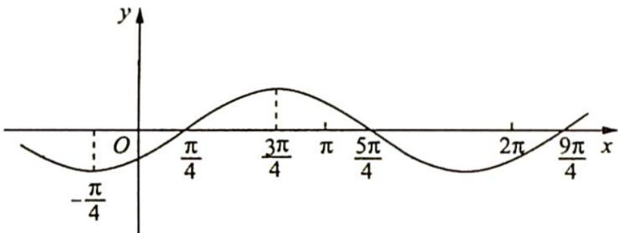
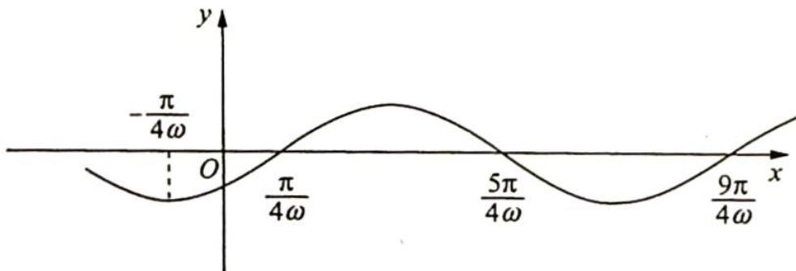

> [!faq]- 《高考数学培优40讲》例题解析
>
> > [!success]- **【答案】** D
>
> > [!note]- **【分析】**
> > 分析 ▶ 思路一(代数法): 没有零点的区间最多为半个周期, 所以根据区间长度可得 $2\pi - \pi \leqslant \frac{T}{2}$ , 即 $0 < \omega \leqslant 1$ ; 再考虑到区间端点可得 $k\pi \leqslant \omega x + \varphi \leqslant k\pi + \pi (k \in \mathbb{Z})$ , 表示出 $\omega$ , 求交集即可.
> >
> > 思路二(几何法): 可以将 $f(x) = \frac{\sqrt{2}}{2}\sin\left(x - \frac{\pi}{4}\right)$ 的没有零点的区间 $\left(0, \frac{\pi}{4}\right)$ 或 $\left(\frac{\pi}{4}, \frac{5\pi}{4}\right)$ 伸缩变换至区间 $(\pi, 2\pi)$ 内, 解得 $\omega_{\min} = \frac{0}{\pi} = 0, \omega_{\max} = \frac{\frac{\pi}{4}}{2\pi} = \frac{1}{8}$ 或 $\omega_{\min} = \frac{\frac{\pi}{4}}{\pi} = \frac{1}{4}, \omega_{\max} = \frac{\frac{5\pi}{4}}{2\pi} = \frac{5}{8}$ .
> >
> > 思路三(几何法):首先根据区间长度可得 $0<\omega\leqslant1$ , 用 $\omega$ 表示出所有零点, 依次将不含零点的区间与 $(\pi,2\pi)$ 对应, 求出 $\omega$ 的范围, 再与 $0<\omega\leqslant1$ 求交集.
>
> > [!note]- **【解析】**
> > 解析 ▶ 解法一(代数法): $f(x) = \sin^2 \frac{\omega x}{2} + \frac{1}{2} \sin \omega x - \frac{1}{2} = \frac{1 - \cos \omega x}{2} + \frac{1}{2} \sin \omega x - \frac{1}{2} = \frac{1}{2} \sin \omega x - \frac{1}{2} \cos \omega x = \frac{\sqrt{2}}{2} \sin \left(\omega x - \frac{\pi}{4}\right), f(x)$ 在区间 $(\pi, 2\pi)$ 内没有零点, 所以 $2\pi - \pi \leqslant \frac{T}{2}$ , 即 $0 < \omega \leqslant 1$ . $k\pi \leqslant \omega\pi - \frac{\pi}{4} < 2\omega\pi - \frac{\pi}{4} \leqslant k\pi + \pi (k \in \mathbf{Z})$ , 即 $\omega \geqslant k + \frac{1}{4}$ 且 $\omega \leqslant \frac{k}{2} + \frac{5}{8}$ , 由 $\left\{ \begin{array}{l} \frac{k}{2} + \frac{5}{8} \geqslant k + \frac{1}{4} \\ \frac{k}{2} + \frac{5}{8} > 0 \end{array} \right.$ 解得 $-\frac{5}{4} < k \leqslant \frac{3}{4} (k \in \mathbf{Z})$ , 所以 $k = -1, 0$ .
> > 令 $k = -1, 0 < \omega \leqslant \frac{1}{8}$ ; 令 $k = 0, \frac{1}{4} \leqslant \omega \leqslant \frac{5}{8}$ , 故选 D.
> > 解法二(几何法): 同解法一, 化简可得 $f(x)=\frac{\sqrt{2}}{2}\sin\left(\omega x-\frac{\pi}{4}\right)$ , $f(x)$ 在区间 $(\pi,2\pi)$ 内没有零点, 所以 $2\pi-\pi\leqslant\frac{T}{2}$ , 即 $0<\omega\leqslant1$ .
> > 令 $\omega = 1$ ，则 $f(x) = \frac{\sqrt{2}}{2}\sin \left(x - \frac{\pi}{4}\right)$ ，若将 $f(x) = \frac{\sqrt{2}}{2}\sin \left(x - \frac{\pi}{4}\right)$ 的图像伸长至 $f(x) = \frac{\sqrt{2}}{2}\sin (\omega x - \frac{\pi}{4})$ ，如图1所示，使得 $f(x)$ 在区间 $(\pi, 2\pi)$ 内没有零点，第一种情形： $\frac{\pi}{4} \xrightarrow{\min} 2\pi$ ，则 $\omega_{\max} = \frac{\frac{\pi}{4}}{2\pi} = \frac{1}{8}$ ，故 $0 < \omega \leqslant \frac{1}{8}$ . 第二种情形： $\frac{\pi}{4} \xrightarrow{\max} \pi, \omega_{\min} = \frac{\frac{\pi}{4}}{\pi} = \frac{1}{4}, \frac{5\pi}{4} \xrightarrow{\min} 2\pi, \omega_{\max} = \frac{\frac{5\pi}{4}}{2\pi} = \frac{5}{8}$ ，则 $\frac{1}{4} \leqslant \omega \leqslant \frac{5}{8}$ .
> > 所以 $0 < \omega \leqslant \frac{1}{8}$ 或 $\frac{1}{4} \leqslant \omega \leqslant \frac{5}{8}$ , 故选 D.
> > 
> > 图 1
> > 解法三(几何法): 同解法一可得 $f(x)=\frac{\sqrt{2}}{2}\sin\left(\omega x-\frac{\pi}{4}\right)$ ，且 $0<\omega\leqslant1$ .
> > 根据图2可得:若 $y=\frac{\sqrt{2}}{2}\sin\left(\omega x-\frac{\pi}{4}\right)$ 在区间 $(\pi,2\pi)$ 内没有零点, 则 $2\pi\leqslant\frac{\pi}{4\omega}$ , 解得 $0<\omega\leqslant\frac{1}{8}$ ; 若 $\frac{\pi}{4\omega}\leqslant\pi<2\pi\leqslant\frac{5\pi}{4\omega}$ , 解得 $\frac{1}{4}\leqslant\omega\leqslant\frac{5}{8}$ ; 若 $\frac{5\pi}{4\omega}\leqslant\pi<2\pi\leqslant\frac{9\pi}{4\omega}$ , 解得 $\omega\geqslant\frac{5}{4}$ 且 $\omega\leqslant\frac{9}{8}$ , 无解.
> > 所以 $0 < \omega \leqslant \frac{1}{8}$ 或 $\frac{1}{4} \leqslant \omega \leqslant \frac{5}{8}$ ，故选D.
> > 
> > 图2
