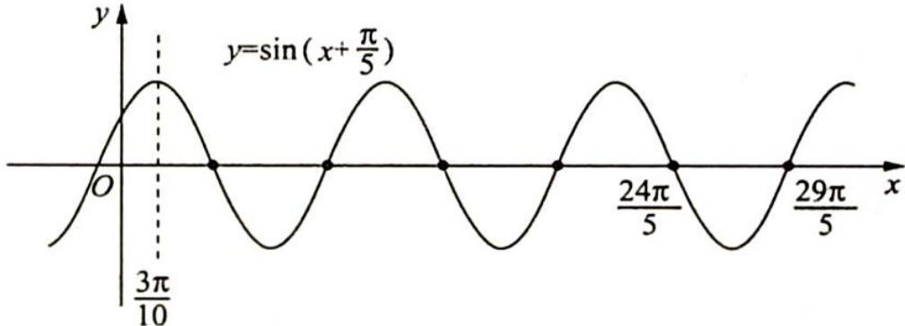

> [!faq]- 《高考数学培优40讲》例题解析
>
> > [!success]- **【答案】** D
>
> > [!note]- **【分析】**
> > 本题未单列分析。
>
> > [!note]- **【解析】**
> > 解析 根据图像可得 $y = \sin \left( x + \frac{\pi}{5} \right)$ 在 $y$ 轴右侧的第 5 个零点为 $\frac{24\pi}{5}$ ，第 6 个零点为 $\frac{29\pi}{5}$ ，要使得 $f(x)$ 在 $[0, 2\pi]$ 有且仅有 5 个零点，故 $\frac{24\pi}{5} \xrightarrow{\max} 2\pi$ （取得到）， $\omega_{\min} = \frac{12}{5}, \frac{29\pi}{5} \xrightarrow{\min} 2\pi$ （取不到）， $\omega_{\max} = \frac{29}{10}$ ，因此 $\frac{12}{5} \leqslant \omega < \frac{29}{10}$ ，故④正确。
> > 由图像可得, 当 $y = \sin \left( x + \frac{\pi}{5} \right)$ 取到 5 个零点时, 有且仅有 3 个极大值点, 有 2 个或者 3 个极小值点, 故①正确, ②错误.
> > 因为 $\omega \in \left[\frac{12}{5}, \frac{29}{10}\right)$ , 所以 $\omega < 3$ , 则对称轴 $\frac{3\pi}{10}$ 伸缩变换以后在 $\frac{\pi}{10}$ 的右侧, 所以 $f(x)$ 在 $(0, \frac{\pi}{10})$ 上单调递增, 故③正确.
> > 综上所述,正确结论的编号有①③④,故选D.
> > 
