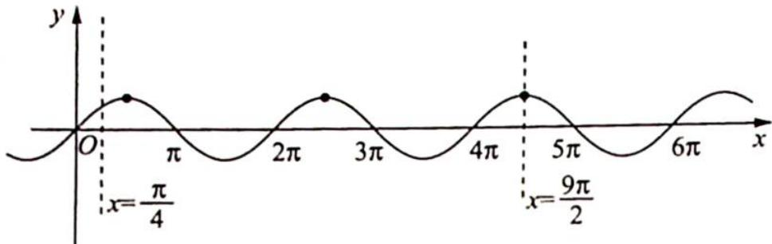
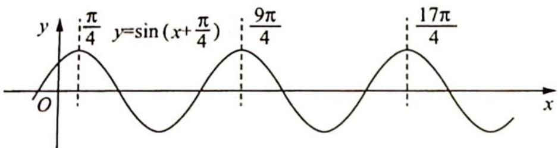

> [!faq]- 《高考数学培优40讲》例题解析
>
> > [!success]- **【答案】** 详见解析
>
> > [!note]- **【分析】**
> > 分析 ▶ 思路一(代数法): $f(x)=\sin x$ 对应的第三个最大值点的横坐标为 $\frac{9\pi}{2}$ ，只需要保证 $\omega x+\frac{\pi}{4}$ 所在区间包含第三个最大值点即可.
> >
> > 思路二(几何法): 将 $f(x)=\sin\left(x+\frac{\pi}{4}\right)$ 的第 3 个最大值点的横坐标 $\frac{17\pi}{4}$ 压缩至区间 [0,2] 内, 可得 $\omega$ 的取值范围.
>
> > [!note]- **【解析】**
> > 解析 ▶ 解法一(代数法): 由图1可得 $f(x) = \sin x$ 对应的第三个最大值点的横坐标为 $\frac{9\pi}{2}, f(x) = \sin \left( \omega x + \frac{\pi}{4} \right) (\omega > 0)$ 的图像在 $[0, 2]$ 上至少有三个最大值点, 则 $2\omega + \frac{\pi}{4} \geqslant \frac{9\pi}{2}$ , 解得 $\omega \geqslant \frac{17\pi}{8}$ , 所以 $\omega$ 的取值范围是 $\left[ \frac{17\pi}{8}, +\infty \right)$ .
> > 
> > 图1
> > 解法二(几何法):根据图2可得 $f(x)=\sin\left(x+\frac{\pi}{4}\right)$ 的第3个最大值点的横坐标为 $\frac{17\pi}{4}$ ，根据题意将 $\frac{17\pi}{4}\xrightarrow{max}2$ ，可得 $\omega_{\min}=\frac{\frac{17\pi}{4}}{2}=\frac{17\pi}{8}$ ，所以 $\omega\geqslant\frac{17\pi}{8}$ ，故 $\omega$ 的取值范围是 $\left[\frac{17\pi}{8},+\infty\right)$ .
> > 
> > 图 2
