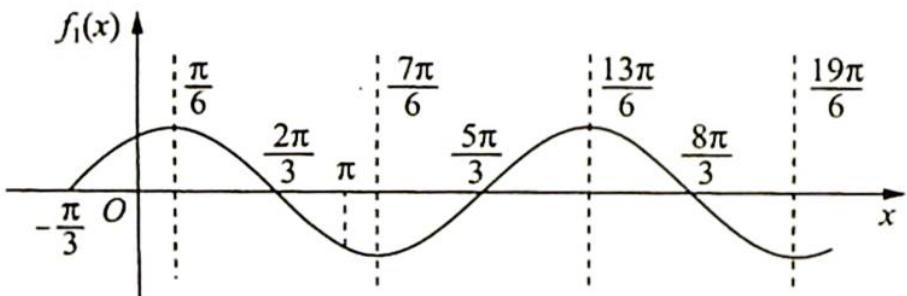

> [!faq]- 《高考数学培优40讲》例题解析
>
> > [!success]- **【答案】** C
>
> > [!note]- **【分析】**
> > 本题未单列分析。
>
> > [!note]- **【解析】**
> > 解析 ▶ 解法一(代数法): 令 $t = \omega x + \frac{\pi}{3}$ , 因为 $x \in (0, \pi), \omega > 0$ , 所以 $t \in \left(\frac{\pi}{3}, \omega \pi + \frac{\pi}{3}\right)$ , 结合 $y = \sin t$ 的图像得 $\frac{5\pi}{2} < \omega \pi + \frac{\pi}{3} \leqslant 3\pi$ , 解得 $\frac{13}{6} < \omega \leqslant \frac{8}{3}$ , 故选 C.
> > 解法二(几何法): 令 $\omega = 1, f_{1}(x) = \sin \left(x + \frac{\pi}{3}\right)$ , 其图像如下图所示.
> > 
> > 若 $f(x) = \sin \left(\omega x + \frac{\pi}{3}\right)$ 在区间 $(0, \pi)$ 上恰有三个极值点、两个零点，则 $\frac{13\pi}{6} \xrightarrow{\max} \pi$ （取不到），可得 $\omega_{\min} = \frac{13}{6}$ ，取不到； $\frac{8\pi}{3} \xrightarrow{\min} \pi$ （取得到），可得 $\omega_{\max} = \frac{8}{3}$ ，取得到。因此 $\frac{13}{6} < \omega \leqslant \frac{8}{3}$ ，
> >
> > 故选 **C**.
