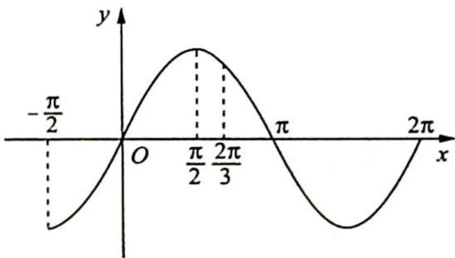

> [!faq]- 《高考数学培优40讲》例题解析
>
> > [!success]- **【答案】** D
>
> > [!note]- **【分析】**
> > 本题未单列分析。
>
> > [!note]- **【解析】**
> > ## 解析 ▶ 令 $f_{1}(x)=2\sin x$ ，如右图所示.
> > 若 $f(x) = 2\sin \omega x$ 在 $\left[-\frac{\pi}{2}, \frac{2\pi}{3}\right]$ 上单调递增，且在 $[0, \pi]$ 上恰好取得一次最大值，则 $\frac{\pi}{2} \xrightarrow{\min} \frac{2\pi}{3}, \omega_{\max} = \frac{3}{4}; \frac{\pi}{2} \xrightarrow{\max} \pi, \omega_{\min} = \frac{1}{2}$ ，因此 $\omega$ 的取值范围是 $\left[\frac{1}{2}, \frac{3}{4}\right]$ ，故选 D.
> > 
