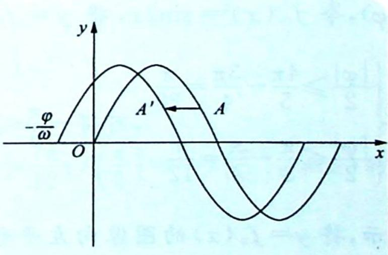

## 23.3 $\varphi$ 的范围

## 研究密钥

对于函数 $f(x) = \sin \omega x (\omega > 0)$ 经平移变换后得到 $g(x) = \sin (\omega x + \varphi) = \sin \left[\omega \left(x + \frac{\varphi}{\omega}\right)\right] (\omega > 0)$ .

$\frac{\varphi}{\omega}$ 的几何意义:如右图所示,在平移变换前后,对应点横坐标的差值, $\frac{\varphi}{\omega}=x_{A}-x_{A'}$ ,即 $\varphi=\omega(x_{A}-x_{A'})$ .

![[高中/总复习/专题/高考数学培优40讲/高考数学培优40讲-03-三角、向量、数列、不等式与复数/第23讲_三角函数的图像与性质/三角函数图像的变换及应用/23_3_φ_的范围/例题/Q00019702.md]]
![[高中/总复习/专题/高考数学培优40讲/高考数学培优40讲-03-三角、向量、数列、不等式与复数/第23讲_三角函数的图像与性质/三角函数图像的变换及应用/23_3_φ_的范围/例题/Q00019703.md]]
