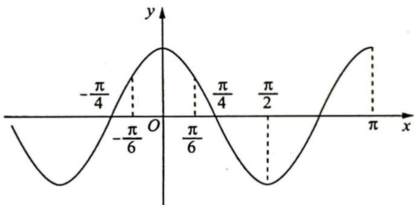

> [!faq]- 《高考数学培优40讲》例题解析
>
> > [!success]- **【答案】** D
>
> > [!note]- **【分析】**
> > ## 分析 ▶ 运用图像平移变换求解 $\varphi$ 的取值范围.
>
> > [!note]- **【解析】**
> > 解析 令 $\varphi=0$ , 其图像如图所示.
> > 若 $f(x)=\cos(2x+\varphi)(0<\varphi<\pi)$ 在区间 $\left[-\frac{\pi}{6}, \frac{\pi}{6}\right]$ 上单调递减, 则 $\frac{\varphi}{2} \geqslant \frac{\pi}{6}$ , 可得 $\varphi \geqslant \frac{\pi}{3}$ .
> > 又 $f(x)$ 在区间 $\left(0, \frac{\pi}{6}\right)$ 上存在零点, $\frac{\pi}{4}-\frac{\pi}{6}<\frac{\varphi}{2}<\frac{\pi}{4}$ , 可得 $\frac{\pi}{6}<\varphi<\frac{\pi}{2}$ .
> > 综上所述, $\varphi$ 的取值范围为 $\left[\frac{\pi}{3}, \frac{\pi}{2}\right)$ , 故选 D.
> > 
