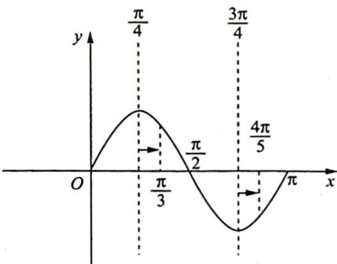

> [!faq]- 《高考数学培优40讲》例题解析
>
> > [!success]- **【答案】** C
>
> > [!note]- **【分析】**
> > 本题未单列分析。
>
> > [!note]- **【解析】**
> > 解析 依题意得 $T = \frac{2\pi}{\omega} = \pi$ ，则 $\omega = 2, f(x) = \sin (2x + \varphi)$ ，令 $f_0(x) = \sin 2x$ ，将 $y = f_0(x)$ 向右平移 $\frac{|\varphi|}{2}$ 个单位，则 $\left\{ \begin{array}{l} \frac{|\varphi|}{2} \geqslant \frac{4\pi}{5} - \frac{3\pi}{4} = \frac{\pi}{20} \\ \frac{|\varphi|}{2} \leqslant \frac{\pi}{3} - \frac{\pi}{4} = \frac{\pi}{12} \end{array} \right.$ ，可得 $-\frac{\pi}{6} \leqslant \varphi \leqslant -\frac{\pi}{10} \left( \frac{\pi}{2} < \varphi < 0 \right)$ . 如右图所
> > 
> > 示, 将 $y = f_{0}(x)$ 的图像向左平移 $\frac{\varphi}{2}$ 个单位长度 $\left(0 < \varphi < \frac{\pi}{2}\right)$ , 显然 $f(x)$ 在区间 $\left(\frac{\pi}{3}, \frac{4\pi}{5}\right)$ 上不单调,
> >
> > 故选 **C**.
