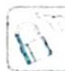

# 23.4 转化中枢——对称性

## 研究密钥

三角函数的性质(对称性、周期性、奇偶性、单调性)有着密切的联系,它们经常交织在一起综合应用.其中,对称性处于一个较核心的位置,由它辐射可挖掘出许多隐含的性质信息.

## 对称性 $\Rightarrow$ 奇偶性

若函数图像关于坐标原点对称,则函数 $f(x)$ 为奇函数;若函数图像关于 $y$ 轴对称,则函数 $f(x)$ 为偶函数.

## 对称性 $\Rightarrow$ 周期性

相邻的两条对称轴之间的距离为 $\frac{T}{2}$ ; 相邻的对称中心之间的距离为 $\frac{T}{2}$ ; 相邻的对称轴与对称中心之间的距离为 $\frac{T}{4}$ .

## 对称性 $\Rightarrow$ 单调性

在相邻的对称轴之间, 函数 $f(x)$ 单调. 特别地, 若 $f(x)=A\sin\omega x, A>0, \omega>0$ , 函数 $f(x)$ 在 $[\theta_1, \theta_2]$ 上单调, 且 $0 \in [\theta_1, \theta_2]$ , 设 $\theta=\max\{|\theta_1|, \theta_2\}$ , 则 $\frac{T}{4} \geqslant \theta$ , 深刻体现了三角函数的单调性与周期性、对称性之间的紧密联系.

![[高中/总复习/专题/高考数学培优40讲/高考数学培优40讲-03-三角、向量、数列、不等式与复数/第23讲_三角函数的图像与性质/三角函数图像的变换及应用/23_4_转化中枢__对称性/例题/Q00019704.md]]
![[高中/总复习/专题/高考数学培优40讲/高考数学培优40讲-03-三角、向量、数列、不等式与复数/第23讲_三角函数的图像与性质/三角函数图像的变换及应用/23_4_转化中枢__对称性/例题/Q00019705.md]]
![[高中/总复习/专题/高考数学培优40讲/高考数学培优40讲-03-三角、向量、数列、不等式与复数/第23讲_三角函数的图像与性质/三角函数图像的变换及应用/23_4_转化中枢__对称性/例题/Q00019706.md]]
![[高中/总复习/专题/高考数学培优40讲/高考数学培优40讲-03-三角、向量、数列、不等式与复数/第23讲_三角函数的图像与性质/三角函数图像的变换及应用/23_4_转化中枢__对称性/例题/Q00019707.md]]
![[高中/总复习/专题/高考数学培优40讲/高考数学培优40讲-03-三角、向量、数列、不等式与复数/第23讲_三角函数的图像与性质/三角函数图像的变换及应用/23_4_转化中枢__对称性/例题/Q00019708.md]]
![[高中/总复习/专题/高考数学培优40讲/高考数学培优40讲-03-三角、向量、数列、不等式与复数/第23讲_三角函数的图像与性质/三角函数图像的变换及应用/23_4_转化中枢__对称性/例题/Q00019709.md]]
