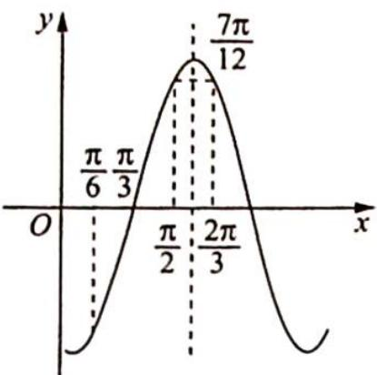
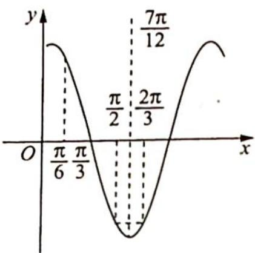

> [!faq]- 《高考数学培优40讲》例题解析
>
> > [!success]- **【答案】** 详见解析
>
> > [!note]- **【分析】**
> > 分析 ▶ 由单调性可以确定周期的范围,根据 $f\left(\frac{\pi}{2}\right) = f\left(\frac{2\pi}{3}\right) = -f\left(\frac{\pi}{6}\right)$ , 可得 $f(x)$ 的一条对称轴和一个对称中心,再由此可以得到最小正周期.
>
> > [!note]- **【解析】**
> > 解析 如图1、图2所示，因为 $f(x)$ 在区间 $\left[\frac{\pi}{6},\frac{\pi}{2}\right]$ 上具有单调性，所以 $\frac{T}{2} \geqslant \frac{\pi}{2} - \frac{\pi}{6}$ ，解得 $T \geqslant \frac{2\pi}{3}$ .
> > 又 $f\left(\frac{\pi}{2}\right) = f\left(\frac{2\pi}{3}\right)$ , 所以 $f(x)$ 的一条对称轴为 $x = \frac{\frac{2\pi}{3} + \frac{\pi}{2}}{2} = \frac{7\pi}{12}; f\left(\frac{\pi}{2}\right) = -f\left(\frac{\pi}{6}\right)$ , $f(x)$ 的一个对称中心的横坐标为 $x = \frac{\frac{\pi}{2} + \frac{\pi}{6}}{2} = \frac{\pi}{3}$ , 故 $\frac{7\pi}{12} - \frac{\pi}{3} = \frac{T}{4}, T = \pi$ .
> > 
> > 图1
> > 
> > 图2
