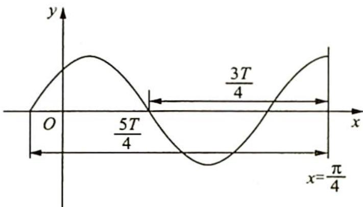

> [!faq]- 《高考数学培优40讲》例题解析
>
> > [!success]- **【答案】** A
>
> > [!note]- **【分析】**
> > 本题未单列分析。
>
> > [!note]- **【解析】**
> > 解析 由题意可得函数图像的一条对称轴为 $x = \frac{\pi}{4}$ , 所以 $\frac{\pi}{4} \omega + \varphi = \frac{\pi}{2} + 2k\pi (k \in \mathbf{Z})$ . 因为 $\varphi \in (0, \pi)$ , 所以 $\omega \in (8k - 2, 8k + 2) (k \in \mathbf{Z})$ ①. 因为 $f(x)$ 在区间 $\left(0, \frac{\pi}{4}\right)$ 上恰有两个零点, 所以 $\omega$ 的取值范围的临界情况如图所示.
> > 
> > 则 $\frac{3T}{4} < \frac{\pi}{4} \leqslant \frac{5T}{4}$ , 即 $\frac{\pi}{5} \leqslant T < \frac{\pi}{3}, \frac{\pi}{5} \leqslant \frac{2\pi}{\omega} < \frac{\pi}{3}$ , 解得 $6 < \omega \leqslant 10$ ②. 综合①②可得 $\omega$ 的取值范围为 (6,10),
> >
> > 故选 **A**.
