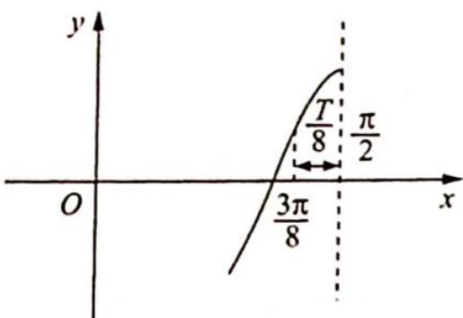
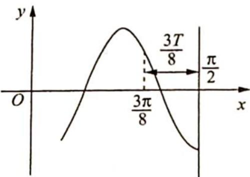

> [!faq]- 《高考数学培优40讲》例题解析
>
> > [!success]- **【答案】** A
>
> > [!note]- **【分析】**
> > 本题未单列分析。
>
> > [!note]- **【解析】**
> > 解析 由 $f(x)$ 在区间 $\left[-\frac{3\pi}{8}, -\frac{\pi}{4}\right]$ 上单调，则 $-\frac{\pi}{4} + \frac{3\pi}{8} = \frac{\pi}{8} \leqslant \frac{T}{2}$ ，可得 $T \geqslant \frac{\pi}{4}$ . 又 $\frac{\pi}{2} - \frac{3\pi}{8} = \frac{\pi}{8}$ ，则区间 $\left[\frac{3\pi}{8}, \frac{\pi}{2}\right]$ 之间的距离 $\leqslant \frac{T}{2}$ ，则符合题意的 $f(x)$ 的图像如图1、图2所示.
> > 
> > 图1
> > 
> > 图2
> > 若为图1:由 $\frac{T}{8}=\frac{\pi}{8}$ 可得 $T=\pi$ ，此时 $\omega=\frac{2\pi}{T}=2$ ，再推导在区间 $\left[-\frac{3\pi}{8},-\frac{\pi}{4}\right]$ 是否有对称轴， $x=-\frac{\pi}{2}\xleftarrow{\frac{T}{2}}x=0\xleftarrow{\frac{T}{2}}x=\frac{\pi}{2}.$
> > 不难发现 $-\frac{\pi}{2} < -\frac{3\pi}{8} < -\frac{\pi}{4} < 0$ ，在区间 $\left[-\frac{3\pi}{8}, -\frac{\pi}{4}\right]$ 内没有对称轴，因此 $f(x)$ 在区间 $\left[-\frac{3\pi}{8}, -\frac{\pi}{4}\right]$ 上单调。
> > 若为图2:由 $\frac{3T}{8}=\frac{\pi}{8}$ 可得 $T=\frac{\pi}{3}=\frac{2\pi}{\omega},\omega=6$ ，再推导在区间 $\left[-\frac{3\pi}{8},-\frac{\pi}{4}\right]$ 上是否有对称轴， $x=-\frac{\pi}{3}\xleftarrow{\frac{T}{2}}x=-\frac{\pi}{6}\xleftarrow{T}x=\frac{\pi}{6}\xleftarrow{T}x=\frac{\pi}{2}.$
> > 不难发现 $-\frac{3\pi}{8} < -\frac{\pi}{3} < -\frac{\pi}{4}$ , 因此在区间 $\left[-\frac{3\pi}{8}, -\frac{\pi}{4}\right]$ 上含有对称轴, 所以 $f(x)$ 在区间 $\left[-\frac{3\pi}{8}, -\frac{\pi}{4}\right]$ 上不单调.
> > 综上所述, $\omega$ 的值只能为2,故选A.
> > ## 评注
> > 对于正弦型或余弦型函数,给出在区间 $[a,b]$ 上单调,进而得出其区间长 $b - a \leqslant \frac{T}{2}$ ,这是其必要条件,还需验证充分性.
