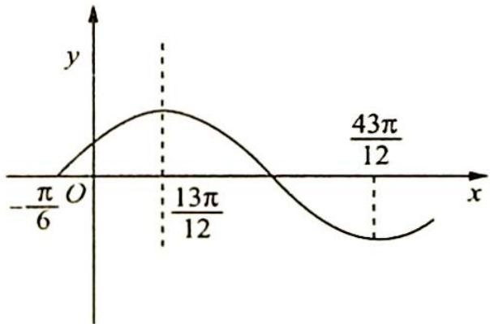
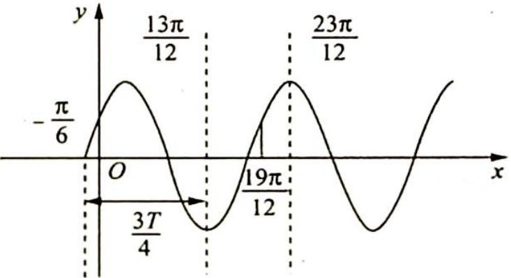
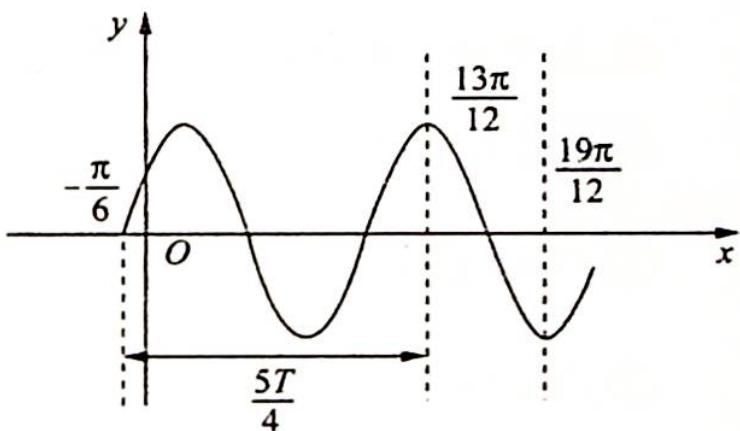

> [!faq]- 《高考数学培优40讲》例题解析
>
> > [!success]- **【答案】** 详见解析
>
> > [!note]- **【分析】**
> > 本题未单列分析。
>
> > [!note]- **【解析】**
> > 解析 ▶ 依题意得 $\frac{13\pi}{12} + \frac{\pi}{6} = \frac{T}{4}(2k - 1)(k \in \mathbb{N}^*)$ ，即 $\frac{5\pi}{4} = \frac{T}{4}(2k - 1)$ ，可得 $T = \frac{5\pi}{2k - 1}$ ( $k \in \mathbb{N}^*$ ).
> > 又 $f(x)$ 在 $\left[\frac{13\pi}{12}, \frac{19\pi}{12}\right]$ 上单调递减，则 $\frac{\pi}{2} \leqslant \frac{T}{2}$ ，即 $T \geqslant \pi$ ，由 $\frac{5\pi}{2k - 1} \geqslant \pi$ 得 $0 < 2k - 1 \leqslant 5 (k \in \mathbf{N}^*)$ ，所以 $k = 1, 2, 3$ .
> > - **①**：若 $k=1, T=5\pi, \omega=\frac{2\pi}{T}=\frac{2}{5}$ ，此时 $f(x)$ 在 $\left[\frac{13\pi}{12}, \frac{19\pi}{12}\right]$ 上单调递减，如图 1 所示，符合题意.
> > - **②**：若 $k = 2$ ，此时 $T = \frac{5\pi}{3} = \frac{2\pi}{\omega}$ 得 $\omega = \frac{6}{5}$ ，那么 $\frac{13\pi}{12} +\frac{\pi}{6} = \frac{5\pi}{4} = \frac{3T}{4}$ ，如图2所示，易知 $f(x)$ 在区间 $\left[\frac{13\pi}{12},\frac{19\pi}{12}\right]$ 上单调递增，与题意不符，故舍去.
> > - **③**：若 k=3，此时 $T=\frac{5\pi}{5}=\pi$ ，得 $\omega=2$ ，那么 $\frac{13\pi}{12}+\frac{\pi}{6}=\frac{5T}{4}$ ，如图 3 所示。易知 $f(x)$ 在区间 $\left[\frac{13\pi}{12},\frac{19\pi}{12}\right]$ 上单调递减，满足题意。
> > 
> > 图 1
> > 
> > 图 2
> > 
> > 图3
> > 综上所述, $\omega$ 的值为2或 $\frac{2}{5}$ ,S的值为 $\frac{12}{5}$ .
> > 
