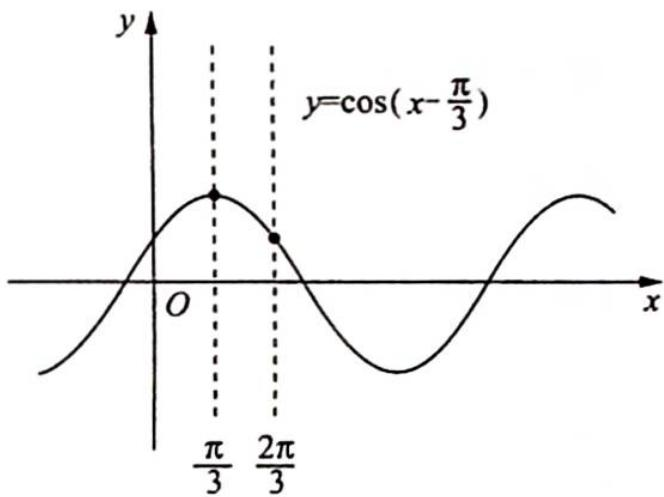

> [!faq]- 《高考数学培优40讲》参考答案
>
> > [!success]- **【答案】** A
>
> > [!note]- **【分析】**
> > 本题未单列分析。
>
> > [!note]- **【解析】**
> > 解法一: 当 $x \in [0, \pi]$ 时, $\omega x - \frac{\pi}{3} \in \left[-\frac{\pi}{3}, \pi \omega - \frac{\pi}{3}\right]$ .
> > 又 $f(x)$ 值域为 $\left[\frac{1}{2}, 1\right]$ , $f(0) = \cos \left(-\frac{\pi}{3}\right) = \frac{1}{2}$ , 所以 $0 \leqslant \pi \omega - \frac{\pi}{3} \leqslant \frac{\pi}{3}$ , 即 $\frac{1}{3} \leqslant \omega \leqslant \frac{2}{3}$ , 故选 A.
> > 解法二:根据图像可得 $y=\cos\left(x-\frac{\pi}{3}\right)$ 的值域为 $\left[\frac{1}{2},1\right]$ . 若左端点横坐标为 0, 则右端点横坐标位于 $\frac{\pi}{3}$ 和 $\frac{2\pi}{3}$ 之间, 根据题意可得伸缩变换至少将 $\frac{\pi}{3}$ 变换至 $\pi$ , 至多将 $\frac{2\pi}{3}$ 经变换至 $\pi$ , 所以 $\omega\geqslant\frac{\frac{\pi}{3}}{\pi}=\frac{1}{3}, \omega\leqslant\frac{\frac{2\pi}{3}}{\pi}=\frac{2}{3}$ .
> > 则 $\frac{1}{3}\leqslant\omega\leqslant\frac{2}{3}$ ，故选A.
> > 
