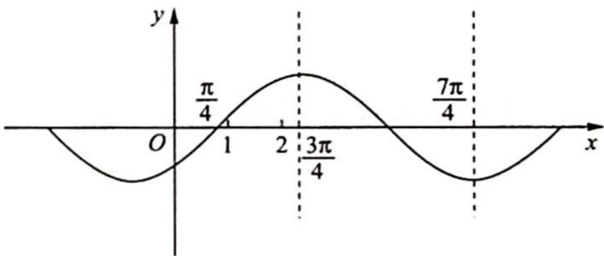

> [!faq]- 《高考数学培优40讲》参考答案
>
> > [!success]- **【答案】** B
>
> > [!note]- **【分析】**
> > 本题未单列分析。
>
> > [!note]- **【解析】**
> > 设 $f_{1}(x)=\sin\left(x-\frac{\pi}{4}\right)$ ，其图像如图所示.
> > 若函数图像伸长,则 $f(x)$ 在 $(1,2)$ 上单调递增,与题意不符,舍去.
> > 若函数图像缩短，则 $\frac{3\pi}{4} \xrightarrow{\min} 1$ （取不到），此时 $\omega_{\max} = \frac{3\pi}{4}, \frac{3\pi}{4} \xrightarrow{\max}$
> > 
> > 2(取不到), $\omega_{\min}=\frac{3\pi}{8}$ ,因此 $\frac{3\pi}{8}<\omega<\frac{3\pi}{4}$ .
> > 或 $\frac{7\pi}{4} \xrightarrow{\min} 1$ (取不到), $\omega_{\max} = \frac{7\pi}{4}, \frac{7\pi}{4} \xrightarrow{\max} 2$ (取不到), $\omega_{\min} = \frac{7\pi}{8}$ , 此时 $\frac{7\pi}{8} < \omega < \frac{7\pi}{4}$ .
> > 或 $\frac{11\pi}{4}\xrightarrow{\min}1$ （取不到）， $\omega_{\mathrm{max}} = \frac{11\pi}{4},\frac{11\pi}{4}\xrightarrow{\max}2$ （取不到）， $\omega_{\mathrm{min}} = \frac{11\pi}{8}$ ，则 $\frac{11\pi}{8} <  \omega <  \frac{11\pi}{4},\dots ,$ 依次类推.
> > 综上所述， $\omega$ 的取值范围为 $\frac{3\pi}{8} <  \omega <  \frac{3\pi}{4}$ 或 $\omega >\frac{7\pi}{8}$ ，
> >
> > 故选 **B**.
