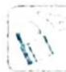

## 24.2 三角形形状的判定

## 研究密钥

判断三角形形状的两种途径：

(1)利用正弦定理、余弦定理,把已知条件转化为边边关系,再分析.

(2)转化为内角的三角函数之间的关系,通过恒等变换得出内角的关系,再判断.

正弦定理

$\frac{a}{\sin A}=\frac{b}{\sin B}=\frac{c}{\sin C}=2R(2R$ 为 $\triangle ABC$ 的外接圆直径).

余弦定理

$c^{2}=a^{2}+b^{2}-2ab\cos C$ （已知两边a,b及夹角C，求第三边c）.

$\cos C = \frac{a^2 + b^2 - c^2}{2ab}$ （已知三边求角）.

![[高中/总复习/专题/高考数学培优40讲/高考数学培优40讲-03-三角、向量、数列、不等式与复数/第24讲_三角恒等变换/三角形中的三角恒等变换/24_2_三角形形状的判定/例题/Q00019731.md]]
![[高中/总复习/专题/高考数学培优40讲/高考数学培优40讲-03-三角、向量、数列、不等式与复数/第24讲_三角恒等变换/三角形中的三角恒等变换/24_2_三角形形状的判定/例题/Q00019732.md]]
![[高中/总复习/专题/高考数学培优40讲/高考数学培优40讲-03-三角、向量、数列、不等式与复数/第24讲_三角恒等变换/三角形中的三角恒等变换/24_2_三角形形状的判定/例题/Q00019733.md]]
![[高中/总复习/专题/高考数学培优40讲/高考数学培优40讲-03-三角、向量、数列、不等式与复数/第24讲_三角恒等变换/三角形中的三角恒等变换/24_2_三角形形状的判定/例题/Q00019734.md]]
