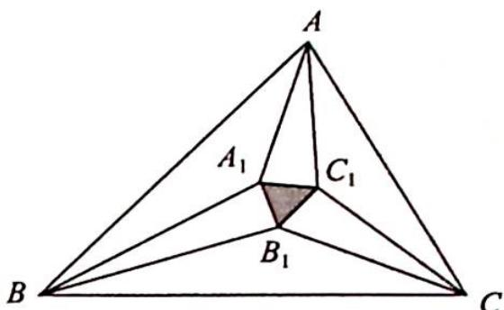
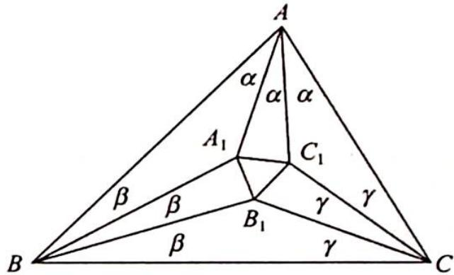

> [!faq]- 《高考数学培优40讲》例题解析
>
> > [!success]- **【答案】** 详见解析
>
> > [!note]- **【分析】**
> > 分析 已知条件是三个内角三等分,所以考虑将结果向角度方向转换. 边 $A_{1}C_{1}$ 在 $\triangle AA_{1}C_{1}$ 中, 由余弦定理得 $A_{1}C_{1}^{2}=AA_{1}^{2}+AC_{1}^{2}$
> >
> > 
> >
> > $-2AA_{1} \cdot AC_{1}\cos\alpha$ , 使用正弦定理把边 $AA_{1}$ 和 $AC_{1}$ 转换成角度, 根据式子的结构特征构造三角形, 并结合正弦、余弦定理进行化简. 由于 $A_{1}C_{1}, A_{1}B_{1}, B_{1}C_{1}$ 地位对等, 将 $A_{1}B_{1}, B_{1}C_{1}$ 用轮换的原则表示出来, 若相等则命题得证.
>
> > [!note]- **【解析】**
> > 解析 如图所示, 设 $A = 3\alpha, B = 3\beta, C = 3\gamma, \triangle ABC$ 的外接圆的直径为 $2R, \alpha + \beta + \gamma = \frac{\pi}{3}$ .
> > 
> > 在 $\triangle AA_{1}C_{1}$ 中，由余弦定理得 $A_{1}C_{1}^{2}=AA_{1}^{2}+AC_{1}^{2}-2AA_{1}$ 。
> > $AC_{1}\cos\alpha$ , 且在 $\triangle A_{1}AB$ 中, 由正弦定理得 $\frac{AA_{1}}{\sin\beta}=\frac{AB}{\sin(\alpha+\beta)}=\frac{AB}{\sin\left(\frac{\pi}{3}-\gamma\right)}=\frac{2R\sin3\gamma}{\sin\left(\frac{\pi}{3}-\gamma\right)}=8R\sin\gamma\sin\left(\gamma+\frac{\pi}{3}\right)$ (用到正弦的三倍角公式), 即 $AA_{1}=8R\sin\beta\sin\gamma\sin\left(\gamma+\frac{\pi}{3}\right)$ .
> > $$
> > \triangle A C C _ {1}
> > $$
> > $$
> > \frac {A C _ {1}}{\sin \gamma} = \frac {A C}{\sin (\alpha + \gamma)} = \frac {A C}{\sin \left(\frac {\pi}{3} - \beta\right)} = \frac {2 R \sin 3 \beta}{\sin \left(\frac {\pi}{3} - \beta\right)} =
> > $$
> > $$
> > 8 R \sin \beta \sin \left(\frac {\pi}{3} + \beta\right)
> > $$
> > $$
> > A C _ {1} = 8 R \sin \gamma \sin \beta \sin \left(\frac {\pi}{3} + \beta\right)
> > $$
> > $$
> > A _ {1} C _ {1} ^ {2} = A A _ {1} ^ {2} + A C _ {1} ^ {2} - 2 A A _ {1} \cdot A C _ {1} \cos \alpha
> > $$
> > $$
> > = (8 R \sin \beta \sin \gamma) ^ {2} \left[ \sin^ {2} \left(\frac {\pi}{3} + \gamma\right) + \sin^ {2} \left(\frac {\pi}{3} + \beta\right) - 2 \sin \left(\frac {\pi}{3} + \gamma\right) \sin \left(\frac {\pi}{3} + \beta\right) \cos \alpha \right].
> > $$
> > 对于 $\sin^{2}\left(\frac{\pi}{3}+\gamma\right)+\sin^{2}\left(\frac{\pi}{3}+\beta\right)-2\sin\left(\frac{\pi}{3}+\gamma\right)\sin\left(\frac{\pi}{3}+\beta\right)\cos\alpha$ 这个式子，构造三角形，使得三内角分别为 $\frac{\pi}{3}+\gamma,\frac{\pi}{3}+\beta$ 和 $\alpha$ ，且三角形的外接圆直径为 1，则 $\sin^{2}\left(\frac{\pi}{3}+\gamma\right)+\sin^{2}\left(\frac{\pi}{3}+\beta\right)-2\sin\left(\frac{\pi}{3}+\gamma\right)\sin\left(\frac{\pi}{3}+\beta\right)\cos\alpha=\sin^{2}\alpha$ ，因此 $A_{1}C_{1}^{2}=(8R\sin\alpha\sin\beta\sin\gamma)^{2}$ ，即 $A_{1}C_{1}=8R\sin\alpha\sin\beta\sin\gamma$ .
> > 同理 $A_{1}B_{1} = 8R\sin \alpha \sin \beta \sin \gamma, B_{1}C_{1} = 8R\sin \alpha \sin \beta \sin \gamma$ ，所以 $A_{1}B_{1} = A_{1}C_{1} = B_{1}C_{1}$ ，故 $\triangle A_{1}B_{1}C_{1}$ 为等边三角形。得证。
