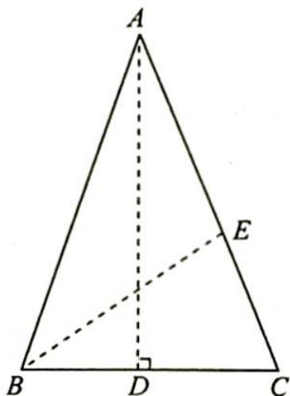

> [!faq]- 《高考数学培优40讲》例题解析
>
> > [!success]- **【答案】** 详见解析
>
> > [!note]- **【分析】**
> > 分析 ▶ 思路一(代数法): $\sin(2\times18^{\circ})=\cos(3\times18^{\circ})$ , 使用倍角公式和同角三角函数的基本关系恒等变形, 转化为关于 $\sin18^{\circ}$ 的一元二次方程, 使用求根公式可得 $\sin18^{\circ}$ 的值.
> >
> > 思路二(几何法): 做一个顶角为 $36^{\circ}$ 的等腰三角形, 再做底角的角平分线, 通过相似三角形对应边成比例可得 $\sin18^{\circ}$ 的值.
>
> > [!note]- **【解析】**
> > 解析 ▶ 解法一(代数法): 因为 $\sin 36^{\circ} = \cos 54^{\circ}$ , 即 $\sin (2 \times 18^{\circ}) = \cos (3 \times 18^{\circ})$ , 所以 $2 \sin 18^{\circ} \cos 18^{\circ} = 4 \cos^{3} 18^{\circ} - 3 \cos 18^{\circ}$ .
> > 又 $\cos 18^{\circ} \neq 0$ ，所以 $2\sin 18^{\circ} = 4\cos^{2} 18^{\circ} - 3$ ，故 $4\sin^{2} 18^{\circ} + 2\sin 18^{\circ} - 1 = 0$ .
> > 因为 $\sin 18^{\circ} > 0$ ，所以 $\sin 18^{\circ} = \frac{-1 + \sqrt{5}}{4}$ .
> > 解法二(几何法): 如图所示构造等腰三角形 ABC, 使 AB = AC = 1, $\angle BAC = 36^{\circ}$ . 作 $AD \perp BC$ 交 BC 于 D, 则 $\angle BAD = \angle CAD = 18^{\circ}$ , BD = CD = $\frac{1}{2}BC$ .
> > 又作 $BE$ 平分 $\angle ABC$ 交 $AC$ 于 $E$ , 则 $\angle ABC = \angle C = 72^{\circ}, \angle ABE = \angle EBC = 36^{\circ}$ , 所以 $\angle BEC = \angle C = 72^{\circ}$ .
> > 
> > 设 $AE = BE = BC = x$ ，则 $EC = 1 - x$ ，所以 $\triangle ABC \sim \triangle BEC$ ， $\frac{AB}{BC} = \frac{BE}{EC}$ ，即 $\frac{1}{x} = \frac{x}{1 - x}$ ，解得 $x = \frac{-1 \pm \sqrt{5}}{2}$ 。又 $x > 0$ ，所以 $x = \frac{-1 + \sqrt{5}}{2}$ 。
> > 在 Rt△ABD 中，sin∠BAD = sin18° = $\frac{BD}{AB}$ = $\frac{x}{2}$ = $\frac{-1 + \sqrt{5}}{4}$ .
