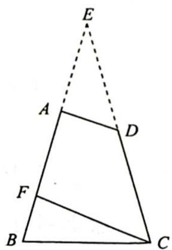

> [!faq]- 《高考数学培优40讲》例题解析
>
> > [!success]- **【答案】** 详见解析
>
> > [!note]- **【分析】**
> > 本题未单列分析。
>
> > [!note]- **【解析】**
> > 解析 ▶ 解法一(几何法): 如图所示, 延长 BA, CD 交于点 E, 平移 AD.
> > - **①**：当 $A$ 点, $D$ 点与 $E$ 点重合时, $AB$ 最长, 所以 $\frac{2}{\sin 30^\circ} = \frac{BE}{\sin 75^\circ}$ , $BE = \sqrt{6} + \sqrt{2}$ , 则 $AB < \sqrt{6} + \sqrt{2}$ .
> > - **②**：当 D 点与 C 点重合, A 点与 F 点重合时, AB 最短, 所以 $\frac{BF}{\sin30^{\circ}} = \frac{2}{\sin75^{\circ}}$ , $BF = \sqrt{6} - \sqrt{2}$ , 则 $AB > \sqrt{6} - \sqrt{2}$ .
> > 综上所述，AB 的取值范围为 $(\sqrt{6}-\sqrt{2},\sqrt{6}+\sqrt{2})$ .
> > 解法二(代数法): 由题意得 $AC > AB, AC > 2$ , 因为 $AC^{2} = AB^{2} + 4 - 2AB \times$
> > 
> > $2 \times \cos 75^{\circ}$ , 所以 $AB^{2} + 4 - 2AB \times 2 \times \cos 75^{\circ} > AB^{2}, AB^{2} + 4 - 2AB \times 2 \times \cos 75^{\circ} > 4$ , 因此 $4 \cos 75^{\circ} < AB < \frac{1}{\cos 75^{\circ}}$ , 则 $4 \times \frac{\sqrt{6} - \sqrt{2}}{4} < AB < \frac{1}{\frac{\sqrt{6} - \sqrt{2}}{4}}$ , 即 $\sqrt{6} - \sqrt{2} < AB < \sqrt{6} + \sqrt{2}$ .
> > 故 AB 的取值范围为 $(\sqrt{6}-\sqrt{2},\sqrt{6}+\sqrt{2})$ .
