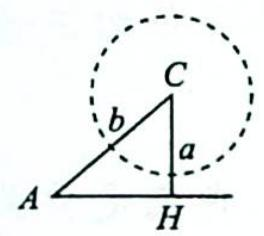
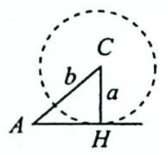
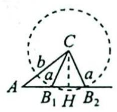
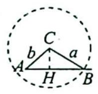
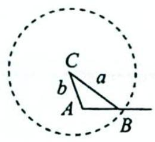
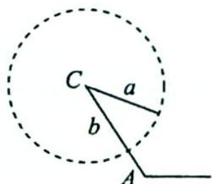

## 25.1 解的个数

## 研究密钥

三角形解的个数问题是个难点和易错点,类型也比较丰富,针对不同的类型,是选用正弦定理还是余弦定理很好地考查了学生分析问题和解决问题的能力,其主要设问形式是三角形有几个解、形状有几种、已知解的个数求参等,解决方式为正弦定理+有界性,也可以找到临界情况不断进行调整.

如在已知两边及一边对角(即 $a, b, A$ )时, 可利用数形结合法判断解的个数.

我们作图来直观地观察一下. 不妨设已知 $\triangle ABC$ 的两边 $a, b$ 和角 $A$ , 作图步骤如下: ① 先作出已知角 $A$ , 把未知边 $c$ 画为水平的, 角 $A$ 的另一条边为已知边 $b$ ; ② 以边 $b$ 的不是 $A$ 点的另外一个端点为圆心, 以 $a$ 为半径作圆 $C$ ; ③ 观察圆 $C$ 与边 $c$ 交点的个数, 便可得此三角形解的个数.

显然, 当 A 为锐角时, 有如图 1 所示的四种情况.

(a) $a <   CH = b\sin A$ 无解

(b) $a = CH = b\sin A$ 仅有一个解

(c) $CH = b\sin A < a < b$ 有两个解

图 1
(d) $a > b$ 仅有一个解

当 A 为钝角或直角时,有如图 2 所示的两种情况.

(a) $a > b$ 仅有一解

(b) $a < b$ 无解

图 2

根据上面的分析可知,由于 $a, b$ 长度关系的不同,导致了问题有不同个数的解,若 $A$ 为锐角,只有当 $a$ 不小于 $b \sin A$ 时才有解,随着 $a$ 的增大得到的解的个数也是不相同的.

当 A 为钝角时, 只有当 a 大于 b 时才有解.

![[高中/总复习/专题/高考数学培优40讲/高考数学培优40讲-03-三角、向量、数列、不等式与复数/第25讲_解三角形/25_1_解的个数/例题/Q00019751.md]]
![[高中/总复习/专题/高考数学培优40讲/高考数学培优40讲-03-三角、向量、数列、不等式与复数/第25讲_解三角形/25_1_解的个数/例题/Q00019752.md]]
![[高中/总复习/专题/高考数学培优40讲/高考数学培优40讲-03-三角、向量、数列、不等式与复数/第25讲_解三角形/25_1_解的个数/例题/Q00019753.md]]
