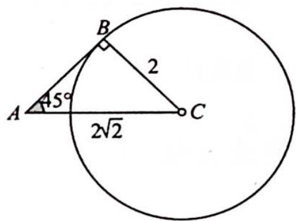

> [!faq]- 《高考数学培优40讲》例题解析
>
> > [!success]- **【答案】** 详见解析
>
> > [!note]- **【分析】**
> > 分析 ▶ 思路一(代数法): 使用正弦定理把边的关系转化为角度的关系, 再用有界性确定范围.
> >
> > 思路二(几何法): 假设 C 为圆心, B 为圆上的动点, 根据相切的临界情况确定 A 的取值范围.
>
> > [!note]- **【解析】**
> > 解析 ▶ 解法一(代数法):由正弦定理可得 $\frac{2}{\sin A}=\frac{2\sqrt{2}}{\sin B}$ ，即 $\sin B=\sqrt{2}\sin A$ .
> > 因为 $\sin B\in (0,1]$ ，所以 $\sin A\in \left(0,\frac{\sqrt{2}}{2}\right]$ ，则 $A\in \left(0,\frac{\pi}{4}\right]$
> > 解法二(几何法):由图像可得当 $A > 45^{\circ}$ 时,不能构成三角形,所以 $A \in \left(0, \frac{\pi}{4}\right]$ .
> > 
