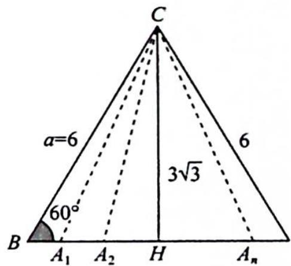

> [!faq]- 《高考数学培优40讲》例题解析
>
> > [!success]- **【答案】** 详见解析
>
> > [!note]- **【分析】**
> > 本题未单列分析。
>
> > [!note]- **【解析】**
> > 解析 由 $A + C = 2B = \pi - B$ 可得 $B = \frac{\pi}{3}$ , 所以 $\sin B = \frac{\sqrt{3}}{2}$ .
> > 由 $b\sin A = 6\sin B$ 可得 $\frac{6}{\sin A} = \frac{b}{\sin B}$ , 所以 $a = 6$ .
> > 解法一(代数法):要使得符合条件的三角形有两解,则 $a\sin60^{\circ}<b<a$ , 即 $3\sqrt{3}<b<6$ , 所以 b 的取值范围是 $(3\sqrt{3},6)$ .
> > 解法二(数形结合法): $b=\frac{6\sin B}{\sin A}=\frac{3\sqrt{3}}{\sin A}$ ，因为 $\sin A\in(0,1]$ ，所以 $b\geqslant3\sqrt{3}$ ，由图可得当 $b=3\sqrt{3}$ 时，只有一解，所以 $b>3\sqrt{3}$ ，要使得符合条件的三角形有两解，还需要满足 b<a=6。
> > 
> > 所以 b 的取值范围是 $(3\sqrt{3},6)$ .
