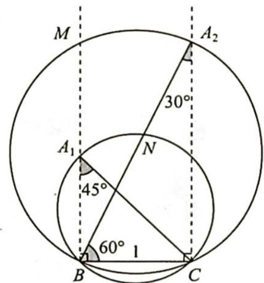

> [!faq]- 《高考数学培优40讲》例题解析
>
> > [!success]- **【答案】** 详见解析
>
> > [!note]- **【分析】**
> > 本题未单列分析。
>
> > [!note]- **【解析】**
> > 解析 ▶ 解法一: 因为 $\triangle ABC$ 为锐角三角形, 所以 $\left\{\begin{aligned}0&A<\frac{\pi}{2}\\ 0&B<\frac{\pi}{2}\end{aligned}\right.$ ，即 $\left\{\begin{aligned}0&A<\frac{\pi}{2}\\ 0&<2A<\frac{\pi}{2}\end{aligned}\right.$ ，则 $\frac{\pi}{6}<\frac{\pi}{2}<3A<\pi$
> > $A<\frac{\pi}{4},\frac{AC}{\cos A}=\frac{2R\sin B}{\cos A}=\frac{\frac{a}{\sin A}\sin2A}{\cos A}=\frac{a\cdot2\sin A\cos A}{\sin A\cos A}=2a=2$ ，所以 $AC=2\cos A\in(\sqrt{2},\sqrt{3})$ ，故 AC 的取值范围为 $(\sqrt{2},\sqrt{3})$ .
> > 解法二(几何法):如图所示,根据题意可得点 A 在 $A_{1}, N, A_{2}, M$ 围成的不规则图形内部.
> > 由正弦定理可得 $\frac{BC}{\sin A} = 2R, \sin A = \frac{1}{2R}, 2R = \frac{AC}{\sin B} = \frac{AC}{\sin 2A} = \frac{AC}{2\sin A\cos A} = \frac{2R \cdot AC}{2\cos A}$ , 所以 $\frac{AC}{\cos A} = 2, AC = 2\cos A$ .
> > 在 $A_{1}, N, A_{2}, M$ 围成的不规则图形内部任意一点 $A_{i}$ , 都有 $30^{\circ} < \angle BA_{i}C < 45^{\circ}$ , 所以 $A$ 在 $A_{1}$ 时, $AC$ 有最小值 $\frac{1}{\sin 45^{\circ}} = \sqrt{2}; A$ 在 $A_{2}$ 时, $AC$ 有最大值 $2\cos 30^{\circ} = \sqrt{3}$ , 故 $AC$ 的取值范围为 $(\sqrt{2}, \sqrt{3})$ .
> > 
