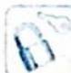

## 25.3 三角形中的最值

## 研究密钥

有关解三角形的问题是高考重点考查的内容, 也是热点问题。其主要分为两种类型: 一类是完全可解的三角形, 可以做到知三求一; 另一类则是不完全可解的三角形, 即通过减少已知条件转变为函数和不等式问题, 其主要题型以求周长 (边) 和面积的最值 (范围) 为主。

解决此类问题有两种方法:代数法:余弦定理+基本不等式.几何法:当某个角度已知时,可以将顶点看作动点;当某条边已知时,可以将对角的顶点看作动点.

![[高中/总复习/专题/高考数学培优40讲/高考数学培优40讲-03-三角、向量、数列、不等式与复数/第25讲_解三角形/25_3_三角形中的最值/例题/Q00019756.md]]
![[高中/总复习/专题/高考数学培优40讲/高考数学培优40讲-03-三角、向量、数列、不等式与复数/第25讲_解三角形/25_3_三角形中的最值/例题/Q00019757.md]]
![[高中/总复习/专题/高考数学培优40讲/高考数学培优40讲-03-三角、向量、数列、不等式与复数/第25讲_解三角形/25_3_三角形中的最值/例题/Q00019758.md]]
![[高中/总复习/专题/高考数学培优40讲/高考数学培优40讲-03-三角、向量、数列、不等式与复数/第25讲_解三角形/25_3_三角形中的最值/例题/Q00019759.md]]
![[高中/总复习/专题/高考数学培优40讲/高考数学培优40讲-03-三角、向量、数列、不等式与复数/第25讲_解三角形/25_3_三角形中的最值/例题/Q00019760.md]]
![[高中/总复习/专题/高考数学培优40讲/高考数学培优40讲-03-三角、向量、数列、不等式与复数/第25讲_解三角形/25_3_三角形中的最值/例题/Q00019761.md]]
![[高中/总复习/专题/高考数学培优40讲/高考数学培优40讲-03-三角、向量、数列、不等式与复数/第25讲_解三角形/25_3_三角形中的最值/例题/Q00019762.md]]
![[高中/总复习/专题/高考数学培优40讲/高考数学培优40讲-03-三角、向量、数列、不等式与复数/第25讲_解三角形/25_3_三角形中的最值/例题/Q00019763.md]]
![[高中/总复习/专题/高考数学培优40讲/高考数学培优40讲-03-三角、向量、数列、不等式与复数/第25讲_解三角形/25_3_三角形中的最值/例题/Q00019764.md]]
![[高中/总复习/专题/高考数学培优40讲/高考数学培优40讲-03-三角、向量、数列、不等式与复数/第25讲_解三角形/25_3_三角形中的最值/例题/Q00019765.md]]
![[高中/总复习/专题/高考数学培优40讲/高考数学培优40讲-03-三角、向量、数列、不等式与复数/第25讲_解三角形/25_3_三角形中的最值/例题/Q00019766.md]]
![[高中/总复习/专题/高考数学培优40讲/高考数学培优40讲-03-三角、向量、数列、不等式与复数/第25讲_解三角形/25_3_三角形中的最值/例题/Q00019767.md]]
