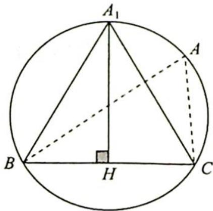
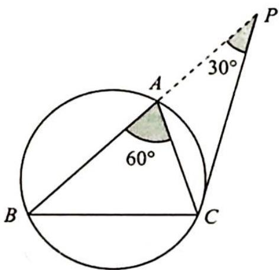
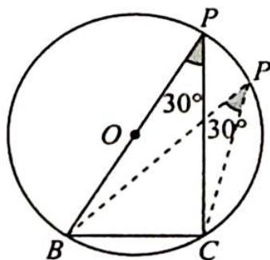

> [!faq]- 《高考数学培优40讲》例题解析
>
> > [!success]- **【答案】** 详见解析
>
> > [!note]- **【分析】**
> > 分析 ▶ 使用正弦定理角化边,再使用余弦定理由三边关系推出 $A=\frac{\pi}{3}$ .
> >
> > 思路一(代数法): $S_{\triangle ABC} = \frac{1}{2} bc \sin A$ , 使用基本不等式可得 $bc$ 的范围.
> >
> > 思路二(数形结合法): 因为同弦对应的圆周角相等, 所以把点 A 看作圆弧上的一点, 角 A 对应的弦长为 2, 以弦为底, 当三角形的高取到最大值时面积可以取得最大值, 此时点 A 位于弦的垂直平分线上.
>
> > [!note]- **【解析】**
> > 解析 由题意可得 $(a+b)(\sin A-\sin B)=(c-b)\sin C$ ，由正弦定理可得 $(a+b)(a-b)=(c-b)c$ ，即 $a^{2}-b^{2}=c^{2}-bc$ ，所以 $\cos A=\frac{b^{2}+c^{2}-a^{2}}{2bc}=\frac{1}{2}$ ，则 $A=\frac{\pi}{3}$ .
> > 解法一(代数法): 因为 $a^{2}=b^{2}+c^{2}-bc\geqslant bc$ ，所以 $bc\leqslant4$ ，故 $S_{\triangle ABC}=\frac{1}{2}bc\sin A\leqslant\sqrt{3}$ ，即 $S_{\triangle ABC}$ 的最大值为 $\sqrt{3}$ .
> > 解法二(数形结合法):由题意可得 $a=2, A=\frac{\pi}{3}$ .
> > 如图所示, $BC$ 对应的圆周角为 $\frac{\pi}{3}$ , 点 $A$ 在优弧 $\widehat{BC}$ 上运动, 作 $BC$ 的垂直平分线 $A_{1}H$ .
> > 
> > 以 $BC$ 为 $\triangle ABC$ 的底边, 当 $A$ 运动到 $A_{1}$ 时, $\triangle ABC$ 的高 $A_{1}H$ 有最大
> > 值, 此时 $\triangle ABC$ 为边长为 2 的等边三角形, 易得 $A_{1}H = \sqrt{3}$ , 所以 $S_{\triangle ABC} = \frac{1}{2} BC \cdot A_{1}H = \sqrt{3}$ .
> > 若本题改为求 $\triangle ABC$ 周长的最大值呢？由题意得 $A=\frac{\pi}{3}$ .
> > 用代数法求周长的最大值: 因为 $a^{2}=b^{2}+c^{2}-bc=(b+c)^{2}-3bc=4$ ，又因为 $bc \leqslant \left(\frac{b+c}{2}\right)^{2}$ ，所以 $(b+c)^{2}-3bc \geqslant (b+c)^{2}-\frac{3(b+c)^{2}}{4}=\frac{(b+c)^{2}}{4}$ ，即 $4 \geqslant \frac{(b+c)^{2}}{4}$ ， $b+c \leqslant 4$ ，当且仅当 b=c 时等号成立，所以 $\triangle ABC$ 的周长 $C_{\triangle ABC}=a+b+c \leqslant 6$ ，即 $\triangle ABC$ 周长的最大值为 6.
> > 用几何法求周长的最大值: 如图 1 所示, 延长 BA 到点 P, 使得 AP = AC, 所以 $AB + AC = AB + AP = BP$ , 要使得周长最大, 则需满足 BP 长度最大.
> > 将问题转化为已知一边 a=2，一对角 $\angle P=30^{\circ}$ ，求另一边 BP 的长度的最大值。
> > 由图 2 可得，当 BP 为该圆直径时，BP 最大，即 $\left|BP\right|_{\max}=\frac{a}{\sin P}=\frac{2}{\sin30^{\circ}}=4$ ，所以 $C_{\triangle ABC}=BC+BP\leqslant2+4=6.$
> > 
> > 图1
> > 
> > 图2
